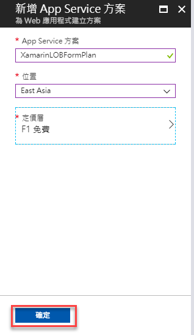
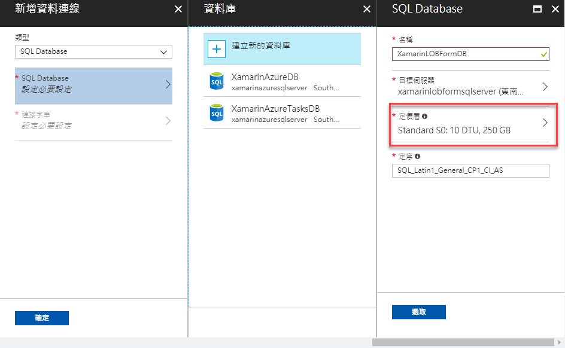

# Backend1 建立與設定 Azure 行動應用程式服務

這份文件將會說明如何在 Azure 上來建立一個行動應用程式服務的後端相關服務與專案

# 建立 Azure 行動應用程式服務

在這裡我們需要建立一個 Azure 行動應用程式來提供我們後端的資料存取服務。

* 打開瀏覽器，輸入網址 [https://azure.microsoft.com](https://azure.microsoft.com) ，接著輸入登入之帳號與密碼，進入到Microsoft Azure 儀表板

* 在 Microsoft Azure 儀表板頁面左上方，找到 `+ 新增` 區域，點擊這個連結

  

* 在 `新增` 刀鋒視窗中，選擇 `Web + 行動`

* 在接著請選擇 `行動應用程式`

   

* 在 `行動應用程式` 刀鋒視窗中，依序輸入 `應用程式名稱` / `訂戶名稱` / `資源群組` / `App Service 方案/位置`，下圖為這個練習所建立的 `行動應用程式` 資訊。

  應用程式名稱 : `XamarinLOBForm`

  >  該名稱在 Azure 上必須是唯一名稱，因此，請輸入適合自己的應用程式名稱

  訂用帳戶 : 在這裡請選擇您自己的訂用帳戶

  資源群組(新建)： XamarinLOBForm

  >  您可以新建一個資源群組名稱，或者使用您現有 Azure 上存在的資源群組名稱

  App Service 方案/位置

  > 建議參考底下步驟說明，建立適合您的 App Service 方案/位置
    
  * 點選 `App Service 方案/位置`

  * 在 `App Service 方案` 刀鋒視窗中，點選 `建立新項目` 

    

  * 在 `新增 App Server 方案` 欄位中，輸入 `XamarinLOBFormPlan`

    >  請輸入適合自己的App Server 方案

  * 在 `位置` 欄位中，使用下拉選單選擇該主機存放位置，在這裡我是使用 `East Asia`

  * 點選 `定價層` 欄位，此時，右方會出現 `選擇定價層` 刀鋒視窗，若您只是要做練習之用，可以選擇 `F1 免費` 這個項目；一旦，選擇為定價層項目之後，請在 `選擇定價層` 刀鋒視窗的最下方點選 `選取` 按鈕

    >  定價層選擇 `F1 免費`，會有一定的使用資源額度，超過這個額度，將無法使用，因此，若您要佈署成為正式應用環境，請選擇其他訂價等級

    

  * 當 `選擇定價層` 刀鋒視窗關閉之後，請在 `新增 App Server 方案` 刀鋒視窗內，點選 `確定` 按鈕

    

  * 此時，會回到 `行動應用程式` 刀鋒視窗內，請在該刀鋒視窗底下，勾選 `釘選到儀表板` 檢查盒，最後，點選 `建立` 按鈕

    >  將這個 `行動應用程式` 釘選到儀表板上，可以方便日後直接從儀表板上，找到這個 `行動應用程式` 服務

    

* 現在，將會回到 Azure 儀表板頁面上，我們也看到了正在佈署行動應用程式的訊息

    

* 稍微等候一下，一旦 Azure 將這個行動應用程式服務佈署完成後，就會看到如下圖畫面，您可以選點左方的 `釘選到儀表板` 按鈕

  

* 點選右上方的鐘圖示，關閉右方的提示視窗，就會看到如下圖畫面，這裡就是您剛剛建立的 `行動應用程式` 的服務

  

* 點選左上方的 `Microsoft Azure` 文字，就會切換到儀表板畫面，此時，您會看到您剛剛建立的 `行動應用程式` 的服務就會出現儀表板上。

  

>  若您想要購買任何 Azure 方面的服務或者產品，歡迎您與 [多奇數位創意有限公司](http://bit.ly/2rtqAnY) 聯繫。

# 行動應用程式之快速設定

* Microsoft Azure 儀表板上，點選我們剛剛建立的 `XamarinLOBForm 行動 App` 服務圖示，請點選這個圖示，以便開啟 `XamarinLOBForm 行動 App`。

  

* 在 `XamarinLOBForm` 刀鋒視窗中，找到 `快速入門` 項目，點選這個 `快速入門` > `Xamarin.Forms`

  

* 在 `XamarinLOBForm 快速入門` 刀鋒視窗中，點選 `Xamarin.Forms` 下方的區塊

  

* 在 `Xamarin.Forms` 刀鋒視窗中，點選 `連結資料庫` 下方的區塊

  

* 在 `資料連接` 刀鋒視窗中，點選 `+ 新增` 按鈕

  >  若您已經有存在的資料連結，可以直接選取他，不過，我們在這裡將會展示新建立一個 SQL Server 資料連結

  

* 在 `新增資料連線` 刀鋒視窗中，類型欄位，選擇 `SQL Database`

* 點選 `SQL Database 設定必要設定`

  

* 此時，會出現兩個新的刀鋒視窗：`資料庫` 與 `SQL Database`，我們將會在 `SQL Database` 刀鋒視窗中的名稱欄位輸入 `XamarinLOBFormDB`

  

* 接著，在 `SQL Database` 刀鋒視窗中，點選 `目標伺服器 設定必要的設定`

* 現在，又出現了兩個刀鋒視窗：`伺服器` 與 `新伺服器`

  * 請在 `伺服器名稱` 欄位中，輸入 `XamarinLOBFormSQLServer`

    >  您可以屬於您自己的 SQL Server 伺服器主機名稱

  * 接著在 `伺服器管理員登入` 與 `密碼` 和 `確認密碼` 這三個欄位中，分別輸入您這台 SQL Server 管理員的帳號與密碼，完成後，請點選底下的 `選取` 按鈕

    >  強烈建議這台 SQL Server 主機所在的位置，最好與 行動應用程式 主機所在的位置在同一個地區，這樣，執行效能會比較好。若不同主機服務無法在同一個位置，也選擇較靠近的臨近的位置。

* 我們在剛剛出現的新刀鋒視窗 `SQL Database`，點選 `定價層`，設定這台 SQL Server 的租用費用等級。

* 請在 `Configure performance` 刀鋒視窗中，選擇這台 SQL Server 的租用費用等級，若您只是要做練習，可以選擇 `免費` 這個選項，完成後，點選 `套用` 按鈕

* 請確認 `SQL Database` 刀鋒視窗內的設定選項，若沒有問題，請點選 `選取` 按鈕

* 我們來到了 `新增資料連線` 刀鋒視窗，請點選 `連結字串` 項目

* 在 `連接字串` 刀鋒視窗，請直接點選 `確定` 按鈕

* 現在回到了 `新增資料連線` 刀鋒視窗，相關設定都已經完成，請直接點選 `確定` 按鈕

* 此時，螢幕右上角出現一個提示訊息：`... 資料連線建立`，Azure 正在幫我們建立一個 SQL Server 與資料庫。

* 完成資料連接設定，在 `資料連接` 刀鋒視窗中會看到一個 `MS_TableConnectionString` 項目。

  請在 `Xamarin.Forms` 刀鋒窗中，選擇 `後端語言` 為 `C#`

  接著點選 `下載` 按鈕，下載這個 ASP.NET 專案檔案

# 完成 Azure 行動應用程式服務的安裝與設定

 

恭喜您，您已經完成了Azure 行動應用程式服務的安裝與設定，也就是說，您可以開始進行後端 Web API 服務的開發，並且可以佈署到 Azure 上，讓 Xamarin.Forms App 透過網路存取這些 Web API；而，這些 API 的資料，將會使用 Azure SQL Server 服務，把資料存放到 Azure 上。

 

若您無法使用 Azure 行動應用程式服務，您可以使用社團上提供的專案原始碼壓縮檔案，將這個目錄 `XamarinLOBForms\1AzureLabs\01FromAzure` 複製出來，您可以直接從這個目錄下的專案，打開來，跟著這份文章來進行練習；當然，這個專案可以讓您直接在本機電腦上執行 Web API 專案，也可以將這個專案部署到任何有 IIS 的主機上來運行，這是沒有問題的。

# 問題研究

 若我沒有使用 Azure 帳號，並且無法建立出 Azure 行動應用程式服務，是否就無法完成這個後端 Web API 的練習。

 要使用 Azure 行動應用程式服務來建立一個後端 Web API 專案的目的是甚麼?

