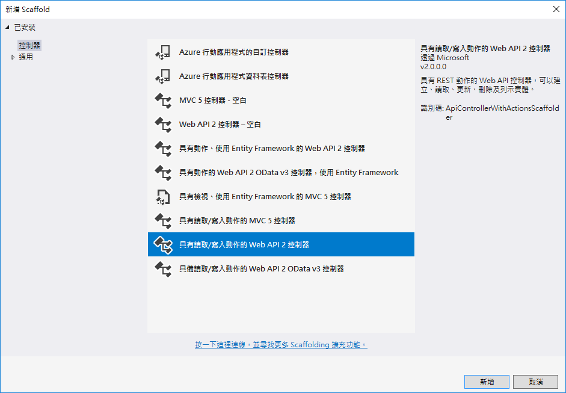
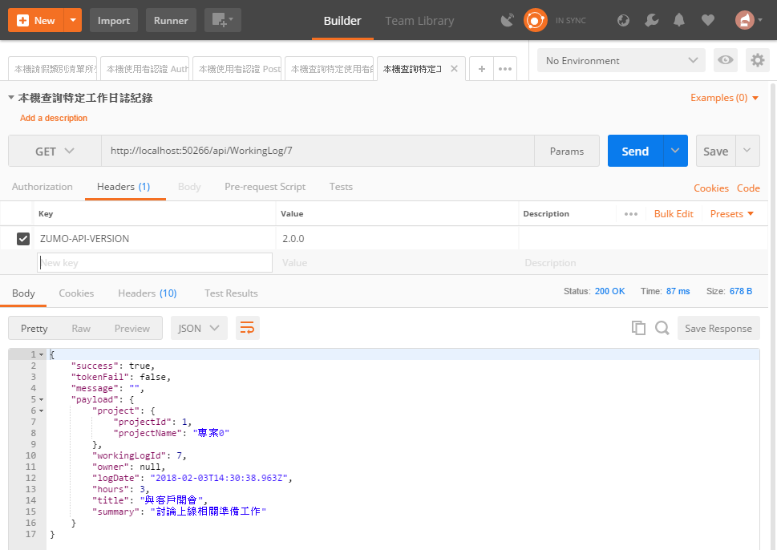
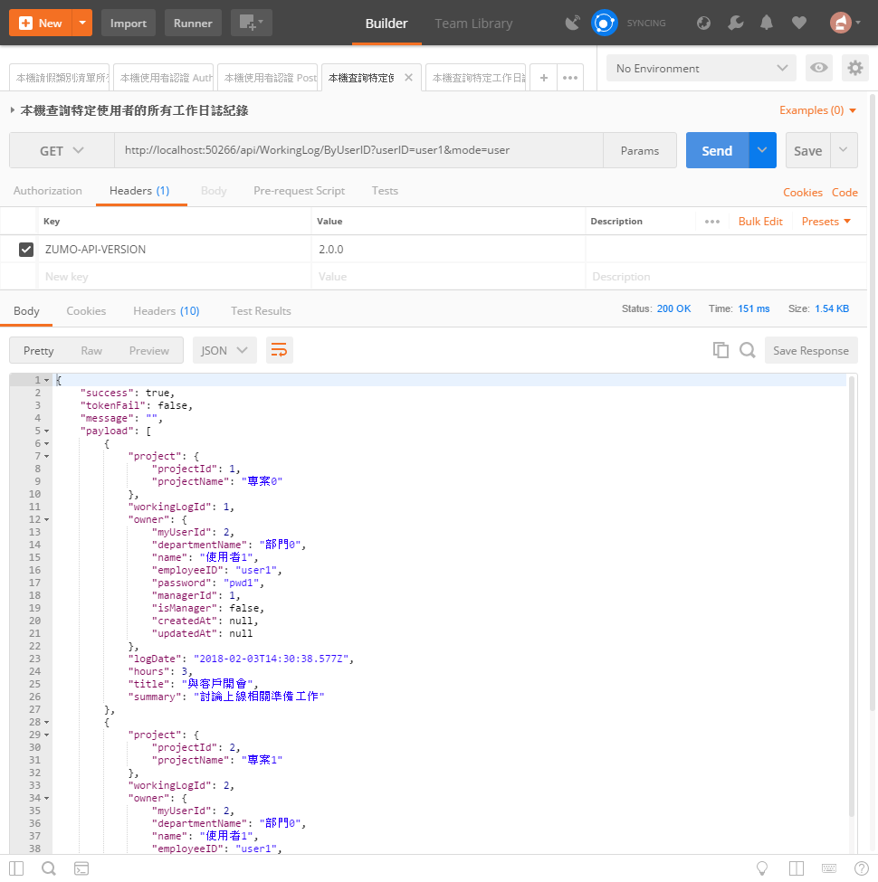
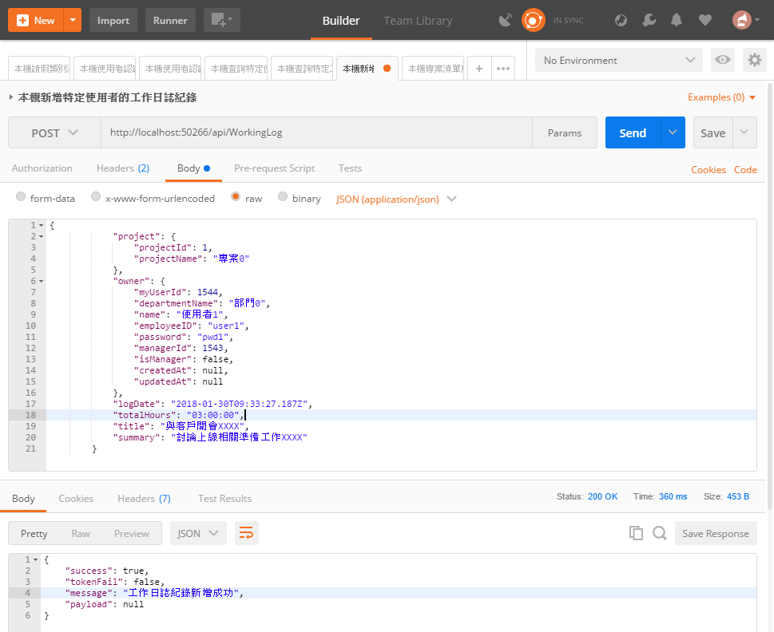
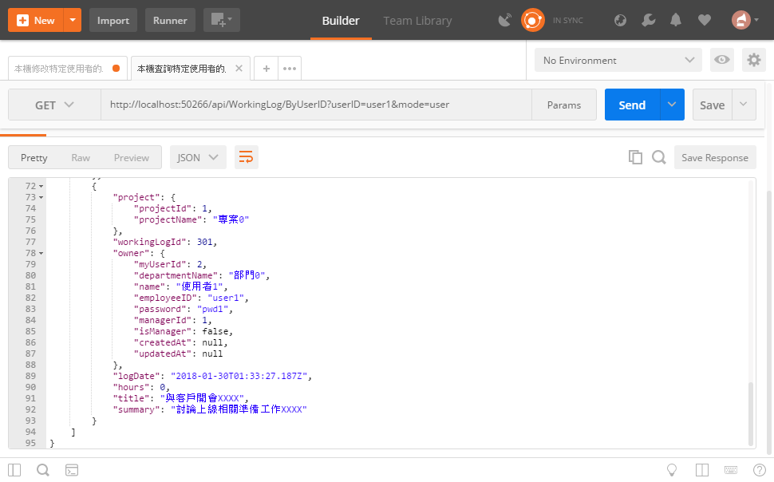
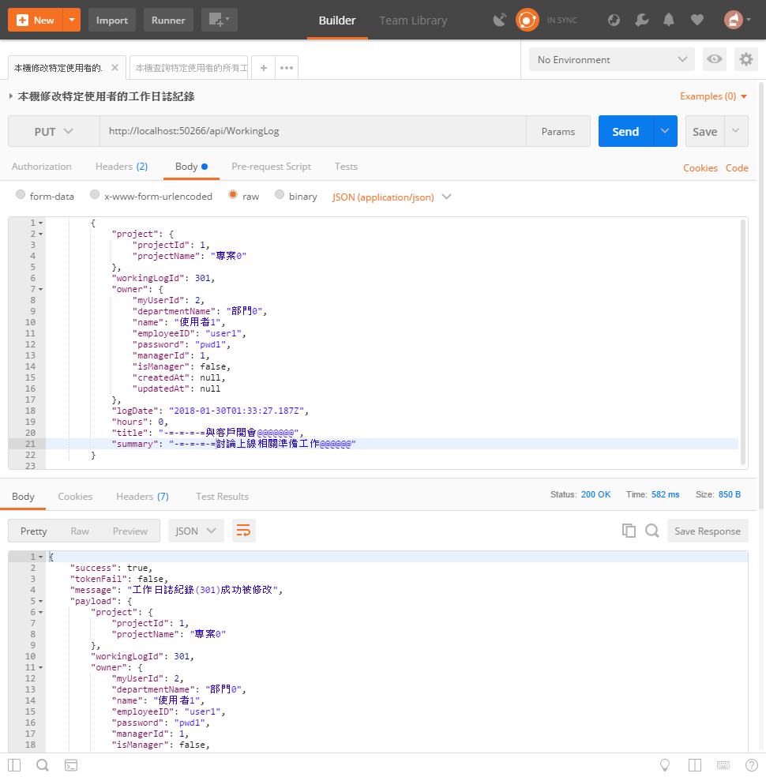
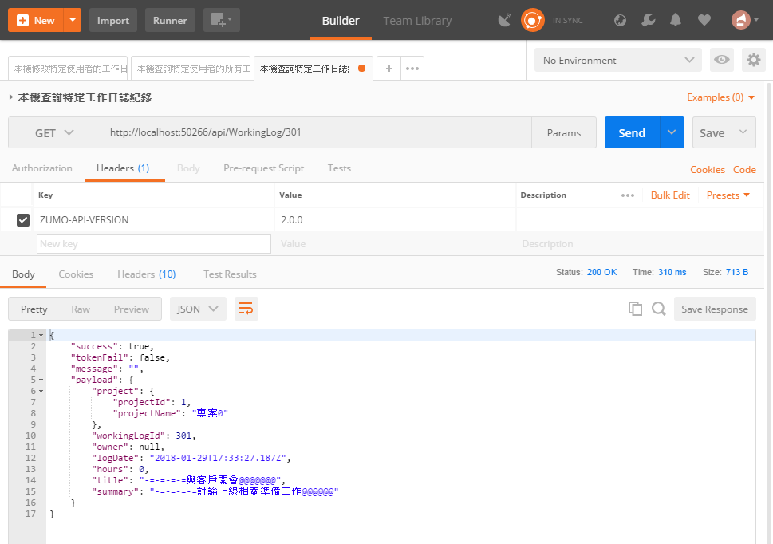
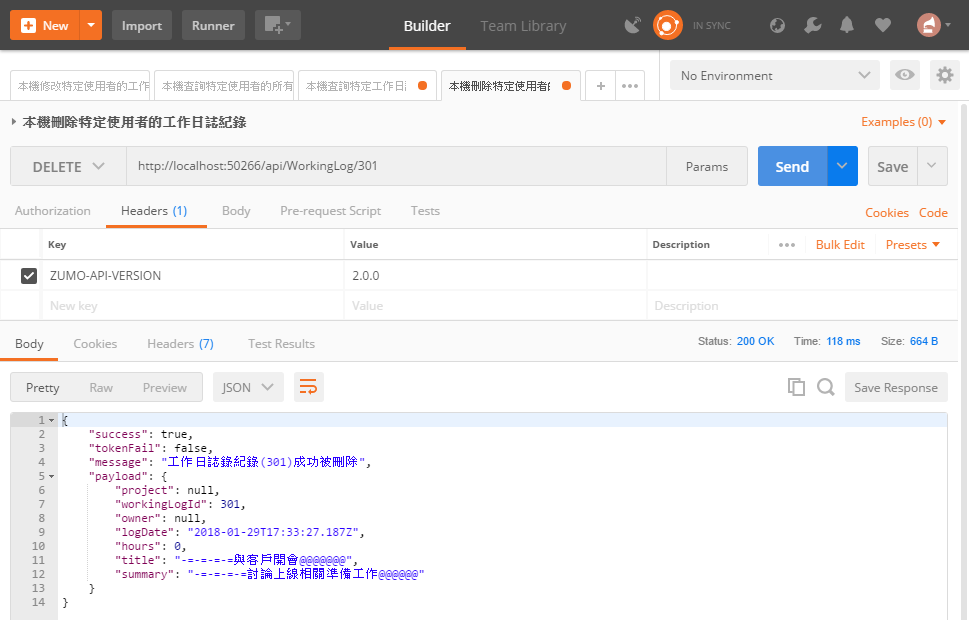
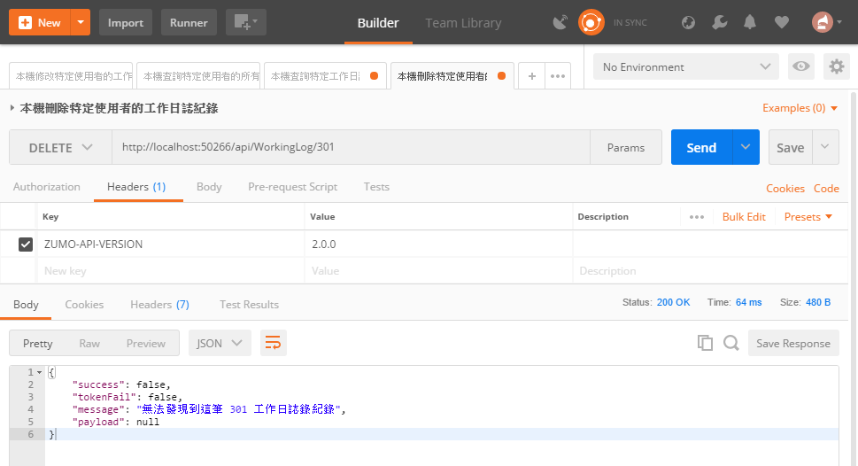
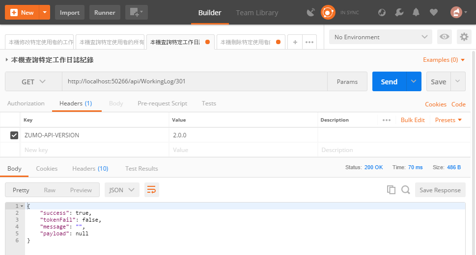

# Backend10 建立工作日誌使用的 CRUD API

 這份文件的完成結果專案原始碼，可以參考 `XamarinLOBForms\1AzureLabs\10WorkingLog`

在這個練習，將會帶領大家來設計一個具有 CRUD 應用的 Web API，其中，CRUD 指的是：`C`reate 新增、`R`etrive 查詢、`U`pdate 更新和 `D`elete 刪除。一般來說，對於查詢的 Web API，我們通常會設計使用紀錄ID，來查詢出資料庫內指定ID的紀錄出來，另外一個是設計可以依據指定條件，查詢出一群或者所有紀錄的方法。

## 建立工作日誌控制器

* 滑鼠右擊 `Controllers` 資料夾，選擇 `加入` > `控制器`

  

* 在 `新增 Scaffold` 對話窗中，點選 `具有讀取/寫入動作的 Web API 2 控制器` > `新增`

* 在 `加入控制器` 對話窗中，輸入 `Login`，如同底下畫面，最後點選 `加入` 按鈕

  

* 新增的類別檔案最上方，加入參考這些命名空間


```csharp
using XamarinLOBFormService.Models;
using XamarinLOBFormService.DataObjects;
```

* 將新增的類別以底下程式碼替換


```csharp
[Microsoft.Azure.Mobile.Server.Config.MobileAppController]
//[Filters.JwtAuth]
public class WorkingLogController : ApiController
{
    private XamarinLOBFormContext Context = new XamarinLOBFormContext();
    APIResult fooResult = new APIResult();
 
    // 取得所有工作日誌資料 GET: api/WorkingLog
    public APIResult Get()
    {
        fooResult.Success = true;
        fooResult.Message = $"";
        fooResult.TokenFail = false;
        fooResult.Payload = Context.WorkingLogs.ToList();
        return fooResult;
    }
 
    // 查詢某筆工作日誌資料 GET: api/WorkingLog/5
    public APIResult Get(int id)
    {
        var fooItem = Context.WorkingLogs.FirstOrDefault(x => x.WorkingLogId == id);
        if (fooItem != null)
        {
            fooResult.Success = true;
            fooResult.Message = $"";
            fooResult.TokenFail = false;
            fooResult.Payload = fooItem;
        }
        else
        {
            fooResult.Success = true;
            fooResult.Message = $"";
            fooResult.TokenFail = false;
            fooResult.Payload = null;
        }
        return fooResult;
    }
 
    // 查詢指定使用者的所有工作日誌紀錄 GET: api/LeaveAppForm/ByUserID?userID=User1&mode=NA
    [HttpGet]
    [Route("ByUserID")]
    public APIResult GetByUserID(string userID, string mode)
    {
        #region 取得特定使用者的所有工作日誌
        var fooUser = Context.MyUsers.FirstOrDefault(x => x.EmployeeID == userID);
        if (fooUser != null)
        {
            var fooItem = Context.WorkingLogs.Where(x => x.Owner.MyUserId == fooUser.MyUserId);
            if (fooItem != null)
            {
                fooResult.Success = true;
                fooResult.Message = $"";
                fooResult.TokenFail = false;
                fooResult.Payload = fooItem.ToList();
            }
            else
            {
                fooResult.Success = true;
                fooResult.Message = $"";
                fooResult.TokenFail = false;
                fooResult.Payload = null;
            }
        }
        else
        {
            fooResult.Success = false;
            fooResult.Message = $"找不到指定使用者資料";
            fooResult.TokenFail = false;
            fooResult.Payload = null;
        }
        #endregion
        return fooResult;
    }
 
    // 新增資料 POST: api/LeaveAppForm
    public APIResult Post([FromBody]WorkingLog value)
    {
        #region 檢查使用者是否存在
        var fooUser = Context.MyUsers.FirstOrDefault(x => x.EmployeeID == value.Owner.EmployeeID);
        if (fooUser != null)
        {
            #region 檢查使用者是否存在
            var fooProject = Context.Projects.FirstOrDefault(x => x.ProjectId == value.Project.ProjectId);
            if (fooProject != null)
            {
                #region 產生工作日誌物件
                var fooLeaveAppFormItem = new WorkingLog()
                {
                    LogDate = value.LogDate,
                    Summary = value.Summary,
                    Title = value.Title,
                    Hours = value.Hours,
                    Owner = fooUser,
                    Project = fooProject
 
                };
                Context.WorkingLogs.Add(fooLeaveAppFormItem);
                #endregion
                var fooCC = Context.SaveChanges();
                if (fooCC > 0)
                {
                    fooResult.Success = true;
                    fooResult.Message = $"工作日誌紀錄新增成功";
                    fooResult.TokenFail = false;
                    fooResult.Payload = null;
                }
                else
                {
                    fooResult.Success = false;
                    fooResult.Message = $"無法新增到這筆工作日誌紀錄";
                    fooResult.TokenFail = false;
                    fooResult.Payload = null;
                }
            }
            else
            {
                fooResult.Success = false;
                fooResult.Message = $"這筆工作日誌紀錄指定的專案不存在";
                fooResult.TokenFail = false;
                fooResult.Payload = null;
            }
            #endregion
        }
        else
        {
            fooResult.Success = false;
            fooResult.Message = $"這筆工作日誌紀錄指定的使用者不存在";
            fooResult.TokenFail = false;
            fooResult.Payload = null;
        }
        #endregion
        return fooResult;
    }
 
    // 修改資料 PUT: api/LeaveAppForm/5
    public APIResult Put([FromBody]WorkingLog value)
    {
        #region 檢查使用者是否存在
        var fooUser = Context.MyUsers.FirstOrDefault(x => x.EmployeeID == value.Owner.EmployeeID);
        if (fooUser != null)
        {
            #region 檢查使用者是否存在
            var fooProject = Context.Projects.FirstOrDefault(x => x.ProjectId == value.Project.ProjectId);
            if (fooProject != null)
            {
                var fooItem = Context.WorkingLogs.FirstOrDefault(x => x.WorkingLogId == value.WorkingLogId);
                if (fooItem != null)
                {
                    #region 更新資料庫上的紀錄
                    fooItem.LogDate = value.LogDate;
                    fooItem.Owner = fooUser;
                    fooItem.Project = fooProject;
                    fooItem.Summary = value.Summary;
                    fooItem.Title = value.Title;
                    fooItem.Hours = value.Hours;
                    #endregion
                    var fooCC = Context.SaveChanges();
                    if (fooCC > 0)
                    {
                        fooResult.Success = true;
                        fooResult.Message = $"工作日誌紀錄({fooItem.WorkingLogId})成功被修改";
                        fooResult.TokenFail = false;
                        fooResult.Payload = fooItem;
                    }
                    else
                    {
                        fooResult.Success = false;
                        fooResult.Message = $"無法修改這筆 {fooItem.WorkingLogId} 工作日誌紀錄";
                        fooResult.TokenFail = false;
                        fooResult.Payload = null;
                    }
                }
            }
            else
            {
                fooResult.Success = false;
                fooResult.Message = $"這筆工作日誌紀錄指定的專案不存在";
                fooResult.TokenFail = false;
                fooResult.Payload = null;
            }
            #endregion
        }
        else
        {
            fooResult.Success = false;
            fooResult.Message = $"無法發現到這筆 {value.WorkingLogId} 工作日誌錄";
            fooResult.TokenFail = false;
            fooResult.Payload = null;
        }
        #endregion
        return fooResult;
    }
 
    // 刪除資料 DELETE: api/LeaveAppForm/5
    public APIResult Delete(int id)
    {
        var fooItem = Context.WorkingLogs.FirstOrDefault(x => x.WorkingLogId == id);
        if (fooItem != null)
        {
            Context.WorkingLogs.Remove(fooItem);
            var fooCC = Context.SaveChanges();
            if (fooCC > 0)
            {
                fooResult.Success = true;
                fooResult.Message = $"工作日誌錄紀錄({id})成功被刪除";
                fooResult.TokenFail = false;
                fooResult.Payload = fooItem;
            }
            else
            {
                fooResult.Success = false;
                fooResult.Message = $"無法刪除到這筆 {id} 工作日誌錄紀錄";
                fooResult.TokenFail = false;
                fooResult.Payload = null;
            }
        }
        else
        {
            fooResult.Success = false;
            fooResult.Message = $"無法發現到這筆 {id} 工作日誌錄紀錄";
            fooResult.TokenFail = false;
            fooResult.Payload = null;
        }
        return fooResult;
    }
}
```

# 測試此控制器

* 執行此專案

## 測試 查詢特定工作日誌紀錄 GET 方法 (C`R`UD)

* 打開 PostMan 工具

  * 選擇 Http 方法為 `Get`

  * 輸入 URL 為 `http://localhost:50266/api/WorkingLog/7`

    > 若您自己建立的 Web API 專案，請在這裡輸入您專案的 Port 編號
    >
    >最後的數字 7，表示所要查詢工作日誌紀錄的 ID 為 7 的紀錄，因此，若您的資料庫內沒有這筆紀錄，可以將數字 7 更換成為您資料庫內有的紀錄。

  * 點選 `Headers` 標籤頁次

  * 輸入這組 Http 標頭
  
    \[Key] 名稱為 `ZUMO-API-VERSION`
    
    \[Value] 值為 `2.0.0`

  * 點選 `Send` 按鈕



* 請確認輸出內容是否與底下內容類似


```json
{
    "success": true,
    "tokenFail": false,
    "message": "",
    "payload": {
        "project": {
            "projectId": 1,
            "projectName": "專案0"
        },
        "workingLogId": 7,
        "owner": null,
        "logDate": "2018-02-03T14:30:38.963Z",
        "hours": 3,
        "title": "與客戶開會",
        "summary": "討論上線相關準備工作"
    }
}
```

## 測試 查詢特定使用者的所有工作日誌紀錄 GET 方法  (C`R`UD)

* 打開 PostMan 工具

  * 選擇 Http 方法為 `Get`

  * 輸入 URL 為 `http://localhost:50266/api/WorkingLog/ByUserID?userID=user1&mode=user`

    > 若您自己建立的 Web API 專案，請在這裡輸入您專案的 Port 編號

  * 點選 `Headers` 標籤頁次

  * 輸入這組 Http 標頭
  
    \[Key] 名稱為 `ZUMO-API-VERSION`
    
    \[Value] 值為 `2.0.0`

  * 點選 `Send` 按鈕



* 請確認輸出內容是否與底下內容類似


```json
{
    "success": true,
    "tokenFail": false,
    "message": "",
    "payload": [
        {
            "project": {
                "projectId": 1,
                "projectName": "專案0"
            },
            "workingLogId": 1,
            "owner": {
                "myUserId": 2,
                "departmentName": "部門0",
                "name": "使用者1",
                "employeeID": "user1",
                "password": "pwd1",
                "managerId": 1,
                "isManager": false,
                "createdAt": null,
                "updatedAt": null
            },
            "logDate": "2018-02-03T14:30:38.577Z",
            "hours": 3,
            "title": "與客戶開會",
            "summary": "討論上線相關準備工作"
        },
        {
            "project": {
                "projectId": 2,
                "projectName": "專案1"
            },
            "workingLogId": 2,
            "owner": {
                "myUserId": 2,
                "departmentName": "部門0",
                "name": "使用者1",
                "employeeID": "user1",
                "password": "pwd1",
                "managerId": 1,
                "isManager": false,
                "createdAt": null,
                "updatedAt": null
            },
            "logDate": "2018-02-03T14:30:38.597Z",
            "hours": 3,
            "title": "與客戶開會",
            "summary": "討論上線相關準備工作"
        },
        {
            "project": {
                "projectId": 3,
                "projectName": "專案2"
            },
            "workingLogId": 3,
            "owner": {
                "myUserId": 2,
                "departmentName": "部門0",
                "name": "使用者1",
                "employeeID": "user1",
                "password": "pwd1",
                "managerId": 1,
                "isManager": false,
                "createdAt": null,
                "updatedAt": null
            },
            "logDate": "2018-02-03T14:30:38.613Z",
            "hours": 3,
            "title": "與客戶開會",
            "summary": "討論上線相關準備工作"
        }
    ]
}
```

## 測試 新增工作日誌紀錄 POST 方法  (`C`RUD)

* 打開 PostMan 工具

  * 選擇 Http 方法為 `Post`

  * 輸入 URL 為 `http://localhost:50266/api/WorkingLog`

    > 若您自己建立的 Web API 專案，請在這裡輸入您專案的 Port 編號

  * 點選 `Headers` 標籤頁次

  * 輸入這組 Http 標頭
  
    \[Key] 名稱為 `ZUMO-API-VERSION`
    
    \[Value] 值為 `2.0.0`

  * 點選 `Body` 標籤頁次

  * 選擇使用 `raw` / `JSON(application/json)`，並且輸入底下 JSON內容


```json
{
            "project": {
                "projectId": 1,
                "projectName": "專案0"
            },
            "owner": {
                "myUserId": 1544,
                "departmentName": "部門0",
                "name": "使用者1",
                "employeeID": "user1",
                "password": "pwd1",
                "managerId": 1543,
                "isManager": false,
                "createdAt": null,
                "updatedAt": null
            },
            "logDate": "2018-01-30T09:33:27.187Z",
            "totalHours": "03:00:00",
            "title": "與客戶開會XXXX",
            "summary": "討論上線相關準備工作XXXX"
}
```

  * 點選 `Send` 按鈕



* 請確認輸出內容是否與底下內容類似


```json
{
    "success": true,
    "tokenFail": false,
    "message": "工作日誌紀錄新增成功",
    "payload": null
}
```

## 測試 修改工作日誌紀錄 PUT 方法  (CR`U`D)

* 若要檢測剛剛的新增工作日誌紀錄，是否真的有加入到資料庫內，可以參考前面提到的 `測試 查詢特定使用者的所有工作日誌紀錄 GET 方法` 內容，查詢該使用者的所有工作日誌，應該會在最後面看到剛剛新增的工作日誌紀錄，下圖為我這裡查詢到的結果截圖。



* 現在，我們要將這筆紀錄進行修改，所以，我們要檢測工作日誌紀錄修改的 API是否正常運作

* 打開 PostMan 工具

  * 選擇 Http 方法為 `Put`

  * 輸入 URL 為 `http://localhost:50266/api/WorkingLog`

    > 若您自己建立的 Web API 專案，請在這裡輸入您專案的 Port 編號

  * 點選 `Headers` 標籤頁次

  * 輸入這組 Http 標頭
  
    \[Key] 名稱為 `ZUMO-API-VERSION`
    
    \[Value] 值為 `2.0.0`

  * 點選 `Body` 標籤頁次

  * 選擇使用 `raw` / `JSON(application/json)`，並且輸入底下 JSON內容


```json
        {
            "project": {
                "projectId": 1,
                "projectName": "專案0"
            },
            "workingLogId": 301,
            "owner": {
                "myUserId": 2,
                "departmentName": "部門0",
                "name": "使用者1",
                "employeeID": "user1",
                "password": "pwd1",
                "managerId": 1,
                "isManager": false,
                "createdAt": null,
                "updatedAt": null
            },
            "logDate": "2018-01-30T01:33:27.187Z",
            "hours": 0,
            "title": "-=-=-=-=與客戶開會@@@@@@@",
            "summary": "-=-=-=-=討論上線相關準備工作@@@@@@"
        }
```

  * 點選 `Send` 按鈕



* 請確認輸出內容是否與底下內容類似


```json
{
    "success": true,
    "tokenFail": false,
    "message": "工作日誌紀錄(301)成功被修改",
    "payload": {
        "project": {
            "projectId": 1,
            "projectName": "專案0"
        },
        "workingLogId": 301,
        "owner": {
            "myUserId": 2,
            "departmentName": "部門0",
            "name": "使用者1",
            "employeeID": "user1",
            "password": "pwd1",
            "managerId": 1,
            "isManager": false,
            "createdAt": null,
            "updatedAt": null
        },
        "logDate": "2018-01-30T01:33:27.187Z",
        "hours": 0,
        "title": "-=-=-=-=與客戶開會@@@@@@@",
        "summary": "-=-=-=-=討論上線相關準備工作@@@@@@"
    }
}
```

## 測試 刪除工作日誌紀錄 DELETE 方法  (CRU`D`)

* 若要檢測剛剛的修改工作日誌紀錄，是否真的有更新到資料庫內，可以參考前面提到的 `測試 查詢特定工作日誌紀錄 GET 方法` 內容，因為，剛剛修改的工作日誌紀錄為 301 (我們可以從上面結果的 `"workingLogId": 301` 欄位中得知)，所以，底下為查詢工作日誌紀錄編號為 301 的查詢結果截圖。



* 現在，我們要將這筆紀錄進行刪除，所以，我們要檢測工作日誌紀錄刪除的 API是否正常運作

* 打開 PostMan 工具

  * 選擇 Http 方法為 `Delete`

  * 輸入 URL 為 `http://localhost:50266/api/WorkingLog/301`

    > 若您自己建立的 Web API 專案，請在這裡輸入您專案的 Port 編號
    >
    >最後的數字 301，表示所要刪除工作日誌紀錄的 ID 為 301 的紀錄，因此，若您的資料庫內沒有這筆紀錄，可以將數字 301 更換成為您資料庫內有的紀錄。

  * 點選 `Headers` 標籤頁次

  * 輸入這組 Http 標頭
  
    \[Key] 名稱為 `ZUMO-API-VERSION`
    
    \[Value] 值為 `2.0.0`

  * 點選 `Send` 按鈕



* 請確認輸出內容是否與底下內容類似


```json
{
    "success": true,
    "tokenFail": false,
    "message": "工作日誌錄紀錄(301)成功被刪除",
    "payload": {
        "project": null,
        "workingLogId": 301,
        "owner": null,
        "logDate": "2018-01-29T17:33:27.187Z",
        "hours": 0,
        "title": "-=-=-=-=與客戶開會@@@@@@@",
        "summary": "-=-=-=-=討論上線相關準備工作@@@@@@"
    }
}
```

* 若我們再度執行一次刪除 API，會得到如底下畫面結果，告知 `無法發現到這筆 301 工作日誌錄紀錄`



* 若我們執行查詢 301 這筆工作日誌紀錄 API，會得到如底下畫面結果，告知這筆紀錄已經不存在了。



# 問題研究

 在這個類別中，為什麼要在類別外面，設定這個屬性 `[Microsoft.Azure.Mobile.Server.Config.MobileAppController] `呢？

 在這個類別中，這行註解的屬性設定敘述 `[Filters.JwtAuth]`，若把啟用這個屬性敘述，會發生甚麼事情呢？

 為什麼在上一個使用者登入驗證的練習中，我們不使用這個屬性設定敘述 `[Filters.JwtAuth]`？

 在建立這個控制器的時候，為什麼要選取 `具有讀取/寫入動作的 Web API 2 控制器` 這個選項呢？

 請試著實際使用 PostMan 來進行您設計的 Web API 的存取測試，確認您設計的 Web API 可以正常運作。

 在設計 CRUD 應用的 Web API，我沒有看到任何關於 SQL 敘述指令，哪麼，我要如何進行資料庫內資料表的存取與交易異動呢？

 在設計 CRUD 應用的 Web API，請體驗如何進行資料庫內資料表紀錄的實際 CRUD 操作。

 在 GetByUser 方法前，有個 `[Route("ByUserID")]` 屬性，這是在做甚麼用的呢？若不使用這個屬性，會發生甚麼問題嗎？

 不論是查詢某筆 ID 紀錄或者刪除某筆 ID 紀錄的 Web API，都將 ID 編號使用查詢字串 (Query String)傳送到 Web API內，這樣會不會不安全，該如何保護呢？

 若在呼叫這個控制器內的不同 Web API 方法且發生了不可預期的例外異常，對於 Xamarin.Forms 的應用程式，會有甚麼影響呢？

 為何在無法查詢到某筆紀錄、更新某筆紀錄、刪除某筆紀錄的時候，一樣會回傳 HttpStatusCode.OK 狀態碼？我可以使用其他較適合的狀態碼嗎？


