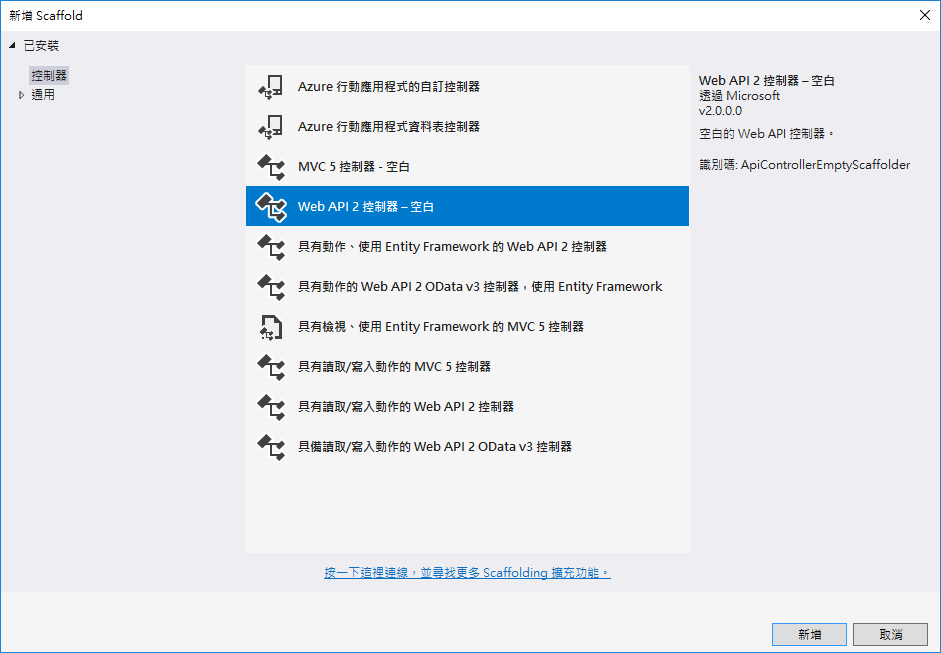
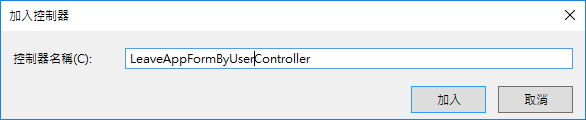
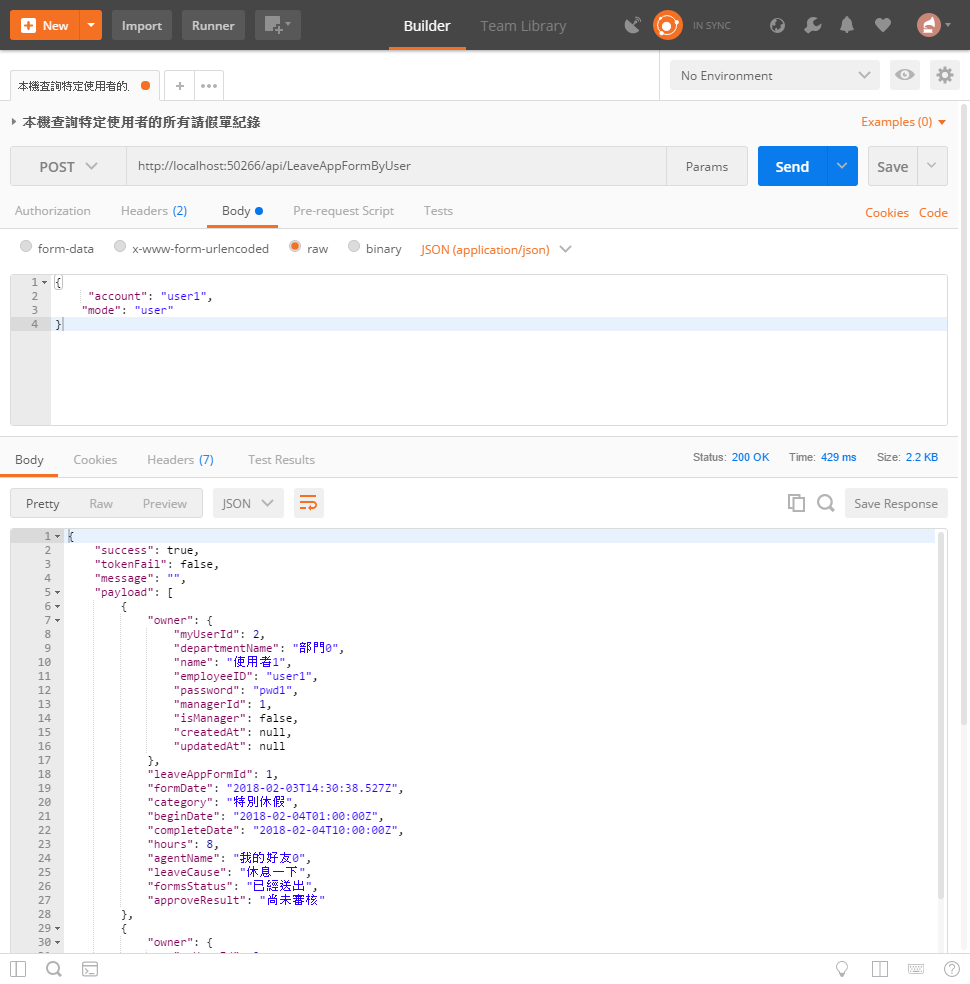
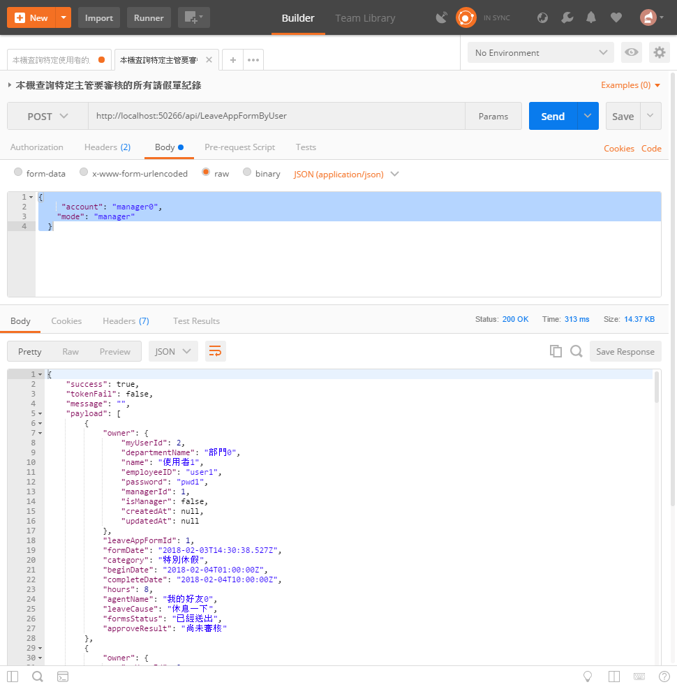

# Backend11 依照使用者身分查詢請假單 API

 這份文件的完成結果專案原始碼，可以參考 `XamarinLOBForms\1AzureLabs\11LeaveAppFormByUser`

由於請假單專案需求中，若一般使用者僅能夠對於自己申請的請假單進行 CRUD 的交易異動，而對於管理者而言，他可以針對該部門的使用者，進行請假單的通過與拒絕審核判定，因此，我們在這裡特別將這個 Web API獨立於另外一個控制器中。若想要取得該部門所有請假單，呼叫這個 Web API的使用者，必須具備管理者的身分。

## 建立依照使用者身分查詢請假單控制器

* 滑鼠右擊 `Controllers` 資料夾，選擇 `加入` > `控制器`

  
  
* 在 `新增 Scaffold` 對話窗中，點選 `Web API 2 控制器 - 空白` > `新增`

* 在 `加入控制器` 對話窗中，輸入 `LeaveAppFormByUser`，如同底下畫面，最後點選 `加入` 按鈕

  

* 新增的類別檔案最上方，加入參考這些命名空間


```csharp
using XamarinLOBFormService.DataObjects;
using XamarinLOBFormService.Models;
```

* 將新增的類別以底下程式碼替換


```csharp
[Microsoft.Azure.Mobile.Server.Config.MobileAppController]
//[Filters.JwtAuth]
public class LeaveAppFormByUserController : ApiController
{
    private XamarinLOBFormContext Context = new XamarinLOBFormContext();
    APIResult fooResult = new APIResult();
 
    // 查詢特定主管要審核或指定使用者的所有請假單紀錄 Post: api/LeaveAppFormByUser
    [HttpPost]
    //public APIResult GetByUserID(string userID, string mode)
    public APIResult Post([FromBody]LeaveAppFormByUserModel leaveAppFormByUserModel)
    {
        var mode = leaveAppFormByUserModel.Mode;
        var userID = leaveAppFormByUserModel.Account;
        if (mode.ToLower() == "manager")
        {
            #region 取得該主管需要審核的請假單
            var fooManageUser = Context.MyUsers.FirstOrDefault(x => x.EmployeeID == userID);
            if (fooManageUser != null)
            {
                #region 檢查該使用者是否為管理者
                if (fooManageUser.IsManager == false)
                {
                    fooResult.Success = false;
                    fooResult.Message = $"這個使用者 {userID} 不具備主管身分";
                    fooResult.TokenFail = false;
                    fooResult.Payload = null;
                    return fooResult;
                }
                #endregion
                var fooItem = Context.LeaveAppForms.Where(x => x.Owner.ManagerId == fooManageUser.MyUserId);
                if (fooItem != null)
                {
                    fooResult.Success = true;
                    fooResult.Message = $"";
                    fooResult.TokenFail = false;
                    fooResult.Payload = fooItem.ToList();
                }
                else
                {
                    fooResult.Success = true;
                    fooResult.Message = $"";
                    fooResult.TokenFail = false;
                    fooResult.Payload = null;
                }
            }
            else
            {
                fooResult.Success = false;
                fooResult.Message = $"找不到指定主管資料";
                fooResult.TokenFail = false;
                fooResult.Payload = null;
            }
            #endregion
        }
        else
        {
            #region 取得特定使用者的所有請假單
            var fooUser = Context.MyUsers.FirstOrDefault(x => x.EmployeeID == userID);
            if (fooUser != null)
            {
                var fooItem = Context.LeaveAppForms.Where(x => x.Owner.MyUserId == fooUser.MyUserId);
                if (fooItem != null)
                {
                    fooResult.Success = true;
                    fooResult.Message = $"";
                    fooResult.TokenFail = false;
                    fooResult.Payload = fooItem.ToList();
                }
                else
                {
                    fooResult.Success = true;
                    fooResult.Message = $"";
                    fooResult.TokenFail = false;
                    fooResult.Payload = null;
                }
            }
            else
            {
                fooResult.Success = false;
                fooResult.Message = $"找不到指定使用者資料";
                fooResult.TokenFail = false;
                fooResult.Payload = null;
            }
            #endregion
        }
        return fooResult;
    }
 
}
```

# 測試此控制器

* 執行此專案

## 測試 查詢非主管身分的使用者之所有請假單

* 打開 PostMan 工具

  * 選擇 Http 方法為 `Post`

  * 輸入 URL 為 `http://localhost:50266/api/LeaveAppFormByUser`

    > 若您自己建立的 Web API 專案，請在這裡輸入您專案的 Port 編號

  * 點選 `Headers` 標籤頁次

  * 輸入這組 Http 標頭
  
    \[Key] 名稱為 `ZUMO-API-VERSION`
    
    \[Value] 值為 `2.0.0`

  * 點選 `Body` 標籤頁次

  * 選擇使用 `raw` / `JSON(application/json)`，並且輸入底下 JSON內容


```json
{
    "account": "user1",
    "mode": "user"
}
```

  * 點選 `Send` 按鈕



* 請確認輸出內容是否與底下內容類似


```json
{
    "success": true,
    "tokenFail": false,
    "message": "",
    "payload": [
        {
            "owner": {
                "myUserId": 2,
                "departmentName": "部門0",
                "name": "使用者1",
                "employeeID": "user1",
                "password": "pwd1",
                "managerId": 1,
                "isManager": false,
                "createdAt": null,
                "updatedAt": null
            },
            "leaveAppFormId": 1,
            "formDate": "2018-02-03T14:30:38.527Z",
            "category": "特別休假",
            "beginDate": "2018-02-04T01:00:00Z",
            "completeDate": "2018-02-04T10:00:00Z",
            "hours": 8,
            "agentName": "我的好友0",
            "leaveCause": "休息一下",
            "formsStatus": "已經送出",
            "approveResult": "尚未審核"
        },
        ...
        {
            "owner": {
                "myUserId": 2,
                "departmentName": "部門0",
                "name": "使用者1",
                "employeeID": "user1",
                "password": "pwd1",
                "managerId": 1,
                "isManager": false,
                "createdAt": null,
                "updatedAt": null
            },
            "leaveAppFormId": 301,
            "formDate": "2018-02-03T14:31:02.273Z",
            "category": "XX",
            "beginDate": "2018-02-03T14:31:02.273Z",
            "completeDate": "2018-02-03T14:31:02.273Z",
            "hours": 8,
            "agentName": "Vulcan",
            "leaveCause": "??",
            "formsStatus": "@@",
            "approveResult": "Wait"
        }
    ]
}
```

## 測試 查詢具有主管身分的使用者之所有請假單

* 打開 PostMan 工具

  * 選擇 Http 方法為 `Post`

  * 輸入 URL 為 `http://localhost:50266/api/LeaveAppFormByUser`

    > 若您自己建立的 Web API 專案，請在這裡輸入您專案的 Port 編號

  * 點選 `Headers` 標籤頁次

  * 輸入這組 Http 標頭
  
    \[Key] 名稱為 `ZUMO-API-VERSION`
    
    \[Value] 值為 `2.0.0`

  * 點選 `Body` 標籤頁次

  * 選擇使用 `raw` / `JSON(application/json)`，並且輸入底下 JSON內容


```json
{
    "account": "manager0",
    "mode": "manager"
}
```

  * 點選 `Send` 按鈕



* 請確認輸出內容是否與底下內容類似


```json
{
    "success": true,
    "tokenFail": false,
    "message": "",
    "payload": [
        {
            "owner": {
                "myUserId": 2,
                "departmentName": "部門0",
                "name": "使用者1",
                "employeeID": "user1",
                "password": "pwd1",
                "managerId": 1,
                "isManager": false,
                "createdAt": null,
                "updatedAt": null
            },
            "leaveAppFormId": 1,
            "formDate": "2018-02-03T14:30:38.527Z",
            "category": "特別休假",
            "beginDate": "2018-02-04T01:00:00Z",
            "completeDate": "2018-02-04T10:00:00Z",
            "hours": 8,
            "agentName": "我的好友0",
            "leaveCause": "休息一下",
            "formsStatus": "已經送出",
            "approveResult": "尚未審核"
        },
        {
            "owner": {
                "myUserId": 3,
                "departmentName": "部門0",
                "name": "使用者2",
                "employeeID": "user2",
                "password": "pwd2",
                "managerId": 1,
                "isManager": false,
                "createdAt": null,
                "updatedAt": null
            },
            "leaveAppFormId": 4,
            "formDate": "2018-02-03T14:30:38.753Z",
            "category": "特別休假",
            "beginDate": "2018-02-04T01:00:00Z",
            "completeDate": "2018-02-04T10:00:00Z",
            "hours": 8,
            "agentName": "我的好友0",
            "leaveCause": "休息一下",
            "formsStatus": "已經送出",
            "approveResult": "尚未審核"
        },
        ...
        {
            "owner": {
                "myUserId": 11,
                "departmentName": "部門0",
                "name": "使用者10",
                "employeeID": "user10",
                "password": "pwd10",
                "managerId": 1,
                "isManager": false,
                "createdAt": null,
                "updatedAt": null
            },
            "leaveAppFormId": 30,
            "formDate": "2018-02-03T14:30:40.397Z",
            "category": "特別休假",
            "beginDate": "2018-02-04T01:00:00Z",
            "completeDate": "2018-02-04T10:00:00Z",
            "hours": 8,
            "agentName": "我的好友2",
            "leaveCause": "休息一下",
            "formsStatus": "已經送出",
            "approveResult": "尚未審核"
        },
    ]
}
```

# 問題研究

 當要取得該部門所有人員的請假單的時候，我們要如何確認呼叫這個 Web API 的使用者，具備了部門管理者權限？而且僅能夠取得自己所屬部門所有請假單？

 若呼叫這個 Web API 的使用者不具備管理者身分，但是在呼叫 Web API 所傳送的參數中，有指定要以管理者身分來查詢，這時，會發生甚麼事情呢？

 每次查詢使用者的所有請單或者該部門待審核的請假單，在這個練習中，都會回傳所有的請假單，我們該如何修改，可以指定條件，回傳我們需要的請假單紀錄呢？


 對於查詢結果需要進行資料記錄排序，我們是要在這伺服器上來處理，還是要在 Xamarin.Forms 上來處理呢？

