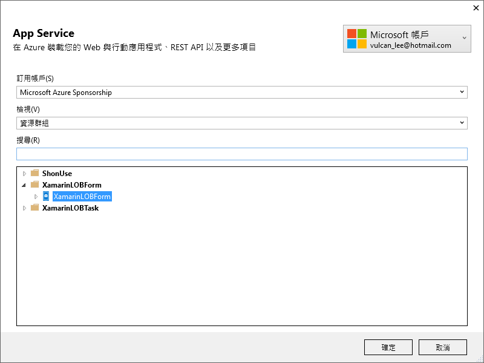
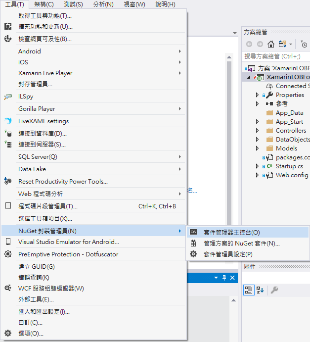
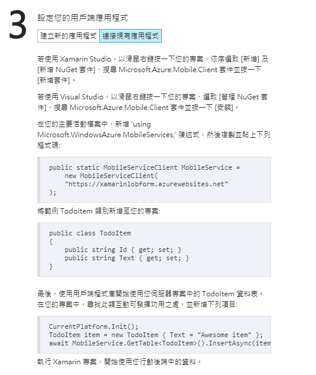

# Backend2 確認 Azure 行動應用程式是正常運作

 這份文件的完成結果專案原始碼，可以參考 `XamarinLOBForms\1AzureLabs\02FirstTime`

接下來，我們需要進行確認剛剛建立的 Azure 行動應用程式 是已經正常且可以運作的；在這裡，我們將會透過 Azure 行動應用程式 所提供的 ASP.NET (後端 Web API) 專案 / Xamarin.Forms (前端 跨平台App) 專案，來實際進行建置、佈署，已進行確認工作。

 若您不是自行從 Azure 行動應用服務網頁上下載下來的　ASP.NET Web API 專案，您可以使用課堂上所提供的專案原始碼壓縮檔案，您可以將在這個 `XamarinLOBForms\1AzureLabs\02FirstTime` 目錄下的檔案，複製到另外一個目錄下，接著，繼續這個後端 ASP.NET Web API 專案開發

##   如何確認本機的 Web API 服務是正常運作的呢?

* 請先執行剛剛下載下來的 Web API 專案

* 在這裡，我們將會使用 PostMan 來做為展示說明，當然，您也可以在 C# 中實際使用這個方法來呼叫。

* 在剛剛開啟的瀏覽器頁面中，我們可以看到這個 Web API 的首頁 URL 是 `http://localhost:50266/`

  >  您所產生的 ASP.NET Web API 專案，所使用的 Port 號碼，可能會與這篇文章的不同，因此，請以您電腦上所看到的 URL 為主

* 請選擇 `Get` 方法，在網址列填入 `http://localhost:50266/tables/todoitem`

  > 其中， `http://localhost:50266/` 是剛剛開啟的瀏覽器頁面中複製下來的網址。

* 在 Header 頁次中，輸入 Key 為 `ZUMO-API-VERSION` / value 為 `2.0.0`

* 點選最右方的 `Send` 藍色按鈕，就可以查詢到這個代辦清單表格內的所有資料。

  

# 測試與佈署到 Azure 上

 

若您不打算佈署到 Azure 行動應用服務上，可以跳過這部分的練

>  不過，若有佈署到 Azure 行動應用程式服務，您所開發的跨平台行動應用程式，就可以直接存取這個 Azure 行動應用程式服務所提供的各種 Web API，而且，也可以直接使用較安全的 Https 加密傳輸服務。

* 在這裡，您可以打開這個 ASP.NET 的專案，建置並確認沒有問題發生

* 滑鼠右擊專案 `XamarinLOBForm`，選擇 `發行`

* 在 `發行` 對話窗，在設定檔中點選 `Microsoft Azure App Service` > `Create Profile` 

  

* 當出現了 `App Service` 對話窗時候，確認右上角使用正確的帳號

  選擇您要發佈會用到的訂用帳戶

  從下方的清單，找到 `XamarinLOBForm` > `XamarinLOBForm`

  點選 `確定` 按鈕

  

* 點選 `確定 按鈕

* 在 `發行` 頁次上，您會看到 `發行` 按鈕，請點選此 `發行` 按鈕。

  

* 從 Visual Studio 2017 的輸出視窗，將會看到底下內容，您可以確定此次發行已經成功了

```
1>------ 已開始建置: 專案: XamarinLOBFormService, 組態: Release Any CPU ------
1>  XamarinLOBFormService -> D:\Vulcan\GitHub\XamarinLOBForms\1AzureLabs\02FirstTime\XamarinLOBFormService\bin\XamarinLOBFormService.dll
2>------ 發行已開始: 專案: XamarinLOBFormService, 組態: Release Any CPU ------
2>已轉換使用 D:\Vulcan\GitHub\XamarinLOBForms\1AzureLabs\02FirstTime\XamarinLOBFormService\Web.Release.config 的 Web.config 成為 obj\Release\TransformWebConfig\transformed\Web.config。
2>自動 ConnectionString 轉換 obj\Release\TransformWebConfig\transformed\Web.config 成為 obj\Release\CSAutoParameterize\transformed\Web.config。
2>正在複製所有檔案至以下暫存位置以進行封裝/發行:
2>obj\Release\Package\PackageTmp。
2>啟動 Web Deploy 發行應用程式/封裝至 https://xamarinlobform.scm.azurewebsites.net/msdeploy.axd?site=XamarinLOBForm ...
2>正在新增目錄 (XamarinLOBForm\bin)。
2>正在新增目錄 (XamarinLOBForm\bin\de)。

...

2>正在新增檔案 (XamarinLOBForm\Web.config)。
2>Adding ACLs for path (XamarinLOBForm)
2>Adding ACLs for path (XamarinLOBForm)
2>已成功發行。
2>已成功發佈 Web 應用程式 http://xamarinlobform.azurewebsites.net/
========== 建置: 1 成功、0 失敗、0 最新、0 略過 ==========
========== 發行: 1 成功、0 失敗、0 略過 ==========
```

* 此時，您將會看到這個網頁 [xamarinlobform.azurewebsites.net](xamarinlobform.azurewebsites.net) 在瀏覽器開啟了，這表示，您在 Azure 主機上的網址。

  

* 打開您的 PostMan App 

* 請選擇 `Get` 方法，在網址列填入 `http://xamarinlobform.azurewebsites.net/tables/todoitem`

  > 其中， `http://xamarinlobform.azurewebsites.net/` 是剛剛開啟的瀏覽器頁面中複製下來的網址。

  >  當然，您也可以使用 `https://xamarinlobform.azurewebsites.net/tables/todoitem` 來呼叫遠端 Web API

* 在 Header 頁次中，輸入 Key 為 `ZUMO-API-VERSION` / value 為 `2.0.0`

   這個 Http 標頭 (Header) 一定在設定在 Postman 內，否則，就無法順利完成 Web API 呼叫。

* 點選最右方的 `Send` 藍色按鈕，就可以查詢到這個代辦清單表格內的所有資料。

* 若您看到底下畫面，那就表示您的 Azuer 上的 Web API 服務，透過後端 SQL Server 成功取得了這些工作資料

  

##  修正 Code First Migration 轉移設定

由於這個產生的 ASP.NET 專案，採用的是 Entity Framework Code First 開發技術，因此，我們需要針對這個專案做些修正，也就是要進行 `Code First Migrations` 的動作；相關更詳細的說明，可以參考 [How to make data model changes to a .NET backend mobile service](https://github.com/Azure/azure-mobile-services/blob/master/docs/mobile-services-dotnet-backend-how-to-use-code-first-migrations.md) 這篇文章。

* 請在 ASP.NET Web API 專案內，選擇功能表 `Tools` > `NuGet 封裝管理員` > `套件管理器主控台`

  

* 在 `套件管理器主控台` 內，輸入 `Enable-Migrations`，這樣，便可以開啟您專案的 Code First Migrations 能力。

   

* 一旦執行完成之後，您就會在 `套件管理器主控台` 內看到底下的訊息文字

```
Checking if the context targets an existing database...
Detected database created with a database initializer. Scaffolded migration '201801281619240_InitialCreate' corresponding to existing database. To use an automatic migration instead, delete the Migrations folder and re-run Enable-Migrations specifying the -EnableAutomaticMigrations parameter.
Code First Migrations enabled for project XamarinLOBFormService.
```

* 接著，請在 `套件管理器主控台` 內，輸入 `Add-Migration Initial` 命令，這樣將會產生一個新的名為 Initial 的 Migration，而在您的專案內，將會有個 `Migrations` 目錄自動產生出來。

   

* 一旦執行完成之後，您就會在 `套件管理器主控台` 內看到底下的訊息文字

```
Scaffolding migration 'Initial'.
The Designer Code for this migration file includes a snapshot of your current Code First model. This snapshot is used to calculate the changes to your model when you scaffold the next migration. If you make additional changes to your model that you want to include in this migration, then you can re-scaffold it by running 'Add-Migration Initial' again.
```

* 最後，請在 `套件管理器主控台` 內，輸入 `Update-Database` 並且按下 Enter 執行這個命令

  底下是執行輸出內容

```
Specify the '-Verbose' flag to view the SQL statements being applied to the target database.
Applying explicit migrations: [201801281648059_Initial].
Applying explicit migration: 201801281648059_Initial.
Running Seed method.
```

  > 相關進階使用說明，可以參考文件 [Package Manager Console (Visual Studio)](https://docs.microsoft.com/en-us/ef/core/miscellaneous/cli/powershell)

* 請在 ASP.NET Web API 專案 `XamarinLOBForm` 下的目錄 `App_Start` 找到 `Startup.MobileApp.cs` 檔案，開啟它。
* 找到 `Database.SetInitializer(new XamarinLOBFormInitializer());` 這行程式碼，將其註解起來。

* 在剛剛註解起來的程式碼下方，加入底下程式碼：

 

```csharp
#region 這裡是自行修正的程式碼
// Use Entity Framework Code First to create database tables based on your DbContext
// 請註解底下這行程式碼，因為，我們要使用接下來的兩行程式碼來取代
//Database.SetInitializer(new XamarinLOBFormInitializer());
 
var migrator = new System.Data.Entity.Migrations.DbMigrator(new Migrations.Configuration());
migrator.Update();
#endregion
```

* 進行 `DbMigrator` 的錯誤修正，加入適當的命名空間 `using System.Data.Entity.Migrations;`

* 按下 `F5` 開始在本機執行這個專案，看看是否可以正常在本機上執行，接著，使用剛剛設定的本機 PostMan 測試項目，測試看看 API 是否一樣可以正常運作。

* 若沒有問題，滑鼠右擊專案 `XamarinLOBForm`，選擇 `發行` 項目
  
  
  
  在 `發行` 對話窗中，點選 `設定` 連結文字
  
  切換到 `設定` 標籤頁次，請勾選 `執行 Code First 轉移 (在應用程式啟動時執行)` 檢查盒選項。

  接著，點選 `儲存` 按鈕

  當回到 `發行` 對話窗後，選擇 `發行` 按鈕

  

* 請確認是否可以正常在 Azure 雲端主機上執行，接著，使用剛剛設定的雲端 PostMan 測試項目，測試看看 API 是否一樣可以正常運作。

# 下載 Xamarin.Forms 用戶端專案

* 您可以接續上一個步驟繼續接下來的動作，或者，先回到 Azure 儀表板首頁，找到 `xamarinlobform 行動 APP` 圖示，點選這個圖示；接著，從 `XamarinLOBForm App Service` 刀鋒視窗中，點選 `快速入門` > `Xamarin.Forms`

* 現在，您應該可以看到如下圖的內容，，請在 `3.設定您的用戶端應用程式` 區塊來進行操作
  
  請點選 `下載` 按鈕，下載 Xamarin.Forms 專案檔案

  

* 下載該 Xamarin.Forms 專案原始碼專案之後，請解壓縮到您電腦中的目錄內。

* 若您點選了 `連接現有應用程式` 則會出現底下內容，告訴您如何在您現有的專案中，加入 `Microsoft.Azure.Mobile.Client` 並且經建立適當程式碼，就可以存取您的 Azure 行動應用程式 後端服務了。

  

# 測試 Xamarin.Forms 專案

 

若您不打算佈署到 Azure 行動應用服務上，可以跳過這部分的練習

* 在這裡，您可以打開這個 ASP.NET 的專案，建置並確認沒有問題發生

在這裡需要實際執行與測試 Azure 行動應用程式 所提供的 Xamarin.Forms 專案，看看是否可以正常連線到 Azure 上。
  
* 請打開您剛剛下載的 Xamarin.Forms 專案，使用 Visual Studio 2017 打開 `XamarinLOBForm.sln` 檔案。 

* 滑鼠右擊 Android 原生專案 ( `XamarinLOBForm.Droid` )，選擇，`設定為起始專案`

* 在 Android 原生專案內找到檔案 `project.json`，將其中內容

  `"MonoAndroid,Version=v7.1"`

  修改成為

  `"MonoAndroid,Version=v8.0"`

* 按下 `F5` 開始進行這個 Xamarin.Forms 專案偵測

* 此時，您可以在電腦中的 Android 模擬器中，這個應用程式實際執行結果，如同看到底下畫面

    

* 您也可以實際在 `Item name` 欄位中輸入代辦工作事項名稱，接著點選右方 ` + ` 按鈕，此時，這筆紀錄就會儲存到遠端 Azure SQL Server 上了

# 已經確認 Azure 行動應用程式 行動應用服務是正常運作

 恭喜您，經過這個練習，您已經後端 ASP.NET 專案佈署到 Azure 主機上，並且使用 Azure 所提供的 Xamarin.Forms 專案與 PostMan 確認過在 Azure 主機上的 Web API 服務，是可以正常運作。

接下來的練習，就是我們要把這個後端 ASP.NET 專案進行擴充與客製化，以便我們之後開發的 Xamarin.Forms 專案可以使用這些 Web API 服務。

# 問題研究

 這個課程有教導如何開發與除錯 Web API 嗎？

 什麼是 Postman，我要從哪裡下載這個工具？

> [https://www.getpostman.com/](https://www.getpostman.com/)

 為何我無法直接將 Web API 的 URL 輸入到瀏覽器位置列上，看到回傳結果呢?

 這個練習會進行許多 Web API 的測試，有沒有已經定義好的 Postman 設定環境可以直接使用呢？

 為什麼要做 `修正 Code First Migration 轉移設定`，不做這個動作可以嗎？

 我可以不要使用 Code First 方式來進行 Web API 開發嗎？

 這份文件操作過程中有註解掉一行程式碼：`Database.SetInitializer(new XamarinLOBFormInitializer());`，我不要註解這行程式碼可以嗎？

 在 `下載 Xamarin.Forms 用戶端專案` 小節中提到的 Xamarin.Forms 專案，裡面做了哪些事情呢？

