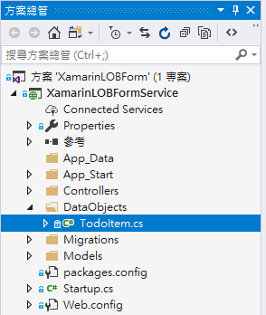
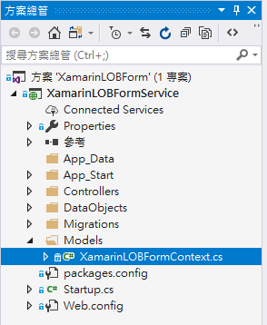

# Backend3 檢視 Azure 行動應用程式提供的後端專案

在這個練習中，對於後端 Web API 服務，我們將會使用剛剛下載的後端專案，進行擴建，因此，您需要先了解 ASP.NET 的專案架構與內容，等下才能夠進行擴建。

在這裡，我們先來了解看看，Azure 提供的 ASP.NET 後台專案，了解要如何在 ASP.NET 專案中，存取 Azure 行動應用程式。

首先，請先使用 Visual Studio 2017，打開剛剛下載的 ASP.NET 後端專案 

* 請開啟這個檔案 `XamarinLOBForm.sln`

* 接下來，我們來大致了解一下這個專案的主要成員

# 資料模型 (Data Model)

在這個下載的範例專案中，使用的是 Entity Framework 的 Code First 方式開發，若有新的資料表要加入到這個專案內，請在 `DataObjects` 資料夾內加入一個資料模型類別。

底下是剛剛操作的代辦事項應用程式的所用到的資料 `TodoItem`



從這裡我們看到，若要能夠透過 Azure 行動應用程式 架構，存取 SQL 資料庫的資料，您所定義的資料表類別，需要繼承 `EntityData` 這個類別。


```csharp
using Microsoft.Azure.Mobile.Server;
 
namespace XamarinLOBFormService.DataObjects
{
    public class TodoItem : EntityData
    {
        public string Text { get; set; }
 
        public bool Complete { get; set; }
    }
}
```

我們看到每個我們要定義的資料模型，都會繼承了 `EntityData` 這個類別，底下為這個類別的定義。


```csharp
public abstract class EntityData : ITableData
{
    protected EntityData();
 
    [System.ComponentModel.DataAnnotations.KeyAttribute]
    [TableColumn(TableColumnType.Id)]
    public string Id { get; set; }
    [TableColumn(TableColumnType.Version)]
    [System.ComponentModel.DataAnnotations.TimestampAttribute]
    public byte[] Version { get; set; }
    [System.ComponentModel.DataAnnotations.Schema.DatabaseGeneratedAttribute]
    [Index(IsClustered = true)]
    [TableColumn(TableColumnType.CreatedAt)]
    public DateTimeOffset? CreatedAt { get; set; }
    [System.ComponentModel.DataAnnotations.Schema.DatabaseGeneratedAttribute]
    [TableColumn(TableColumnType.UpdatedAt)]
    public DateTimeOffset? UpdatedAt { get; set; }
    [TableColumn(TableColumnType.Deleted)]
    public bool Deleted { get; set; }
}
```

# 使用 DbContext 增加一個新的資料表

在 ASP.NET 中，若要增加一個資料表，您需要打開 `Models`  資料夾的 `XamarinLOBFormContext.cs` 檔案，使用底下方法，宣告 CLR 屬性，並且在 `DbSet` 泛型中，指定您的資料表的每個欄位定義。




```csharp
public DbSet<TodoItem> TodoItems { get; set; }
```

當要在 Web API 中進行資料庫存取的時候，可以透過 `XamarinLOBFormContext` 物件，來取得特定資料表的紀錄，例如，底下程式碼將會取得 UserTasks 這個資料表中的特定使用者之未完成的工作紀錄出來。


```csharp
private XamarinLOBFormContext db = new XamarinLOBFormContext();

public async Task<ActionResult> Index(string account)
{
  // 查詢該使用的未完成工作有哪些
  var fooToday =new DateTime(1900,1,1).Date;
  eturn View(await db.UserTasks
    .Where(x=>DbFunctions
    .TruncateTime(x.ReportedDatetime) == fooToday
    && x.Account == account).ToListAsync());
}
```

# 建立一個 Web API 服務

若要產生一個新的 Web API 服務，您可以在 `Controllers` 資料夾內，繼承 `ApiController`來建立一個可供 Xamarin.Forms 呼叫的 Web API 服務。這部分的工作，可以透過 Visual Studio 的專案樣板精靈來完成。

# 同步更新資料庫結構

每次資料表或者欄位有異動的時候，我們需要執行 `add-migration` 與 `Update-Database` 命令，並且當佈署到 Azure 後端的時候，會同步更新資料庫的 Schema 結構。

# 問題研究

 我們之後建立的資料表類別，會繼承 `EntityData` 類別嗎？

 `add-migration` 與 `Update-Database` 命令運作原理是甚麼？有甚麼文件可以進一步了解嗎？


