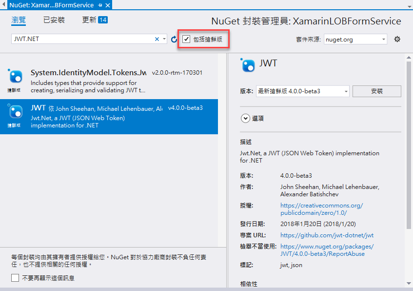
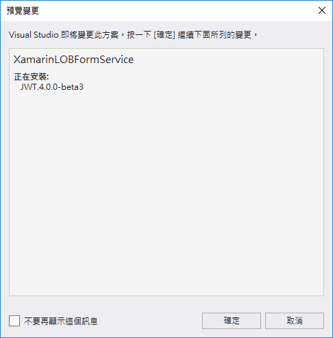
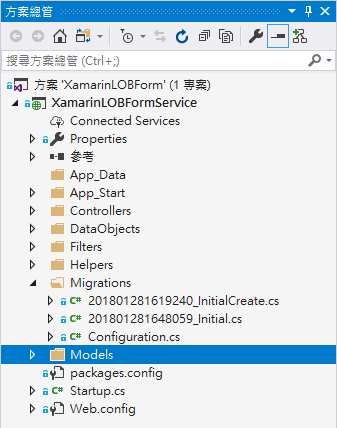
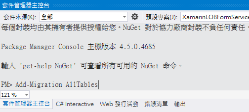
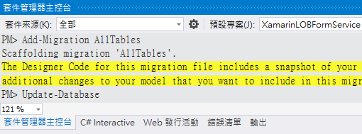
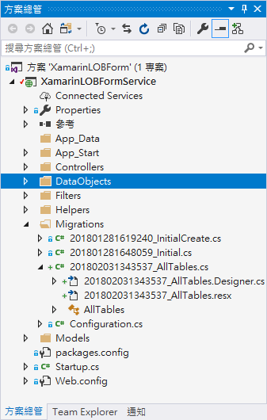

# Backend4 建立 Web API 專案需要用到的類別與資料模型

 這份文件的完成結果專案原始碼，可以參考 `XamarinLOBForms\1AzureLabs\04Preparation`

我們需要在 ASP.NET Web API 專案內，建立 Code First 需要用到的資料模型，與相關支援類別，以便之後我們可以設計出具有 CRUD 的 Web API 服務。

首先，請先使用 Visual Studio 2017，打開剛剛下載的 ASP.NET 後端專案 

* 請開啟這個檔案 `XamarinLOBForm.sln`

# 安裝第三方 NuGet 套件

在這裡，我們需要安裝 NuGet 套件會來產生 JWT 存取權杖。

## 安裝 JWT.NET 套件

* 滑鼠右擊 \[參考] 專案節點，選擇 \[管理 NuGet 套件]

* 在 \[NuGet: AuthToken] 視窗中，點選 \[瀏覽] 標籤頁次

* 在 \[搜尋] 文字輸入盒內，輸入 `JWT.NET`，搜尋這個套件

* 勾選 \[包含搶鮮版] 檢查盒，安裝 4.0 以上的版本


 


# 建立 Entity Framework 的 Code First 會用到的資料模型 (Data Model)

## 使用者 資料表

* 滑鼠右擊資料夾 `DataObjects`，選擇 `加入` > `類別`

* 在 `新增項目 XamarinLOBFormService` 對話窗的 `名稱` 欄位，輸入 `MyUser`

* 點選 `新增` 按鈕，建立這個類別

* 將新增的類別以底下程式碼替換


```csharp
/// <summary>
/// 使用者
/// </summary>
public class MyUser 
{
    public int MyUserId { get; set; }
    public string DepartmentName { get; set; }
    public string Name { get; set; }
    public string EmployeeID { get; set; }
    public string Password { get; set; }
    //public MyUser Manager { get; set; }
    public int ManagerId { get; set; }
    public bool IsManager { get; set; }
    public DateTimeOffset? CreatedAt { get; set; }
    public DateTimeOffset? UpdatedAt { get; set; }
}
```

## 工作日誌的專案 資料表

* 滑鼠右擊資料夾 `DataObjects`，選擇 `加入` > `類別`

* 在 `新增項目 XamarinLOBFormService` 對話窗的 `名稱` 欄位，輸入 `Project`

* 點選 `新增` 按鈕，建立這個類別

* 將新增的類別以底下程式碼替換


```csharp
/// <summary>
/// 專案名稱
/// </summary>
public class Project
{
    public int ProjectId { get; set; }
    public string ProjectName { get; set; }
}
```

## 請假類別 資料表

* 滑鼠右擊資料夾 `DataObjects`，選擇 `加入` > `類別`

* 在 `新增項目 XamarinLOBFormService` 對話窗的 `名稱` 欄位，輸入 `LeaveCategory`

* 點選 `新增` 按鈕，建立這個類別

* 將新增的類別以底下程式碼替換


```csharp
/// <summary>
/// 請假類別
/// </summary>
public class LeaveCategory
{
    public int LeaveCategoryId { get; set; }
    public int SortingOrder { get; set; }
    public string LeaveCategoryName { get; set; }
}
```

## 公司緊急連絡方式 資料表

* 滑鼠右擊資料夾 `DataObjects`，選擇 `加入` > `類別`

* 在 `新增項目 XamarinLOBFormService` 對話窗的 `名稱` 欄位，輸入 `OnCallPhone`

* 點選 `新增` 按鈕，建立這個類別

* 將新增的類別以底下程式碼替換


```csharp
/// <summary>
/// 公司緊急連絡方式
/// </summary>
public class OnCallPhone
{
    public int OnCallPhoneId { get; set; }
    public int SortingOrder { get; set; }
    public string Title { get; set; }
    public string PhoneNumber { get; set; }
}
```

## 工作日誌 資料表

* 滑鼠右擊資料夾 `DataObjects`，選擇 `加入` > `類別`

* 在 `新增項目 XamarinLOBFormService` 對話窗的 `名稱` 欄位，輸入 `WorkingLog`

* 點選 `新增` 按鈕，建立這個類別

* 將新增的類別以底下程式碼替換


```csharp
/// <summary>
/// 工作日誌
/// </summary>
public class WorkingLog
{
    public int WorkingLogId { get; set; }
    public MyUser Owner { get; set; }
    public DateTime LogDate { get; set; }
    public double Hours { get; set; }
    public virtual Project Project { get; set; }
    public string Title { get; set; }
    public string Summary { get; set; }
}
```

## 請假單 資料表

* 滑鼠右擊資料夾 `DataObjects`，選擇 `加入` > `類別`

* 在 `新增項目 XamarinLOBFormService` 對話窗的 `名稱` 欄位，輸入 `LeaveAppForm`

* 點選 `新增` 按鈕，建立這個類別

* 將新增的類別以底下程式碼替換


```csharp
/// <summary>
/// 請假單
/// </summary>
public class LeaveAppForm
{
    public int LeaveAppFormId { get; set; }
    public virtual MyUser Owner { get; set; }
    //public int OwnerId { get; set; }
    public DateTime FormDate { get; set; }
    public string Category { get; set; }
    public DateTime BeginDate { get; set; }
    public DateTime CompleteDate { get; set; }
    public double Hours { get; set; }
    public string AgentName { get; set; }
    public string LeaveCause { get; set; }
    public string FormsStatus { get; set; }
    public string ApproveResult { get; set; }
}
```

# 建立需要的 API 資料模型

## 建立 APIResult 類別

* 滑鼠右擊資料夾 `Models`，選擇 `加入` > `類別`

* 在 `新增項目 XamarinLOBFormService` 對話窗的 `名稱` 欄位，輸入 `APIResult`

* 點選 `新增` 按鈕，建立這個類別

* 將新增的類別以底下程式碼替換


```csharp
/// <summary>
/// 呼叫 API 回傳的制式格式
/// </summary>
public class APIResult
{
    /// <summary>
    /// 此次呼叫 API 是否成功
    /// </summary>
    public bool Success { get; set; } = true;
    /// <summary>
    /// 此次呼叫的存取權杖是否正確
    /// </summary>
    public bool TokenFail { get; set; } = false;
    /// <summary>
    /// 呼叫 API 失敗的錯誤訊息
    /// </summary>
    public string Message { get; set; } = "";
    /// <summary>
    /// 呼叫此API所得到的其他內容
    /// </summary>
    public object Payload { get; set; }
}
```

## 建立 UserLoginModel 類別

* 滑鼠右擊資料夾 `Models`，選擇 `加入` > `類別`

* 在 `新增項目 XamarinLOBFormService` 對話窗的 `名稱` 欄位，輸入 `UserLoginModel`

* 點選 `新增` 按鈕，建立這個類別

* 將新增的類別以底下程式碼替換


```csharp
public class UserLoginModel
{
    public string Account { get; set; } = "";
    public string Password { get; set; } = "";
}
```

## 建立 UserLoginResultModel 類別

* 滑鼠右擊資料夾 `Models`，選擇 `加入` > `類別`

* 在 `新增項目 XamarinLOBFormService` 對話窗的 `名稱` 欄位，輸入 `UserLoginResultModel`

* 點選 `新增` 按鈕，建立這個類別

* 新增的類別檔案最上方，加入參考這些命名空間


```csharp
using XamarinLOBFormService.DataObjects;
```

* 將新增的類別以底下程式碼替換


```csharp
public class UserLoginResultModel
{
    public string AccessToken { get; set; } = "";
    public MyUser MyUser { get; set; }
}
```

## 建立 LeaveAppFormByUserModel 類別

* 滑鼠右擊資料夾 `Models`，選擇 `加入` > `類別`

* 在 `新增項目 XamarinLOBFormService` 對話窗的 `名稱` 欄位，輸入 `LeaveAppFormByUserModel`

* 點選 `新增` 按鈕，建立這個類別

* 將新增的類別以底下程式碼替換


```csharp
public class LeaveAppFormByUserModel
{
    public string Account { get; set; } = "";
    public string Mode { get; set; } = "";
}
```

# 宣告 DbSet 以建立資料表對應

* 在 `Models` 資料夾下，找到檔案 `XamarinLOBFormContext.cs`，打開這個檔案

* 在程式碼 `public DbSet<TodoItem> TodoItems { get; set; }` 前面，加入底下程式碼


```csharp
public DbSet<MyUser> MyUsers { get; set; }
public DbSet<LeaveCategory> LeaveCategories { get; set; }
public DbSet<LeaveAppForm> LeaveAppForms { get; set; }
public DbSet<Project> Projects { get; set; }
public DbSet<WorkingLog> WorkingLogs { get; set; }
public DbSet<OnCallPhone> OnCallPhones { get; set; }
```

# 建立支援字串常數與 Http 動作過濾類別

* 滑鼠右擊專案 `XamarinLOBFormService`，選擇 `加入` > `新增資料夾`

* 輸入 `Helpers`

* 滑鼠右擊專案 `XamarinLOBFormService`，選擇 `加入` > `新增資料夾`

* 輸入 `Filters`

* 滑鼠右擊資料夾 `Helpers`，選擇 `加入` > `類別`

* 在 `新增項目 XamarinLOBFormService` 對話窗的 `名稱` 欄位，輸入 `MainHelper`

* 點選 `新增` 按鈕，建立這個類別

* 將新增的類別以底下程式碼替換


```csharp
public class MainHelper
{
    public const string SecretKey = "GQDstcKsx0NHjPOuXOYg5MbeJ1XT0uFiwDVvVBrk";
}
```

* 滑鼠右擊資料夾 `DataObjects`，選擇 `加入` > `類別`

* 在 `新增項目 XamarinLOBFormService` 對話窗的 `名稱` 欄位，輸入 `JwtAuthAttribute`

* 點選 `新增` 按鈕，建立這個類別

* 新增的類別檔案最上方，加入參考這些命名空間


```csharp
using JWT;
using JWT.Algorithms;
using JWT.Builder;
using System.Net;
using System.Net.Http;
using System.Net.Http.Formatting;
using System.Security.Principal;
using System.Web.Http;
using System.Web.Http.Controllers;
using XamarinLOBFormService.Helpers;
using XamarinLOBFormService.Models;
```

* 將新增的類別以底下程式碼替換


```csharp
/// <summary>
/// 檢查是否有提供正確、有效的存取權杖之 Http 過濾器屬性
/// </summary>
public class JwtAuthAttribute : AuthorizeAttribute
{
    public string ErrorMessage { get; set; } = "";
    /// <summary>
    /// 當在進行處理身分授權時候，發生了失敗會呼叫的方法
    /// </summary>
    /// <param name="actionContext"></param>
    protected override void HandleUnauthorizedRequest(HttpActionContext actionContext)
    {
        if (string.IsNullOrEmpty(ErrorMessage) == false)
        {
            setErrorResponse(actionContext, ErrorMessage);
        }
        else
        {
            base.HandleUnauthorizedRequest(actionContext);
        }
    }
 
    /// <summary>
    /// 當要呼叫一個動作 Action 的時候，需要進行身分授權作業時候會被執行
    /// </summary>
    /// <param name="actionContext"></param>
    public override void OnAuthorization(HttpActionContext actionContext)
    {
        // TODO: key應該移至config
        if (actionContext.Request.Headers.Authorization == null || actionContext.Request.Headers.Authorization.Scheme != "Bearer")
        {
            setErrorResponse(actionContext, "沒有看到存取權杖錯誤");
        }
        else
        {
            try
            {
                #region 進行存取權杖的解碼
                string secretKey = MainHelper.SecretKey;
                var json = new JwtBuilder()
                    .WithAlgorithm(new HMACSHA256Algorithm())
                    .WithSecret(secretKey)
                    .MustVerifySignature()
                    .Decode<Dictionary<string, object>>(actionContext.Request.Headers.Authorization.Parameter);
                #endregion
 
                #region 將存取權杖所夾帶的內容取出來
                var fooRole = json["role"] as Newtonsoft.Json.Linq.JArray;
                var fooRoleList = fooRole.Select(x => (string)x).ToList<string>();
                #endregion
 
                #region 將存取權杖的夾帶欄位，儲存到 HTTP 要求的屬性
                actionContext.Request.Properties.Add("user", json["iss"] as string);
                actionContext.Request.Properties.Add("manager", (bool)json["manager"] );
                actionContext.Request.Properties.Add("role", fooRoleList);
                #endregion
 
                #region 設定目前 HTTP 要求的安全性資訊
                var fooPrincipal =
                    new GenericPrincipal(new GenericIdentity(json["iss"] as string, "MyPassport"), fooRoleList.ToArray());
                if (HttpContext.Current != null)
                {
                    HttpContext.Current.User = fooPrincipal;
                }
                #endregion
 
                #region 角色權限檢查(檢查控制器或動作之屬性(Attribute上設的 Roles的設定內容)
                if (string.IsNullOrEmpty(Roles) == false)
                {
                    // 是否有找到匹配的角色設定
                    bool fooCheckRoleResult = false;
                    // 切割成為多個角色成員
                    var fooConditionRoles = Roles.Split(',');
                    // 逐一檢查，這個使用用者是否有在這個角色條件中
                    foreach (var item in fooConditionRoles)
                    {
                        var fooInRole = fooPrincipal.IsInRole(item.Trim());
                        if (fooInRole == true)
                        {
                            fooCheckRoleResult = true;
                            break;
                        }
                    }
 
                    if (fooCheckRoleResult == false)
                    {
                        setErrorResponse(actionContext, "無效的角色設定，沒有權限使用這個 API");
                    }
                }
                #endregion
 
            }
            catch (TokenExpiredException)
            {
                setErrorResponse(actionContext, "權杖已經逾期");
            }
            catch (SignatureVerificationException)
            {
                setErrorResponse(actionContext, "權杖似乎不正確，沒有正確的數位簽名");
            }
            catch (Exception ex)
            {
                setErrorResponse(actionContext, $"權杖解析發生異常 : {ex.Message}");
            }
        }
 
        base.OnAuthorization(actionContext);
    }
 
    private void setErrorResponse(HttpActionContext actionContext, string message)
    {
        ErrorMessage = message;
        var response = actionContext.Request.CreateErrorResponse(HttpStatusCode.Unauthorized, message);
        response.Content = new ObjectContent<APIResult>(new APIResult()
        {
            Success = false,
            TokenFail = true,
            Message = ErrorMessage,
            Payload = null
        }, new JsonMediaTypeFormatter());
        actionContext.Response = response;
    }
}
```

# 進行新增資料庫移轉

 在進行 `進行新增資料庫移轉` 請先檢查這個專案的資料庫內有哪些資料表

* 請先建置專案，確認專案可以正常建置成功

* 我們之前有在 `套件管理器主控台` 內，輸入 `Enable-Migrations`，這樣，便可以開啟您專案的 Code First Migrations 能力，現在，我們需要進行這次新加入的資料表類別，進行資料庫轉移。

* 在此之前，`Migrations` 資料夾內的檔案內容如下圖所示

  

* 點選功能表 `工具` > `NuGet封裝管理員` > `套件管理器主控台`

* 在 `套件管理器主控台` 內，輸入 `Add-Migration AllTables`，並按下 \[Enter] 按鍵

  

* 若您看到底下訊息，那表示您成功執行了 Add-Migration 指令

```
Scaffolding migration 'AllTables'.
The Designer Code for this migration file includes a snapshot of your current Code First model. This snapshot is used to calculate the changes to your model when you scaffold the next migration. If you make additional changes to your model that you want to include in this migration, then you can re-scaffold it by running 'Add-Migration AllTables' again.
```

* 在 `套件管理器主控台` 內，請繼續輸入 `Update-Database`，並按下 \[Enter] 按鍵

  

* 完成之後，您應該會看到底下的訊息

```
Scaffolding migration 'AllTables'.
The Designer Code for this migration file includes a snapshot of your current Code First model. This snapshot is used to calculate the changes to your model when you scaffold the next migration. If you make additional changes to your model that you want to include in this migration, then you can re-scaffold it by running 'Add-Migration AllTables' again.
PM> Update-Database
Specify the '-Verbose' flag to view the SQL statements being applied to the target database.
Applying explicit migrations: [201802031343537_AllTables].
Applying explicit migration: 201802031343537_AllTables.
Running Seed method.
```

* 現在，在 `Migrations` 資料夾內的檔案內容如下圖所示

  

 在進行 `進行新增資料庫移轉` 動作之後，請先檢查這個專案的資料庫內資料表有甚麼變化

# 確認該專案可以正常執行

* 請執行這個 Web API 專案，確認可以正常執行無誤

# 問題研究

 在這個練習中，我們安裝了 `JWT.NET 套件`，這個套件存在的目的是甚麼呢？

 甚麼是 JWT？

 為什麼要設計存取權杖 (Access Token) 功能呢？

 每次 DataObjects 內資料模型類別有異動的時候，我們都需要做哪些步驟，才能夠讓資料庫的綱要同步更新呢？

 APIResult 類別存在的目的是甚麼？為什麼要設計這個類別呢？

 甚麼是 `Http 動作過濾` (Action Filter)，我們為什麼需要設計這個類別。

 在 MainHelper 類別中，有個字串常數 SecretKey，這個字串常數的值會用在哪裡，做甚麼用的呢？

 不正確、不正常、不合法的存取權杖，會有哪幾種情況呢？

 如何將存取權杖中取出該使用者的相關屬性資料呢？

 若該存取權杖為正確且有效的，我們要如何將這個存取權杖中的使用者身分或者相關資料，傳送到控制器中的動作方法內使用呢？

 這個 Http 動作過濾器該如何使用呢？

 在 LeaveAppForm 類別中，有宣告一個屬性 `public virtual MyUser Owner { get; set; }` 與 WorkingLog 資料表中宣告的屬性 `public MyUser Owner { get; set; }` 有何不同呢？


