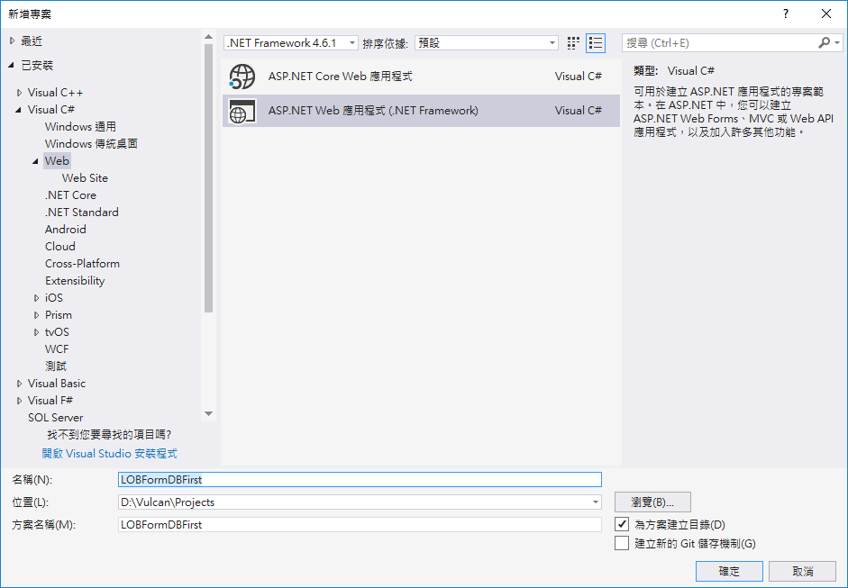
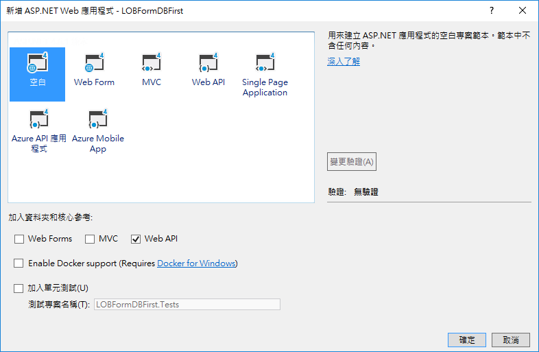
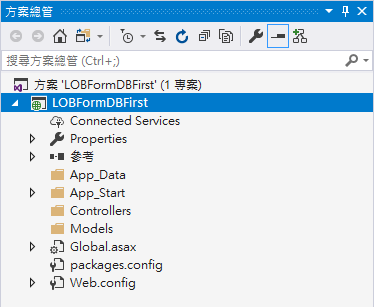

# Backend1 建立 ASP.NET Web API 專案

這一系列教學文章，共計有 14 小節，我們會透過這些文章，帶領大家從無到有的開始進行建置出一個提供 Xamarin.Forms 可以使用的 ASP.NET Web API 專案；在這個 Web API 服務，將會提供企業表單練習的相關服務，其中將會包含了各部門緊急聯絡電話清單、每日工作回報、請假單填寫與申請等服務。

* 首先，開啟 Visual Studio 2017 IDE

* 點選功能表 \[檔案] > \[新增] > \[專案]

* 在 \[新增專案] 對話窗中，點選 \[已安裝] > \[Visual C#] > \[Web] > \[ASP.NET Web 應用程式 (.NET Framework)] 項目

* 在該對話窗的下方之名稱欄位，輸入 LOBFormDBFirst

* 最後點選 \[確定] 按鈕

* 此時會出現 \[新增 ASP.NET Web 應用程式 - LOBFormDBFirst] 對話窗

* 請選擇 \[空白] 選項

* 確認要勾選下方的 \[Web API] 檢查盒

* 在右方的 用來建立 ASP.NET 應用程式的空白專案範本，範本中不含任何內容 文字的下方，請記得要設定驗證模式為 \[無驗證]

* 其他不需要點選的選項，請參考下圖

* 設定完成後，請點選 \[確定] 按鈕

* 如此，我們就可以擁有一個空白的 ASP.NET Web API 專案，當 Visual Studio 2017 建立完成該專案之後，您的 Visual Studio 2017 方案總管，會出現如下圖的結果。

  當然，接下來的工作，我們需要使用 Entity Framework Database First 之 ORM 技術，在這個專案內，提供各種資料庫存取的 REST API。

