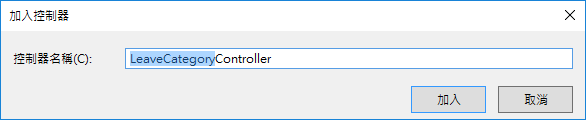

# DBFirst10 建立請假代理人查詢

在這裡，我們將會建立一個控制器，並且只會設計一個 Http GET 動作，這個動作將會回傳請假代理人清單資料。

## 建立請假代理人控制器

* 滑鼠右擊 `Controllers` 資料夾，選擇 `加入` > `控制器`

  

* 在 `新增 Scaffold` 對話窗中，點選 `Web API 2 控制器 - 空白` > `新增`

* 在 `加入控制器` 對話窗中，輸入 `QueryAgent`，如同底下畫面，最後點選 `加入` 按鈕

  

* 新增的類別檔案最上方，加入參考這些命名空間


```csharp
using LOBFormDBFirst.Models;
using System.Data.Entity;
using System.Threading.Tasks;
```

* 將新增的類別以底下程式碼替換


```csharp
#if !DEBUG
    [Filters.JwtAuth]
#endif
    public class QueryAgentController : ApiController
    {
        private LOBFormEntities db = new LOBFormEntities();
        private APIResult fooResult = new APIResult();

        public async Task<APIResult> Post([FromBody] LAFAgentQuery lafAgentQuery)
        {
            IEnumerable<MyUser> fooList;
            if (string.IsNullOrEmpty(lafAgentQuery.DepartmentName))
            {
                if (string.IsNullOrEmpty(lafAgentQuery.Name))
                {
                    await db.LOBMyUsers.ToListAsync();
                    fooList = (await db.LOBMyUsers.ToListAsync()).Select(x => x.ToMyUsers());
                }
                else
                {
                    fooList = (await (db.LOBMyUsers.Where(x => x.Name.Contains(lafAgentQuery.Name)))
                        .ToListAsync()).Select(x => x.ToMyUsers());
                }
            }
            else
            {
                if (string.IsNullOrEmpty(lafAgentQuery.Name))
                {
                    fooList = (await (db.LOBMyUsers.Where(x => x.DepartmentName == lafAgentQuery.DepartmentName))
                        .ToListAsync()).Select(x => x.ToMyUsers());
                }
                else
                {
                    fooList = (await (db.LOBMyUsers.Where(x => x.Name.Contains(lafAgentQuery.Name) && x.DepartmentName == lafAgentQuery.DepartmentName))
                        .ToListAsync()).Select(x => x.ToMyUsers());
                }
            }
            var fooLAFAgentReslutList = new List<LAFAgentReslut>();
            var pp = fooList.ToList();
            foreach (var item in fooList)
            {
                var fooItem = new LAFAgentReslut()
                {
                    DepartmentName = item.DepartmentName,
                    MyUserId = item.MyUserId,
                    Name = item.Name,
                };
                fooLAFAgentReslutList.Add(fooItem);
            }
            fooResult.Success = true;
            fooResult.Message = "";
            fooResult.TokenFail = false;
            fooResult.Payload = fooLAFAgentReslutList;
            return fooResult;
        }

        protected override void Dispose(bool disposing)
        {
            if (disposing)
            {
                db.Dispose();
            }
            base.Dispose(disposing);
        }
    }
```

# 測試此控制器

* 執行此專案

* 打開 PostMan 工具

  * 選擇 Http 方法為 `Post`

  * 輸入 URL 為 `http://localhost:50490/api/QueryAgent`

    > 若您自己建立的 Web API 專案，請在這裡輸入您專案的 Port 編號

  * 點選 `Body` 標籤頁次

  * 選擇使用 `raw` / `JSON(application/json)`，並且輸入底下 JSON內容


```json
{
     "DepartmentName": "部門5",
    "Name": ""
  }
  ```

  * 點選 `Send` 按鈕


* 若輸出底下內容，則表示 `請假代理人` 控制器，已經成功建立完成了


```json
{
    "Success": true,
    "TokenFail": false,
    "Message": "",
    "Payload": [
        {
            "MyUserId": 276,
            "DepartmentName": "部門5",
            "Name": "經理5"
        },
        ...
        {
            "MyUserId": 286,
            "DepartmentName": "部門5",
            "Name": "使用者60"
        }
    ]
}
```
