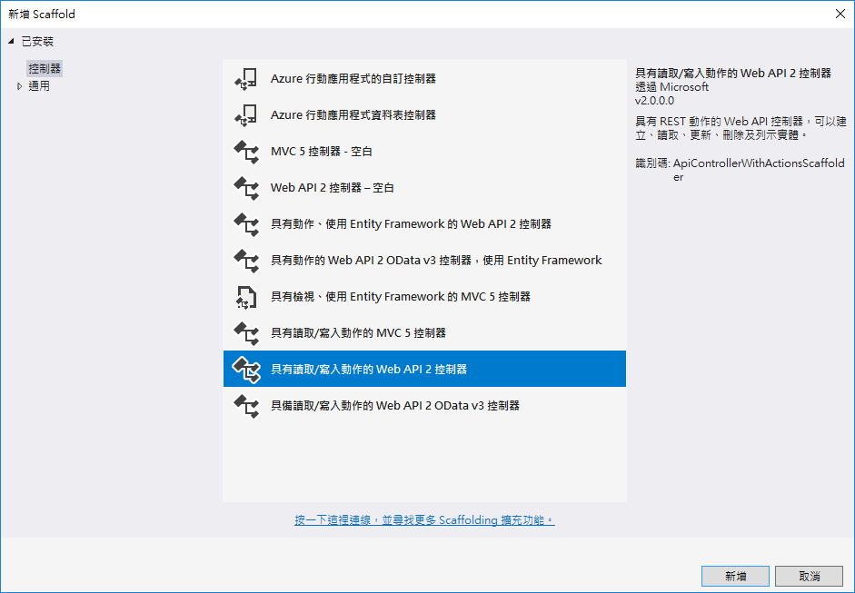
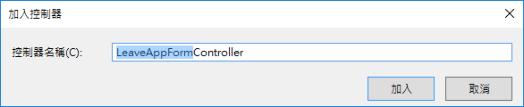
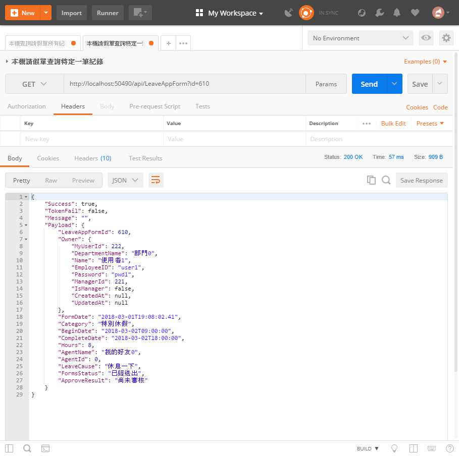
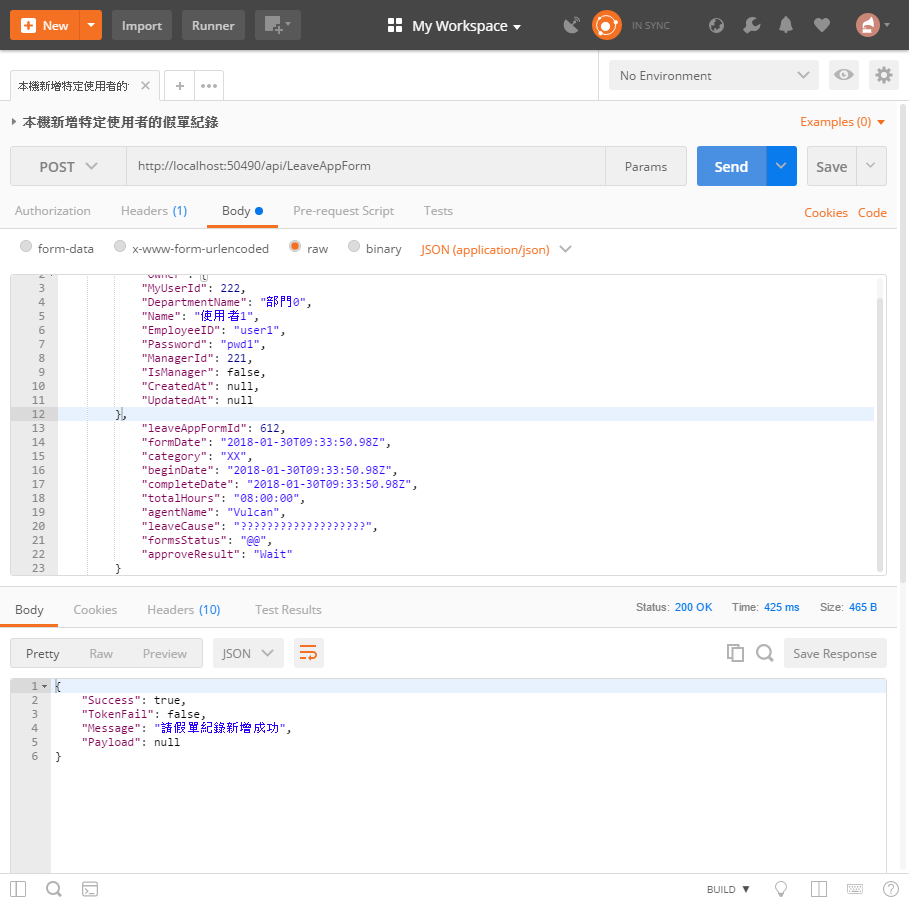
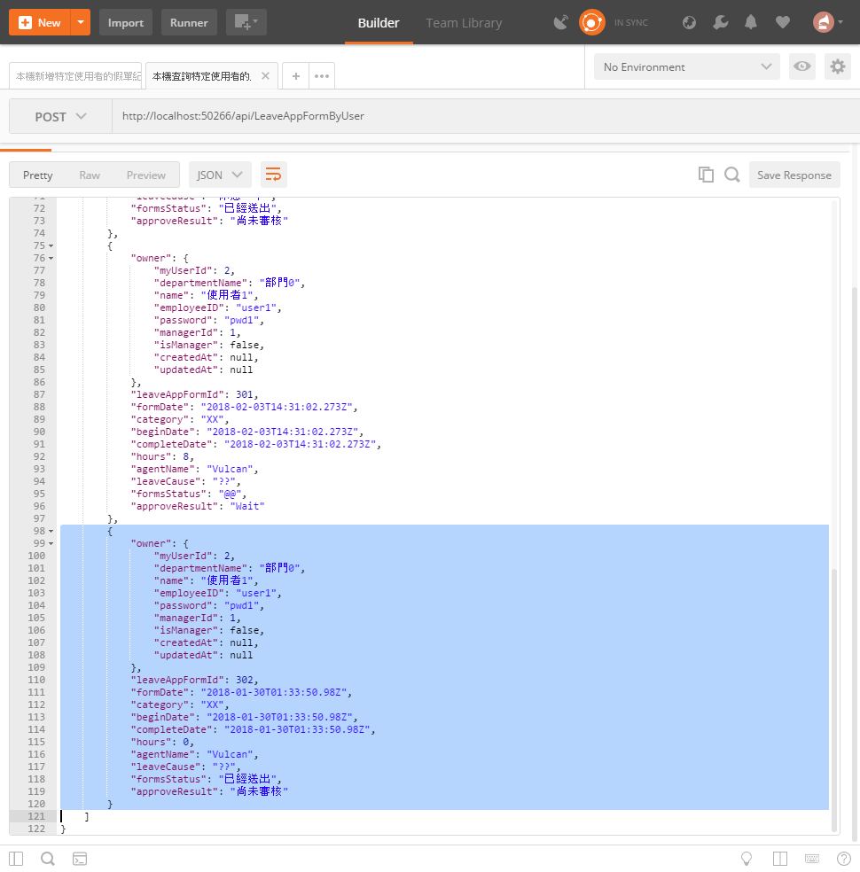
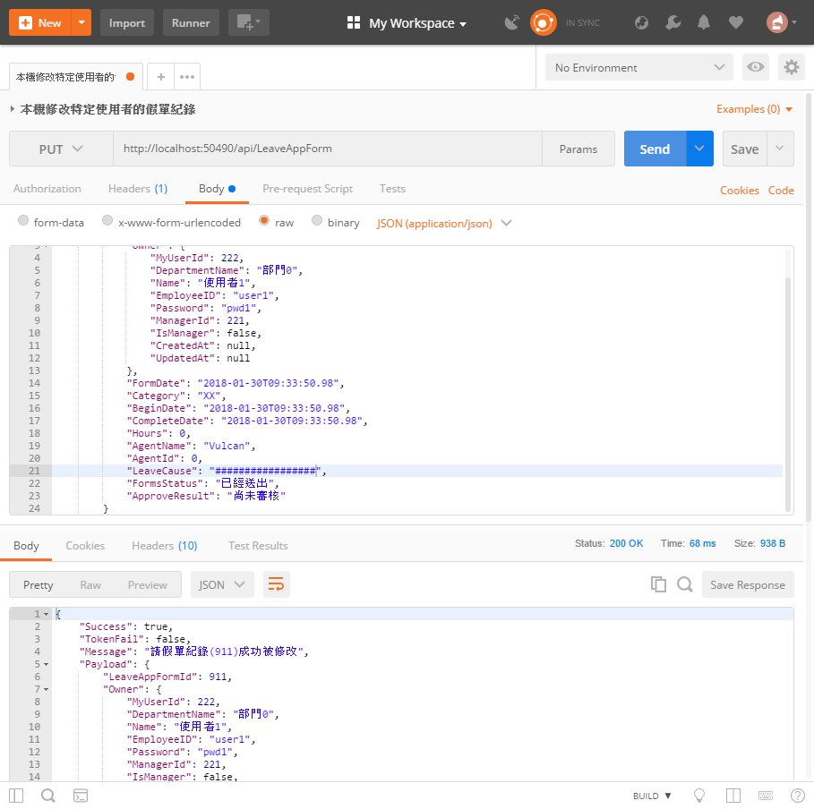
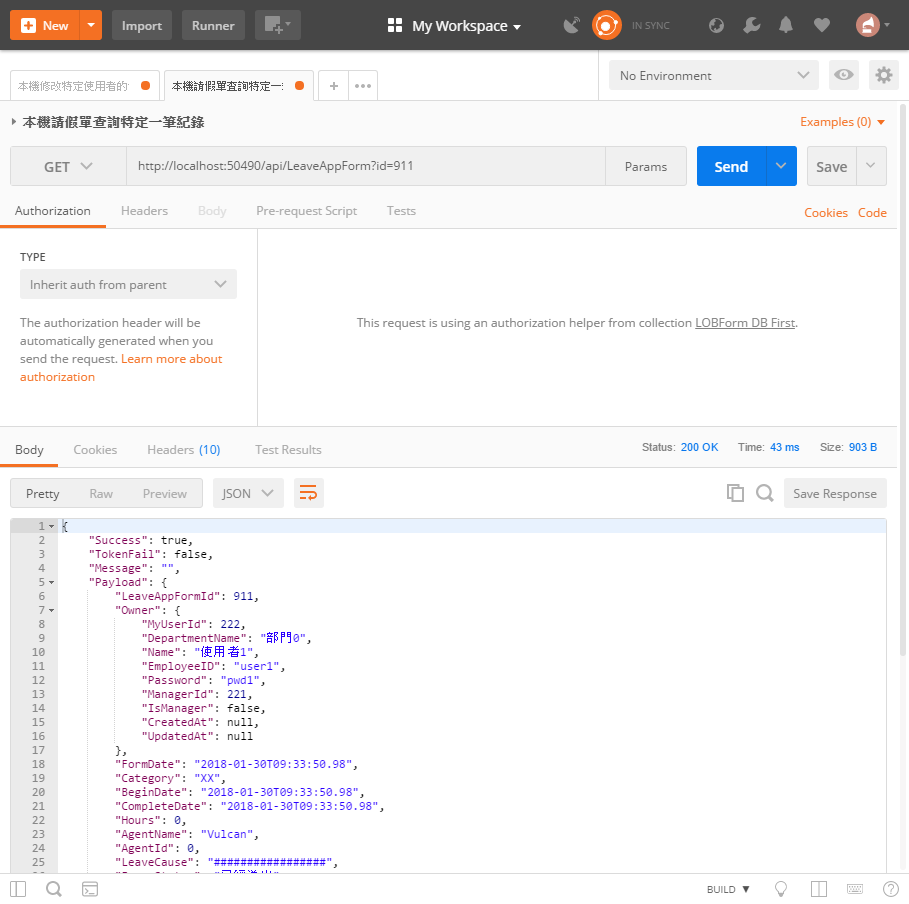
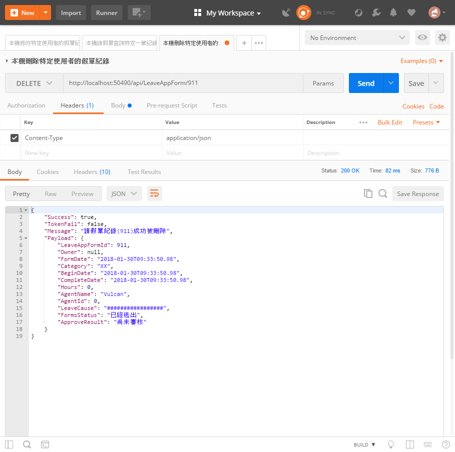
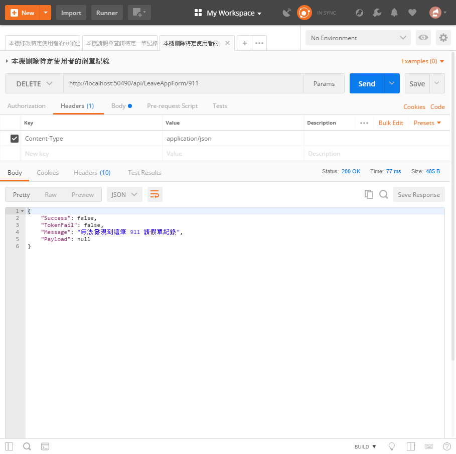
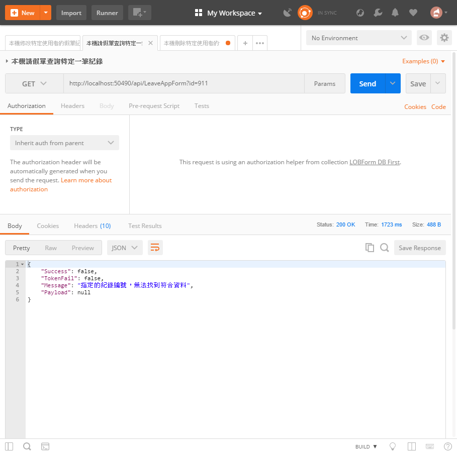

# DBFirst14 建立請假單使用的 CRUD API

這個練習，是我們 Web API 專案開發的最後一個練習，透過這個練習，我們再度來孰悉如何設計一個請假單的 CRUD 應用類型的 Web API 開發。

## 建立請假單控制器

* 滑鼠右擊 `Controllers` 資料夾，選擇 `加入` > `控制器`

  

* 在 `新增 Scaffold` 對話窗中，點選 `具有讀取/寫入動作的 Web API 2 控制器` > `新增`

* 在 `加入控制器` 對話窗中，輸入 `LeaveAppForm`，如同底下畫面，最後點選 `加入` 按鈕

  

* 新增的類別檔案最上方，加入參考這些命名空間


```csharp
using LOBFormDBFirst.Models;
using System.Data.Entity;
using System.Threading.Tasks;
```

* 將新增的類別以底下程式碼替換


```csharp
#if !DEBUG
    [Filters.JwtAuth]
#endif
    [RoutePrefix("api/LeaveAppForm")]
    public class LeaveAppFormController : ApiController
    {
        private LOBFormEntities db = new LOBFormEntities();
        private APIResult fooResult = new APIResult();

        // 取得所有工作日誌資料 GET: api/WorkingLog
        // 取得所有資料 GET: api/LeaveAppForm
        [HttpGet]
        public async Task<APIResult> Get()
        {
            fooResult.Success = true;
            fooResult.Message = $"";
            fooResult.TokenFail = false;
            fooResult.Payload = (await db.LOBLeaveAppForms.ToListAsync()).Select(x => x.ToLeaveAppForm()); ;
            return fooResult;
        }

        // 查詢某筆資料 GET: api/LeaveAppForm/5
        [HttpGet]
        public async Task<APIResult> Get(int id)
        {
            var fooItem = await db.LOBLeaveAppForms.FirstOrDefaultAsync(x => x.LeaveAppFormId == id);
            if (fooItem != null)
            {
                fooResult.Success = true;
                fooResult.Message = $"";
                fooResult.TokenFail = false;
                fooResult.Payload = fooItem.ToLeaveAppForm();
            }
            else
            {
                fooResult.Success = true;
                fooResult.Message = $"";
                fooResult.TokenFail = false;
                fooResult.Payload = null;
            }
            return fooResult;
        }

        // 新增資料 POST: api/LeaveAppForm
        public async Task<APIResult> Post([FromBody]LeaveAppForm value)
        {
            #region 檢查使用者是否存在
            var fooUser = await db.LOBMyUsers.FirstOrDefaultAsync(x => x.EmployeeID == value.Owner.EmployeeID);
            if (fooUser != null)
            {
                #region 產生請假單物件
                var fooLeaveAppFormItem = new LOBLeaveAppForms()
                {
                    AgentName = value.AgentName,
                    BeginDate = value.BeginDate,
                    ApproveResult = "尚未審核",
                    Category = value.Category,
                    CompleteDate = value.CompleteDate,
                    FormDate = value.FormDate,
                    FormsStatus = "已經送出",
                    LeaveCause = value.LeaveCause,
                    LOBMyUsers = fooUser,
                    Hours = value.Hours,
                    AgentId = value.AgentId,
                };
                db.LOBLeaveAppForms.Add(fooLeaveAppFormItem);
                #endregion
                var fooCC = db.SaveChanges();
                if (fooCC > 0)
                {
                    fooResult.Success = true;
                    fooResult.Message = $"請假單紀錄新增成功";
                    fooResult.TokenFail = false;
                    fooResult.Payload = null;
                }
                else
                {
                    fooResult.Success = false;
                    fooResult.Message = $"無法新增到這筆請假單紀錄";
                    fooResult.TokenFail = false;
                    fooResult.Payload = null;
                }
            }
            else
            {
                fooResult.Success = false;
                fooResult.Message = $"這筆請假單紀錄指定的使用者不存在";
                fooResult.TokenFail = false;
                fooResult.Payload = null;
            }
            #endregion
            return fooResult;
        }

        // 修改資料 PUT: api/LeaveAppForm/5
        public async Task<APIResult> Put([FromBody]LeaveAppForm value)
        {
            var fooItem = await db.LOBLeaveAppForms.FirstOrDefaultAsync(x => x.LeaveAppFormId == value.LeaveAppFormId);
            if (fooItem != null)
            {
                #region 更新資料庫上的紀錄
                fooItem.AgentName = value.AgentName;
                fooItem.ApproveResult = value.ApproveResult;
                fooItem.BeginDate = value.BeginDate;
                fooItem.Category = value.Category;
                fooItem.CompleteDate = value.CompleteDate;
                fooItem.FormDate = value.FormDate;
                fooItem.FormsStatus = value.FormsStatus;
                fooItem.LeaveCause = value.LeaveCause;
                //fooItem.Owner = value.Owner;
                fooItem.Hours = value.Hours;
                fooItem.AgentId = value.AgentId;
                #endregion
                var fooCC = db.SaveChanges();
                if (fooCC > 0)
                {
                    fooResult.Success = true;
                    fooResult.Message = $"請假單紀錄({fooItem.LeaveAppFormId})成功被修改";
                    fooResult.TokenFail = false;
                    fooResult.Payload = fooItem.ToLeaveAppForm();
                }
                else
                {
                    fooResult.Success = false;
                    fooResult.Message = $"無法修改這筆 {fooItem.LeaveAppFormId} 請假單紀錄";
                    fooResult.TokenFail = false;
                    fooResult.Payload = null;
                }
            }
            else
            {
                fooResult.Success = false;
                fooResult.Message = $"無法發現到這筆 {value.LeaveAppFormId} 請假單紀錄";
                fooResult.TokenFail = false;
                fooResult.Payload = null;
            }
            return fooResult;
        }

        // 刪除資料 DELETE: api/LeaveAppForm/5
        public async Task<APIResult> Delete(int id)
        {
            var fooItem = await db.LOBLeaveAppForms.FirstOrDefaultAsync(x => x.LeaveAppFormId == id);
            if (fooItem != null)
            {
                db.LOBLeaveAppForms.Remove(fooItem);
                var fooCC = db.SaveChanges();
                if (fooCC > 0)
                {
                    fooResult.Success = true;
                    fooResult.Message = $"請假單紀錄({id})成功被刪除";
                    fooResult.TokenFail = false;
                    fooResult.Payload = fooItem.ToLeaveAppForm();
                }
                else
                {
                    fooResult.Success = false;
                    fooResult.Message = $"無法刪除到這筆 {id} 請假單紀錄";
                    fooResult.TokenFail = false;
                    fooResult.Payload = null;
                }
            }
            else
            {
                fooResult.Success = false;
                fooResult.Message = $"無法發現到這筆 {id} 請假單紀錄";
                fooResult.TokenFail = false;
                fooResult.Payload = null;
            }
            return fooResult;
        }

        protected override void Dispose(bool disposing)
        {
            if (disposing)
            {
                db.Dispose();
            }
            base.Dispose(disposing);
        }
    }
```

# 測試此控制器

* 執行此專案

## 測試 查詢特定請假單紀錄 GET 方法 (C`R`UD)

* 打開 PostMan 工具

  * 選擇 Http 方法為 `Get`

  * 輸入 URL 為 `http://localhost:50490/api/LeaveAppForm?id=7`

    > 若您自己建立的 Web API 專案，請在這裡輸入您專案的 Port 編號
    >
    >最後的數字 7，表示所要查詢請假單紀錄的 ID 為 7 的紀錄，因此，若您的資料庫內沒有這筆紀錄，可以將數字 7 更換成為您資料庫內有的紀錄。

  * 點選 `Send` 按鈕



* 請確認輸出內容是否與底下內容類似


```json
{
    "success": true,
    "tokenFail": false,
    "message": "",
    "payload": {
        "owner": {
            "myUserId": 4,
            "departmentName": "部門0",
            "name": "使用者3",
            "employeeID": "user3",
            "password": "pwd3",
            "managerId": 1,
            "isManager": false,
            "createdAt": null,
            "updatedAt": null
        },
        "leaveAppFormId": 7,
        "formDate": "2018-02-03T14:30:38.947Z",
        "category": "特別休假",
        "beginDate": "2018-02-04T01:00:00Z",
        "completeDate": "2018-02-04T10:00:00Z",
        "hours": 8,
        "agentName": "我的好友0",
        "leaveCause": "休息一下",
        "formsStatus": "已經送出",
        "approveResult": "尚未審核"
    }
}
```

## 測試 新增請假單紀錄 POST 方法  (`C`RUD)

* 打開 PostMan 工具

  * 選擇 Http 方法為 `Post`

  * 輸入 URL 為 `http://localhost:50490/api/LeaveAppForm`

    > 若您自己建立的 Web API 專案，請在這裡輸入您專案的 Port 編號

  * 點選 `Headers` 標籤頁次

  * 點選 `Body` 標籤頁次

  * 選擇使用 `raw` / `JSON(application/json)`，並且輸入底下 JSON內容


```json
{
            "owner": {
                "myUserId": 1544,
                "departmentName": "部門0",
                "name": "使用者1",
                "employeeID": "user1",
                "password": "pwd1",
                "managerId": 1543,
                "isManager": false,
                "createdAt": null,
                "updatedAt": null
            },
            "leaveAppFormId": 612,
            "formDate": "2018-01-30T09:33:50.98Z",
            "category": "XX",
            "beginDate": "2018-01-30T09:33:50.98Z",
            "completeDate": "2018-01-30T09:33:50.98Z",
            "totalHours": "08:00:00",
            "agentName": "Vulcan",
            "leaveCause": "??",
            "formsStatus": "@@",
            "approveResult": "Wait"
}
```

  * 點選 `Send` 按鈕



* 請確認輸出內容是否與底下內容類似


```json
{
    "success": true,
    "tokenFail": false,
    "message": "請假單紀錄新增成功",
    "payload": null
}
```

## 測試 修改請假單紀錄 PUT 方法  (CR`U`D)

* 若要檢測剛剛的新增請假單紀錄，是否真的有加入到資料庫內，可以參考前一篇文章 `Backend11 依照使用者身分查詢請假單 API` 提到的 `測測試 查詢非主管身分的使用者之所有請假單` 內容，查詢該使用者的所有請假單，應該會在最後面看到剛剛新增的請假單紀錄，下圖為我這裡查詢到的結果截圖。



* 現在，我們要將這筆紀錄進行修改，所以，我們要檢測請假單紀錄修改的 API是否正常運作

* 打開 PostMan 工具

  * 選擇 Http 方法為 `Put`

  * 輸入 URL 為 `http://localhost:50490/api/LeaveAppForm`

    > 若您自己建立的 Web API 專案，請在這裡輸入您專案的 Port 編號

  * 點選 `Headers` 標籤頁次

  * 點選 `Body` 標籤頁次

  * 選擇使用 `raw` / `JSON(application/json)`，並且輸入底下 JSON內容


```json
        {
            "owner": {
                "myUserId": 2,
                "departmentName": "部門0",
                "name": "使用者1",
                "employeeID": "user1",
                "password": "pwd1",
                "managerId": 1,
                "isManager": false,
                "createdAt": null,
                "updatedAt": null
            },
            "leaveAppFormId": 302,
            "formDate": "2018-01-30T01:33:50.98Z",
            "category": "-=-=-=-=-=-=-=-=-=-=",
            "beginDate": "2018-01-30T01:33:50.98Z",
            "completeDate": "2018-01-30T01:33:50.98Z",
            "hours": 0,
            "agentName": "Vulcan",
            "leaveCause": "@@@@@@@@@@@@@@@",
            "formsStatus": "已經送出",
            "approveResult": "尚未審核"
        }
```

  * 點選 `Send` 按鈕



* 請確認輸出內容是否與底下內容類似


```json
{
    "success": true,
    "tokenFail": false,
    "message": "請假單紀錄(302)成功被修改",
    "payload": {
        "owner": {
            "myUserId": 2,
            "departmentName": "部門0",
            "name": "使用者1",
            "employeeID": "user1",
            "password": "pwd1",
            "managerId": 1,
            "isManager": false,
            "createdAt": null,
            "updatedAt": null
        },
        "leaveAppFormId": 302,
        "formDate": "2018-01-30T01:33:50.98Z",
        "category": "-=-=-=-=-=-=-=-=-=-=",
        "beginDate": "2018-01-30T01:33:50.98Z",
        "completeDate": "2018-01-30T01:33:50.98Z",
        "hours": 0,
        "agentName": "Vulcan",
        "leaveCause": "@@@@@@@@@@@@@@@",
        "formsStatus": "已經送出",
        "approveResult": "尚未審核"
    }
}
```

## 測試 刪除請假單紀錄 DELETE 方法  (CRU`D`)

* 若要檢測剛剛的修改請假單紀錄，是否真的有更新到資料庫內，可以參考前面提到的 `測試 查詢特定請假單紀錄 GET 方法` 內容，因為，剛剛修改的請假單紀錄為 302 (我們可以從上面結果的 `"LeaveAppFormId": 302` 欄位中得知)，所以，底下為查詢請假單紀錄編號為 302 的查詢結果截圖。



* 現在，我們要將這筆紀錄進行刪除，所以，我們要檢測請假單紀錄刪除的 API是否正常運作

* 打開 PostMan 工具

  * 選擇 Http 方法為 `Delete`

  * 輸入 URL 為 `http://localhost:50490/api/LeaveAppForm/302`

    > 若您自己建立的 Web API 專案，請在這裡輸入您專案的 Port 編號
    >
    >最後的數字 302，表示所要刪除請假單紀錄的 ID 為 302 的紀錄，因此，若您的資料庫內沒有這筆紀錄，可以將數字 302 更換成為您資料庫內有的紀錄。

  * 點選 `Headers` 標籤頁次

  * 點選 `Send` 按鈕



* 請確認輸出內容是否與底下內容類似


```json
{
    "success": true,
    "tokenFail": false,
    "message": "請假單紀錄(302)成功被刪除",
    "payload": {
        "owner": null,
        "leaveAppFormId": 302,
        "formDate": "2018-01-29T17:33:50.98Z",
        "category": "-=-=-=-=-=-=-=-=-=-=",
        "beginDate": "2018-01-29T17:33:50.98Z",
        "completeDate": "2018-01-29T17:33:50.98Z",
        "hours": 0,
        "agentName": "Vulcan",
        "leaveCause": "@@@@@@@@@@@@@@@",
        "formsStatus": "已經送出",
        "approveResult": "尚未審核"
    }
}
```

* 若我們再度執行一次刪除 API，會得到如底下畫面結果，告知 `無法發現到這筆 302 請假單紀錄`



* 若我們執行查詢 302 這筆請假單紀錄 API，會得到如底下畫面結果，告知這筆紀錄已經不存在了。



# 問題研究

 請試著實際使用 PostMan 來進行您設計的 Web API 的存取測試，確認您設計的 Web API 可以正常運作。

 若該請假單已經經過審核，使用者是無法進行任何交易異動，此時，要如何修改，才能夠不讓使用者可以來修改或者刪除(是要在這裡撰寫這樣的商業邏輯，還是要在 Xamarin.Forms 端撰寫這樣的商業邏輯)

 

