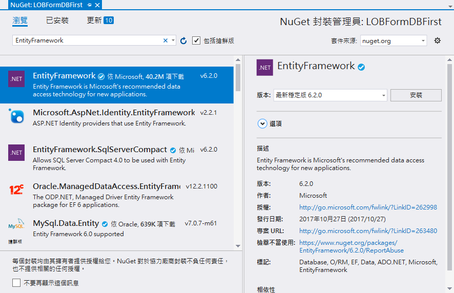
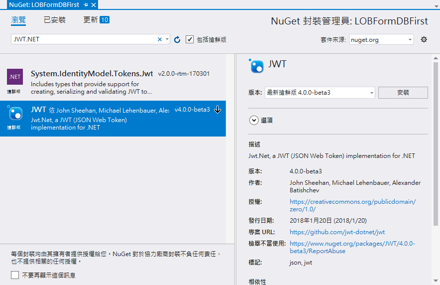
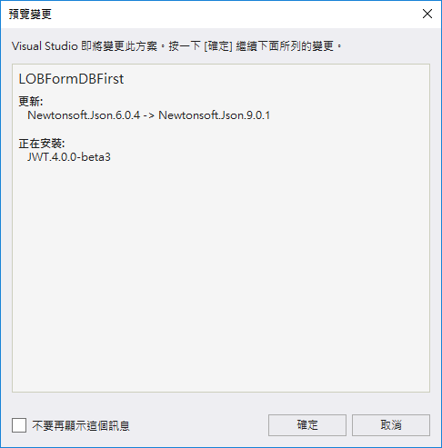

# DBFirst2 進行專案設定與安裝套件

我們緊接著需要針對這個專案，安裝、升級會用到的 NuGet 套件，並且建立相關資料夾

## 安裝 EntityFramework 套件

* 滑鼠右擊 LOBFormDBFirst 專案的 \[參考] 節點，接著選擇 \[管理 NuGet 套件]

* 在 \[NuGET: LOBFormDBFirst] 視窗中，點選 \[瀏覽] 標籤頁次，必且在搜尋文字輸入盒中，輸入 EntityFramework 這個關鍵字

* 當發現到 EntityFramework 套件找到後，請點選該套件，接著，點選右方的 \[安裝] 按鈕，以便安裝這個套件

## 安裝 JWT.NET 套件

* 滑鼠右擊 \[參考] 專案節點，選擇 \[管理 NuGet 套件]

* 在 \[NuGet: LOBFormDBFirst] 視窗中，點選 \[瀏覽] 標籤頁次

* 在 \[搜尋] 文字輸入盒內，輸入 `JWT.NET`，搜尋這個套件

* 勾選 \[包含搶鮮版] 檢查盒，安裝 4.0 以上的版本

* 當發現到 JWT.NET 套件找到後，請點選該套件，接著，點選右方的 \[安裝] 按鈕，以便安裝這個套件

# 建立需要用到的資料夾

* 滑鼠右擊 LOBFormDBFirst 專案，選擇 \[加入] > \[新增資料夾]

* 接這設定這個資料夾名稱為 Filters

* 滑鼠右擊 LOBFormDBFirst 專案，選擇 \[加入] > \[新增資料夾]

* 接這設定這個資料夾名稱為 Helpers

