# DBFirst3 建立資料庫連線

由於我們這個開發練習，將會採用 Entity Framework 的 Database First 模式開發，因此，我們需要先來設定我們要使用到的資料庫，加入到本機 LocalDB 中。

# 開始進行資料庫連線設定

* 請從專案原始碼壓縮檔案中，找到 \[Database] 的目錄，裡面有兩個檔案 \[LOBForm.mdf] & \[LOBForm_log.ldf]，請將他複製到適當的資料夾內。

* 請開啟 \[Microsoft SQL Server Management Studio 17] 工具

* 當出現了 \[Connect to Server] 對話窗後，請在 \[Server name] 欄位，輸入  
(localdb)\MSSQLLocalDB，接著點選 \[Connect] 按鈕

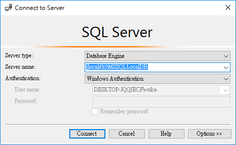 

* 從 \[Object Explorer] 視窗翁，滑鼠右擊 \[Database] 節點，點選 \[Attach...] 選項。

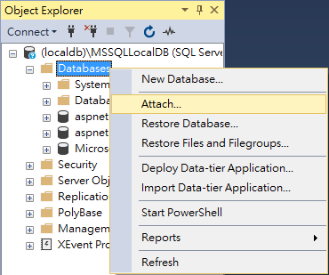 

* 此時，畫面會出現 \[Attach Database] 對話窗，請點選中間的 \[Add...] 按鈕

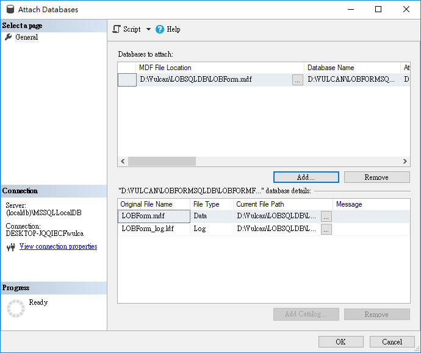 

* 當出現了 \[Locate Database Files] 對話窗之後，請選擇上述提到的資料庫檔案所在路徑，完成後，點選 \[Ok] 按鈕

 

* 此時回到了 \[Attach Database] 對話窗，請點選 \[Ok] 按鈕

* 現在，我們可以從 \[Object Explorer] 視窗中，找到剛剛加入的資料庫，展開 \[Tables] 節點，您就會看到這個資料內共有六個資料表存在。

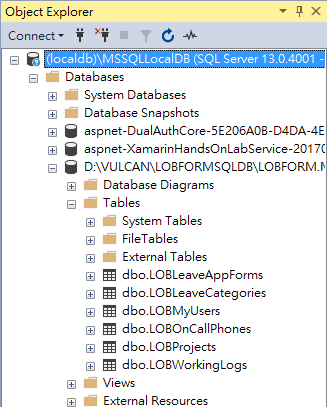 

# 建立企業表單使用的資料庫

現在，讓我們來了解，如何自行建立一個空白的 SQL Database 檔案。

* 首先，打開 Visual Studio 2017，從功能表中，點選 \[檢視] > \[SQL Server 物件總管]，此時，您將會看到 SQL Server 物件總管視窗

* 在  SQL Server 物件總管視窗內，找到 \[資料庫] 節點，滑鼠右擊這個節點，並且選擇 \[加入新的資料庫] 選項

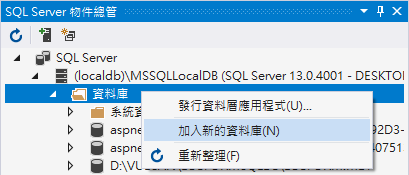 

* 現在，會看到 \[建立資料庫] 視窗，請在 \[資料庫名稱] 欄位中，輸入 LOBForm，接著，在 \[資料庫位置] 欄位，輸入您的資料庫要存放在您電腦中的哪個地方。

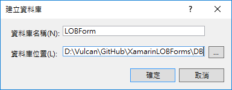 

* 請從 \[SQL Server 物件總管] 內找到 \[資料庫] 節點，現在，您可以看到 \[LOBForm] 資料庫了，但是，展開這個資料之後，從 \[資料表] 節點內，卻沒有看到任何資料表存在

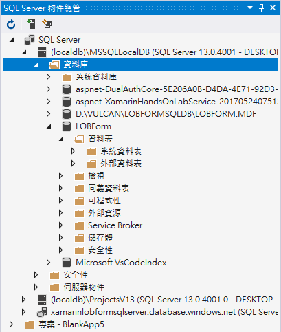 

* 現在，我們要來產生我們所需要的資料庫結構，請使用滑鼠右擊剛剛建立好的資料庫，選擇 \[新增查詢] 這個項目

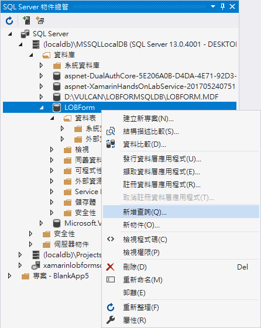 

* 您可以在 Visual Studio 2017 中，看到一個 SQL Query.sql 的視窗，請將底下的 \[企業表單專用的資料庫綱要 (Schema) SQL 敘述] 所有 SQL 指令複製起來，貼到這個視窗中，並且執行這個 SQL 查詢。

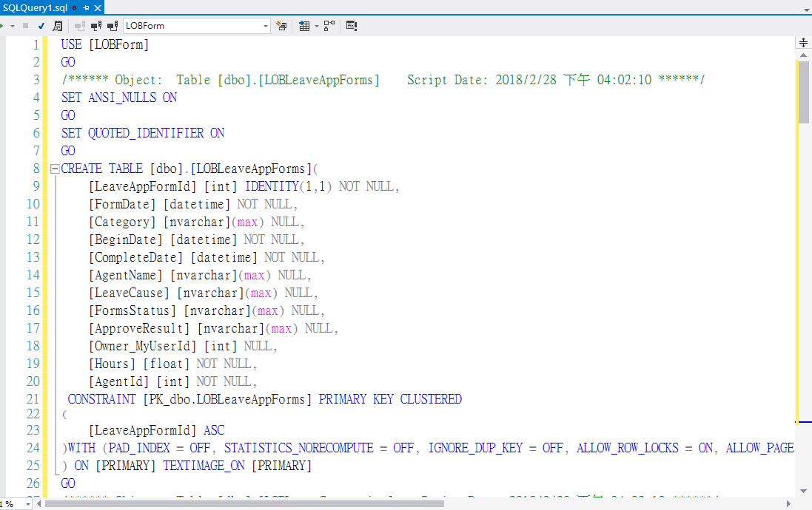 

* 現在，回到 \[SQL Server 物件總管]，使用滑鼠右擊這次新建立的資料庫，選擇 \[重新整理] 選項

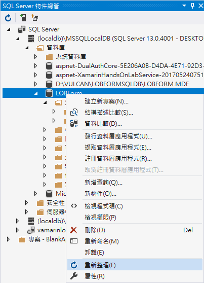 

* 現在，您可以看到這個資料庫將會用到的相關資料表了

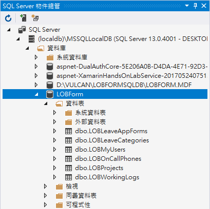 

# 企業表單專用的資料庫綱要 (Schema) SQL 敘述


```SQL
USE [LOBForm]
GO
SET ANSI_NULLS ON
GO
SET QUOTED_IDENTIFIER ON
GO
CREATE TABLE [dbo].[LOBLeaveAppForms](
	[LeaveAppFormId] [int] IDENTITY(1,1) NOT NULL,
	[FormDate] [datetime] NOT NULL,
	[Category] [nvarchar](max) NULL,
	[BeginDate] [datetime] NOT NULL,
	[CompleteDate] [datetime] NOT NULL,
	[AgentName] [nvarchar](max) NULL,
	[LeaveCause] [nvarchar](max) NULL,
	[FormsStatus] [nvarchar](max) NULL,
	[ApproveResult] [nvarchar](max) NULL,
	[Owner_MyUserId] [int] NULL,
	[Hours] [float] NOT NULL,
	[AgentId] [int] NOT NULL,
 CONSTRAINT [PK_dbo.LOBLeaveAppForms] PRIMARY KEY CLUSTERED 
(
	[LeaveAppFormId] ASC
)WITH (PAD_INDEX = OFF, STATISTICS_NORECOMPUTE = OFF, IGNORE_DUP_KEY = OFF, ALLOW_ROW_LOCKS = ON, ALLOW_PAGE_LOCKS = ON) ON [PRIMARY]
) ON [PRIMARY] TEXTIMAGE_ON [PRIMARY]
GO

SET ANSI_NULLS ON
GO
SET QUOTED_IDENTIFIER ON
GO
CREATE TABLE [dbo].[LOBLeaveCategories](
	[LeaveCategoryId] [int] IDENTITY(1,1) NOT NULL,
	[SortingOrder] [int] NOT NULL,
	[LeaveCategoryName] [nvarchar](max) NULL,
 CONSTRAINT [PK_dbo.LOBLeaveCategories] PRIMARY KEY CLUSTERED 
(
	[LeaveCategoryId] ASC
)WITH (PAD_INDEX = OFF, STATISTICS_NORECOMPUTE = OFF, IGNORE_DUP_KEY = OFF, ALLOW_ROW_LOCKS = ON, ALLOW_PAGE_LOCKS = ON) ON [PRIMARY]
) ON [PRIMARY] TEXTIMAGE_ON [PRIMARY]
GO

SET ANSI_NULLS ON
GO
SET QUOTED_IDENTIFIER ON
GO
CREATE TABLE [dbo].[LOBMyUsers](
	[MyUserId] [int] IDENTITY(1,1) NOT NULL,
	[DepartmentName] [nvarchar](max) NULL,
	[Name] [nvarchar](max) NULL,
	[EmployeeID] [nvarchar](max) NULL,
	[Password] [nvarchar](max) NULL,
	[IsManager] [bit] NOT NULL,
	[CreatedAt] [datetimeoffset](7) NULL,
	[UpdatedAt] [datetimeoffset](7) NULL,
	[ManagerId] [int] NOT NULL,
 CONSTRAINT [PK_dbo.LOBMyUsers] PRIMARY KEY CLUSTERED 
(
	[MyUserId] ASC
)WITH (PAD_INDEX = OFF, STATISTICS_NORECOMPUTE = OFF, IGNORE_DUP_KEY = OFF, ALLOW_ROW_LOCKS = ON, ALLOW_PAGE_LOCKS = ON) ON [PRIMARY]
) ON [PRIMARY] TEXTIMAGE_ON [PRIMARY]
GO

SET ANSI_NULLS ON
GO
SET QUOTED_IDENTIFIER ON
GO
CREATE TABLE [dbo].[LOBOnCallPhones](
	[OnCallPhoneId] [int] IDENTITY(1,1) NOT NULL,
	[SortingOrder] [int] NOT NULL,
	[Title] [nvarchar](max) NULL,
	[PhoneNumber] [nvarchar](max) NULL,
 CONSTRAINT [PK_dbo.LOBOnCallPhones] PRIMARY KEY CLUSTERED 
(
	[OnCallPhoneId] ASC
)WITH (PAD_INDEX = OFF, STATISTICS_NORECOMPUTE = OFF, IGNORE_DUP_KEY = OFF, ALLOW_ROW_LOCKS = ON, ALLOW_PAGE_LOCKS = ON) ON [PRIMARY]
) ON [PRIMARY] TEXTIMAGE_ON [PRIMARY]
GO

SET ANSI_NULLS ON
GO
SET QUOTED_IDENTIFIER ON
GO
CREATE TABLE [dbo].[LOBProjects](
	[ProjectId] [int] IDENTITY(1,1) NOT NULL,
	[ProjectName] [nvarchar](max) NULL,
 CONSTRAINT [PK_dbo.LOBProjects] PRIMARY KEY CLUSTERED 
(
	[ProjectId] ASC
)WITH (PAD_INDEX = OFF, STATISTICS_NORECOMPUTE = OFF, IGNORE_DUP_KEY = OFF, ALLOW_ROW_LOCKS = ON, ALLOW_PAGE_LOCKS = ON) ON [PRIMARY]
) ON [PRIMARY] TEXTIMAGE_ON [PRIMARY]
GO

SET ANSI_NULLS ON
GO
SET QUOTED_IDENTIFIER ON
GO
CREATE TABLE [dbo].[LOBWorkingLogs](
	[WorkingLogId] [int] IDENTITY(1,1) NOT NULL,
	[LogDate] [datetime] NOT NULL,
	[Title] [nvarchar](max) NULL,
	[Summary] [nvarchar](max) NULL,
	[Owner_MyUserId] [int] NULL,
	[Project_ProjectId] [int] NULL,
	[Hours] [float] NOT NULL,
 CONSTRAINT [PK_dbo.LOBWorkingLogs] PRIMARY KEY CLUSTERED 
(
	[WorkingLogId] ASC
)WITH (PAD_INDEX = OFF, STATISTICS_NORECOMPUTE = OFF, IGNORE_DUP_KEY = OFF, ALLOW_ROW_LOCKS = ON, ALLOW_PAGE_LOCKS = ON) ON [PRIMARY]
) ON [PRIMARY] TEXTIMAGE_ON [PRIMARY]
GO

CREATE NONCLUSTERED INDEX [IX_Owner_MyUserId] ON [dbo].[LOBLeaveAppForms]
(
	[Owner_MyUserId] ASC
)WITH (PAD_INDEX = OFF, STATISTICS_NORECOMPUTE = OFF, SORT_IN_TEMPDB = OFF, DROP_EXISTING = OFF, ONLINE = OFF, ALLOW_ROW_LOCKS = ON, ALLOW_PAGE_LOCKS = ON) ON [PRIMARY]
GO

CREATE NONCLUSTERED INDEX [IX_Owner_MyUserId] ON [dbo].[LOBWorkingLogs]
(
	[Owner_MyUserId] ASC
)WITH (PAD_INDEX = OFF, STATISTICS_NORECOMPUTE = OFF, SORT_IN_TEMPDB = OFF, DROP_EXISTING = OFF, ONLINE = OFF, ALLOW_ROW_LOCKS = ON, ALLOW_PAGE_LOCKS = ON) ON [PRIMARY]
GO

CREATE NONCLUSTERED INDEX [IX_Project_ProjectId] ON [dbo].[LOBWorkingLogs]
(
	[Project_ProjectId] ASC
)WITH (PAD_INDEX = OFF, STATISTICS_NORECOMPUTE = OFF, SORT_IN_TEMPDB = OFF, DROP_EXISTING = OFF, ONLINE = OFF, ALLOW_ROW_LOCKS = ON, ALLOW_PAGE_LOCKS = ON) ON [PRIMARY]
GO
ALTER TABLE [dbo].[LOBLeaveAppForms] ADD  DEFAULT ((0)) FOR [Hours]
GO
ALTER TABLE [dbo].[LOBLeaveAppForms] ADD  DEFAULT ((0)) FOR [AgentId]
GO
ALTER TABLE [dbo].[LOBMyUsers] ADD  DEFAULT ((0)) FOR [ManagerId]
GO
ALTER TABLE [dbo].[LOBWorkingLogs] ADD  DEFAULT ((0)) FOR [Hours]
GO
ALTER TABLE [dbo].[LOBLeaveAppForms]  WITH CHECK ADD  CONSTRAINT [FK_dbo.LOBLeaveAppForms_dbo.LOBMyUsers_Owner_MyUserId] FOREIGN KEY([Owner_MyUserId])
REFERENCES [dbo].[LOBMyUsers] ([MyUserId])
GO
ALTER TABLE [dbo].[LOBLeaveAppForms] CHECK CONSTRAINT [FK_dbo.LOBLeaveAppForms_dbo.LOBMyUsers_Owner_MyUserId]
GO
ALTER TABLE [dbo].[LOBWorkingLogs]  WITH CHECK ADD  CONSTRAINT [FK_dbo.LOBWorkingLogs_dbo.LOBMyUsers_Owner_MyUserId] FOREIGN KEY([Owner_MyUserId])
REFERENCES [dbo].[LOBMyUsers] ([MyUserId])
GO
ALTER TABLE [dbo].[LOBWorkingLogs] CHECK CONSTRAINT [FK_dbo.LOBWorkingLogs_dbo.LOBMyUsers_Owner_MyUserId]
GO
ALTER TABLE [dbo].[LOBWorkingLogs]  WITH CHECK ADD  CONSTRAINT [FK_dbo.LOBWorkingLogs_dbo.LOBProjects_Project_ProjectId] FOREIGN KEY([Project_ProjectId])
REFERENCES [dbo].[LOBProjects] ([ProjectId])
GO
ALTER TABLE [dbo].[LOBWorkingLogs] CHECK CONSTRAINT [FK_dbo.LOBWorkingLogs_dbo.LOBProjects_Project_ProjectId]
GO
```


