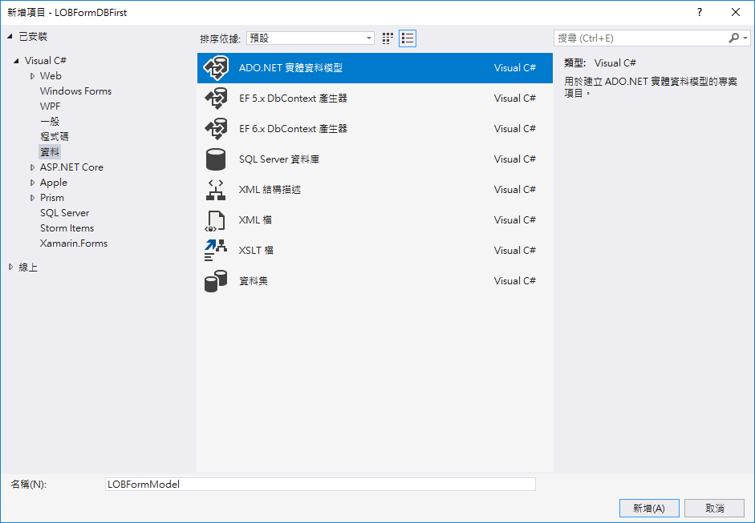
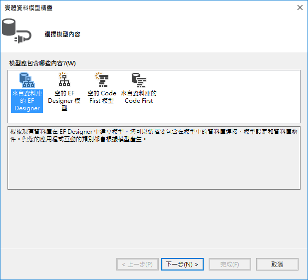
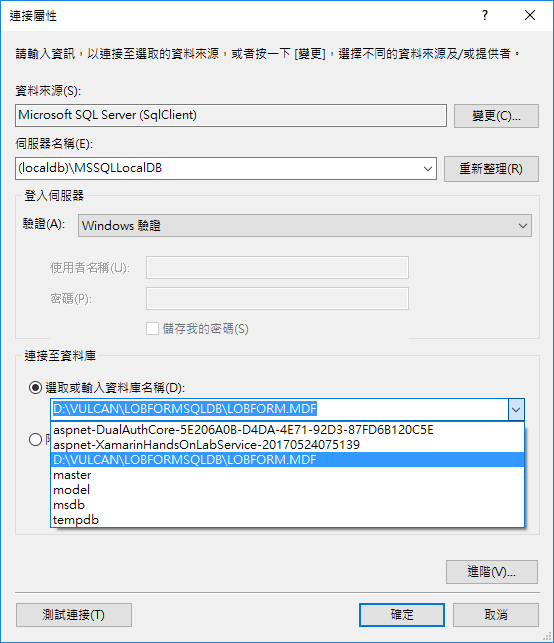
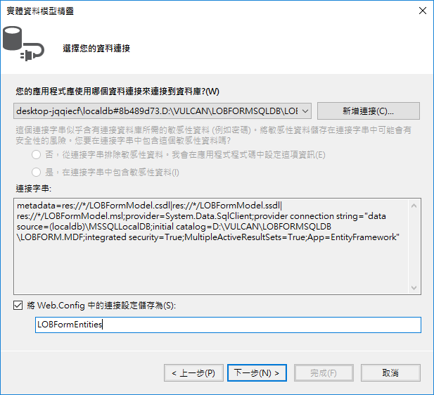
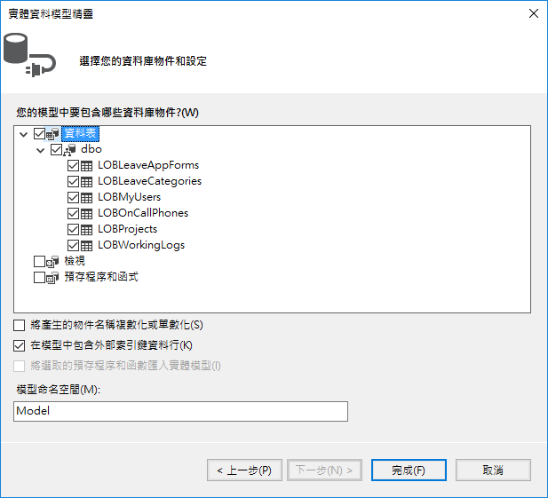
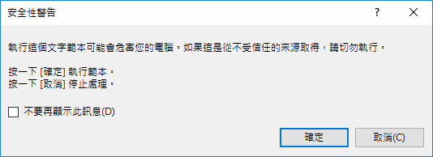
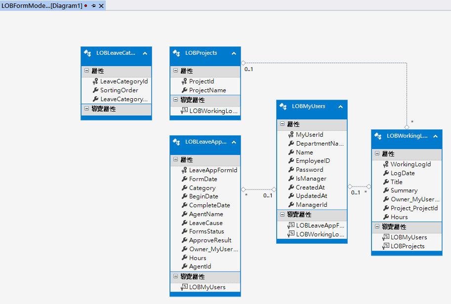

# DBFirst4 建立 ADO.NET 實體資料模型與其他資料模型和支援方法類別

資料庫連線部份我們已經設定好了，現在，我們可以在 ASP.NET Web API 專案，使用 Entity Framework 提供的 Database First 機制，幫助我們在這個專案內，建立起後端 SQL Server 資料庫的存取模型與相關方法。

* 滑鼠右擊 LOBFormDBFirst 專案節點，選擇 \[加入] > \[新增項目]

* 當出現了 \[新增項目 - LOBFormDBFirst] 對話窗，請點選 \[已安裝] > \[Visual C#] > \[資料] 選項

* 從對話窗的中間，選擇 \[ADO.NET 實體資料模型] 項目

* 在下方名稱欄位，輸入 LOBFormModel

* 最後，點選 \[新增] 按鈕



* 此時，會出現 \[實體資料模型精靈]，請在這個對話窗中，點選 \[來自資料庫的 EF Designer] ，接著，點選 \[下一步] 按鈕



* 現在，\[實體資料模型精靈] 對話窗中，請點選 \[新增連接] 按鈕

* 在 \[連接屬性] 對話窗的 \[伺服器名稱] 欄位中，輸入 (localdb)\MSSQLLocalDB

* 接著，在下方的 \[連接至資料庫] 區域，點選 \[點選或輸入資料庫名稱] 欄位的下拉選單，選擇我們剛剛設定的資料庫。

  當然，設定完成後，請記得先點選左下方的 \[測試連接] 按鈕，若沒有發現到任何問題，請點選 \[確定] 按鈕



* 現在回到了 \[實體資料模型精靈] 視窗，修正在下方的文字輸入盒之連接設定為 

  LOBFormEntities

  緊接著點選 \[下一步] 按鈕



* 現在，根據下圖，我們需要選擇所要包含的資料庫物件，在這裡，我們勾選所有的資料表，完成後，點選 \[完成] 按鈕



再點選完 \[完成] 按鈕之後，會看到許多個 \[安全性警告] 對話窗，請直接點選 \[確定] 按鈕



在 Visual Studio 出現了這個後端資料庫的物件關聯圖



* 最後，請儲存 LOBFormModel.edmx

# 做些修正

* 在 Visual Studio 的輸出視窗中，我們看到了底下訊息

```
嘗試安裝 '6.1.3' 版的 'EntityFramework'，但專案已包含不同的版本。略過中...
嘗試安裝 '6.1.3' 版的 'EntityFramework'，但專案已包含不同的版本。略過中...
```

# 加入開發會用到的類別

現在，我們需要建立起這個 Web API 專案會用到的相關資料模型類別，並且，也需要針對資料庫實體模型類別，建立起轉換資料類別的方法。

## APIResult

* 滑鼠右擊資料夾 `Models`，選擇 `加入` > `類別`

* 在 `新增項目 LOBFormDBFirst` 對話窗的 `名稱` 欄位，輸入 `APIResult`

* 點選 `新增` 按鈕，建立這個類別

* 將新增的類別以底下程式碼替換


```csharp
/// <summary>
/// 呼叫 API 回傳的制式格式
/// </summary>
public class APIResult
{
    /// <summary>
    /// 此次呼叫 API 是否成功
    /// </summary>
    public bool Success { get; set; } = true;
    /// <summary>
    /// 此次呼叫的存取權杖是否正確
    /// </summary>
    public bool TokenFail { get; set; } = false;
    /// <summary>
    /// 呼叫 API 失敗的錯誤訊息
    /// </summary>
    public string Message { get; set; } = "";
    /// <summary>
    /// 呼叫此API所得到的其他內容
    /// </summary>
    public object Payload { get; set; }
}
```

## LeaveCategory

* 滑鼠右擊資料夾 `Models`，選擇 `加入` > `類別`

* 在 `新增項目 LOBFormDBFirst` 對話窗的 `名稱` 欄位，輸入 `LeaveCategory`

* 點選 `新增` 按鈕，建立這個類別

* 將新增的類別以底下程式碼替換


```csharp
/// <summary>
/// 請假類別
/// </summary>
public class LeaveCategory
{
    public int LeaveCategoryId { get; set; }
    public int SortingOrder { get; set; }
    public string LeaveCategoryName { get; set; }
}
```

## OnCallPhone

* 滑鼠右擊資料夾 `Models`，選擇 `加入` > `類別`

* 在 `新增項目 LOBFormDBFirst` 對話窗的 `名稱` 欄位，輸入 `OnCallPhone`

* 點選 `新增` 按鈕，建立這個類別

* 將新增的類別以底下程式碼替換


```csharp
/// <summary>
/// 公司緊急連絡方式
/// </summary>
public class OnCallPhone
{
    public int OnCallPhoneId { get; set; }
    public int SortingOrder { get; set; }
    public string Title { get; set; }
    public string PhoneNumber { get; set; }
}
```

## Project

* 滑鼠右擊資料夾 `Models`，選擇 `加入` > `類別`

* 在 `新增項目 LOBFormDBFirst` 對話窗的 `名稱` 欄位，輸入 `Project`

* 點選 `新增` 按鈕，建立這個類別

* 將新增的類別以底下程式碼替換


```csharp
public class Project
{
    public int ProjectId { get; set; }
    public string ProjectName { get; set; }
}
```

## DepartmentModel

* 滑鼠右擊資料夾 `Models`，選擇 `加入` > `類別`

* 在 `新增項目 LOBFormDBFirst` 對話窗的 `名稱` 欄位，輸入 `DepartmentModel`

* 點選 `新增` 按鈕，建立這個類別

* 將新增的類別以底下程式碼替換


```csharp
public class DepartmentModel
{
    public string DepartmentName { get; set; } = "";
}
```

## LAFAgentQuery

* 滑鼠右擊資料夾 `Models`，選擇 `加入` > `類別`

* 在 `新增項目 LOBFormDBFirst` 對話窗的 `名稱` 欄位，輸入 `LAFAgentQuery`

* 點選 `新增` 按鈕，建立這個類別

* 將新增的類別以底下程式碼替換


```csharp
public class LAFAgentQuery
{
    public string DepartmentName { get; set; } = "";
    public string Name { get; set; } = "";
}
```

## LAFAgentReslut

* 滑鼠右擊資料夾 `Models`，選擇 `加入` > `類別`

* 在 `新增項目 LOBFormDBFirst` 對話窗的 `名稱` 欄位，輸入 `LAFAgentReslut`

* 點選 `新增` 按鈕，建立這個類別

* 將新增的類別以底下程式碼替換


```csharp
public class LAFAgentReslut
{
    public int MyUserId { get; set; }
    public string DepartmentName { get; set; }
    public string Name { get; set; }
}
```

## MyUser

* 滑鼠右擊資料夾 `Models`，選擇 `加入` > `類別`

* 在 `新增項目 LOBFormDBFirst` 對話窗的 `名稱` 欄位，輸入 `MyUser`

* 點選 `新增` 按鈕，建立這個類別

* 將新增的類別以底下程式碼替換


```csharp
/// <summary>
/// 使用者
/// </summary>
public class MyUser
{
    public int MyUserId { get; set; }
    public string DepartmentName { get; set; }
    public string Name { get; set; }
    public string EmployeeID { get; set; }
    public string Password { get; set; }
    //public MyUser Manager { get; set; }
    public int ManagerId { get; set; }
    public bool IsManager { get; set; }
    public DateTimeOffset? CreatedAt { get; set; }
    public DateTimeOffset? UpdatedAt { get; set; }
}
```

## UserLoginModel

* 滑鼠右擊資料夾 `Models`，選擇 `加入` > `類別`

* 在 `新增項目 LOBFormDBFirst` 對話窗的 `名稱` 欄位，輸入 `UserLoginModel`

* 點選 `新增` 按鈕，建立這個類別

* 將新增的類別以底下程式碼替換


```csharp
public class UserLoginModel
{
    public string Account { get; set; } = "";
    public string Password { get; set; } = "";
}
```

## UserLoginResultModel

* 滑鼠右擊資料夾 `Models`，選擇 `加入` > `類別`

* 在 `新增項目 LOBFormDBFirst` 對話窗的 `名稱` 欄位，輸入 `UserLoginResultModel`

* 點選 `新增` 按鈕，建立這個類別

* 將新增的類別以底下程式碼替換


```csharp
public class UserLoginResultModel
{
    public string AccessToken { get; set; } = "";
    public MyUser MyUser { get; set; }
}
```

## LeaveAppFormByUserModel

* 滑鼠右擊資料夾 `Models`，選擇 `加入` > `類別`

* 在 `新增項目 LOBFormDBFirst` 對話窗的 `名稱` 欄位，輸入 `LeaveAppFormByUserModel`

* 點選 `新增` 按鈕，建立這個類別

* 將新增的類別以底下程式碼替換


```csharp
public class LeaveAppFormByUserModel
{
    public string Account { get; set; } = "";
    public string Mode { get; set; } = "";
}
```

## WorkingLog

* 滑鼠右擊資料夾 `Models`，選擇 `加入` > `類別`

* 在 `新增項目 LOBFormDBFirst` 對話窗的 `名稱` 欄位，輸入 `WorkingLog`

* 點選 `新增` 按鈕，建立這個類別

* 將新增的類別以底下程式碼替換


```csharp
/// <summary>
/// 工作日誌
/// </summary>
public class WorkingLog
{
    public int WorkingLogId { get; set; }
    public MyUser Owner { get; set; }
    public DateTime LogDate { get; set; }
    public double Hours { get; set; }
    public virtual Project Project { get; set; }
    public string Title { get; set; }
    public string Summary { get; set; }
}
```

## LeaveAppForm

* 滑鼠右擊資料夾 `Models`，選擇 `加入` > `類別`

* 在 `新增項目 LOBFormDBFirst` 對話窗的 `名稱` 欄位，輸入 `LeaveAppForm`

* 點選 `新增` 按鈕，建立這個類別

* 將新增的類別以底下程式碼替換


```csharp
/// <summary>
/// 請假單
/// </summary>
public class LeaveAppForm
{
    public int LeaveAppFormId { get; set; }
    public virtual MyUser Owner { get; set; }
    //public int OwnerId { get; set; }
    public DateTime FormDate { get; set; }
    public string Category { get; set; }
    public DateTime BeginDate { get; set; }
    public DateTime CompleteDate { get; set; }
    public double Hours { get; set; }
    public string AgentName { get; set; }
    public int AgentId { get; set; }
    public string LeaveCause { get; set; }
    public string FormsStatus { get; set; }
    public string ApproveResult { get; set; }
}
```

## LOBMyUsers

* 滑鼠右擊資料夾 `Models`，選擇 `加入` > `類別`

* 在 `新增項目 LOBFormDBFirst` 對話窗的 `名稱` 欄位，輸入 `LOBMyUsers`

* 點選 `新增` 按鈕，建立這個類別

* 將新增的檔案全部內容以底下程式碼替換


```csharp
using LOBFormDBFirst.Models;
using System;
using System.Collections.Generic;
using System.Linq;
using System.Web;

namespace LOBFormDBFirst
{
    public partial class LOBMyUsers
    {
        public MyUser ToMyUsers()
        {
            return new MyUser()
            {
                MyUserId = this.MyUserId,
                DepartmentName = this.DepartmentName,
                EmployeeID = this.EmployeeID,
                IsManager = this.IsManager,
                ManagerId = this.ManagerId,
                Name = this.Name,
                Password = this.Password,
            };
        }
    }
}
```

## LOBProjects

* 滑鼠右擊資料夾 `Models`，選擇 `加入` > `類別`

* 在 `新增項目 LOBFormDBFirst` 對話窗的 `名稱` 欄位，輸入 `LOBProjects`

* 點選 `新增` 按鈕，建立這個類別

* 將新增的檔案全部內容以底下程式碼替換


```csharp
using LOBFormDBFirst.Models;
using System;
using System.Collections.Generic;
using System.Linq;
using System.Web;

namespace LOBFormDBFirst
{
    public partial class LOBProjects
    {
        public Project ToProject()
        {
            return new Project()
            {
                ProjectId = this.ProjectId,
                ProjectName = this.ProjectName,
            };
        }
    }
}
```

## LOBWorkingLogs

* 滑鼠右擊資料夾 `Models`，選擇 `加入` > `類別`

* 在 `新增項目 LOBFormDBFirst` 對話窗的 `名稱` 欄位，輸入 `LOBWorkingLogs`

* 點選 `新增` 按鈕，建立這個類別

* 將新增的檔案全部內容以底下程式碼替換


```csharp
using LOBFormDBFirst.Models;
using System;
using System.Collections.Generic;
using System.Linq;
using System.Web;

namespace LOBFormDBFirst
{
    public partial class LOBWorkingLogs
    {
        public WorkingLog ToWorkingLog()
        {
            return new WorkingLog()
            {
                WorkingLogId = this.WorkingLogId,
                Hours = this.Hours,
                LogDate = this.LogDate,
                Owner = this.LOBMyUsers.ToMyUsers(),
                Project = this.LOBProjects.ToProject(),
                Summary = this.Summary,
                Title = this.Title,
            };
        }
    }
}
```

## LOBLeaveAppForms

* 滑鼠右擊資料夾 `Models`，選擇 `加入` > `類別`

* 在 `新增項目 LOBFormDBFirst` 對話窗的 `名稱` 欄位，輸入 `LOBLeaveAppForms`

* 點選 `新增` 按鈕，建立這個類別

* 將新增的檔案全部內容以底下程式碼替換


```csharp
using DBFirst.Models;
using System;
using System.Collections.Generic;
using System.Linq;
using System.Web;

namespace DBFirst
{
    public partial class LOBLeaveAppForms
    {
        public LeaveAppForm ToLeaveAppForm()
        {
            return new LeaveAppForm()
            {
                LeaveAppFormId = this.LeaveAppFormId,
                AgentId = this.AgentId,
                AgentName = this.AgentName,
                ApproveResult = this.ApproveResult,
                BeginDate = this.BeginDate,
                Category = this.Category,
                CompleteDate = this.CompleteDate,
                FormDate = this.FormDate,
                FormsStatus = this.FormsStatus,
                Hours = this.Hours,
                LeaveCause = this.LeaveCause,
                Owner = this.LOBMyUsers==null?null: this.LOBMyUsers.ToMyUsers()
            };
        }
    }

}
```

# 加入支援類別

## MainHelper

* 滑鼠右擊資料夾 `Helpers`，選擇 `加入` > `類別`

* 在 `新增項目 LOBFormDBFirst` 對話窗的 `名稱` 欄位，輸入 `MainHelper`

* 點選 `新增` 按鈕，建立這個類別

* 將新增的檔案全部內容以底下程式碼替換


```csharp
using System;
using System.Collections.Generic;
using System.Linq;
using System.Web;

namespace LOBFormDBFirst.Helpers
{
    public class MainHelper
    {
        public const string SecretKey = "GQDstcKsx0NHjPOuXOYg5MbeJ1XT0uFiwDVvVBrk";
    }
}
```

## JwtAuthAttribute

由於，我們這個 Web API 專案，將會使用 JWT 存取權杖 Access Token功能，因此，當使用者進行身分驗證成功之後，將會傳回一個合法的存取權杖到用戶端；在此，我們需要使用到 JWT.NET 這個套件，並且，我們也需要建立一個 Action Filter類別，只要我們在需要有通過身分驗證的控制器類別外，加入這個 Action Filter 屬性，所有的用戶端在呼叫這個控制器的所有方法的時候，就需要提供一個合法、有效、正確的存取權證，否則，用戶端將會得到一個錯誤訊息回報。

* 滑鼠右擊資料夾 `Filters`，選擇 `加入` > `類別`

* 在 `新增項目 LOBFormDBFirst` 對話窗的 `名稱` 欄位，輸入 `JwtAuthAttribute`

* 點選 `新增` 按鈕，建立這個類別

* 將新增的檔案全部內容以底下程式碼替換


```csharp
using JWT;
using JWT.Algorithms;
using JWT.Builder;
using LOBFormDBFirst.Helpers;
using LOBFormDBFirst.Models;
using System;
using System.Collections.Generic;
using System.Linq;
using System.Net;
using System.Net.Http;
using System.Net.Http.Formatting;
using System.Security.Principal;
using System.Web;
using System.Web.Http;
using System.Web.Http.Controllers;

namespace LOBFormDBFirst.Filters
{
    /// <summary>
    /// 檢查是否有提供正確、有效的存取權杖之 Http 過濾器屬性
    /// </summary>
    public class JwtAuthAttribute : AuthorizeAttribute
    {
        public string ErrorMessage { get; set; } = "";
        /// <summary>
        /// 當在進行處理身分授權時候，發生了失敗會呼叫的方法
        /// </summary>
        /// <param name="actionContext"></param>
        protected override void HandleUnauthorizedRequest(HttpActionContext actionContext)
        {
            if (string.IsNullOrEmpty(ErrorMessage) == false)
            {
                setErrorResponse(actionContext, ErrorMessage);
            }
            else
            {
                base.HandleUnauthorizedRequest(actionContext);
            }
        }

        /// <summary>
        /// 當要呼叫一個動作 Action 的時候，需要進行身分授權作業時候會被執行
        /// </summary>
        /// <param name="actionContext"></param>
        public override void OnAuthorization(HttpActionContext actionContext)
        {
            // TODO: key應該移至config
            if (actionContext.Request.Headers.Authorization == null || actionContext.Request.Headers.Authorization.Scheme != "Bearer")
            {
                setErrorResponse(actionContext, "沒有看到存取權杖錯誤");
            }
            else
            {
                try
                {
                    #region 進行存取權杖的解碼
                    string secretKey = MainHelper.SecretKey;
                    var json = new JwtBuilder()
                        .WithAlgorithm(new HMACSHA256Algorithm())
                        .WithSecret(secretKey)
                        .MustVerifySignature()
                        .Decode<Dictionary<string, object>>(actionContext.Request.Headers.Authorization.Parameter);
                    #endregion

                    #region 將存取權杖所夾帶的內容取出來
                    var fooRole = json["role"] as Newtonsoft.Json.Linq.JArray;
                    var fooRoleList = fooRole.Select(x => (string)x).ToList<string>();
                    #endregion

                    #region 將存取權杖的夾帶欄位，儲存到 HTTP 要求的屬性
                    actionContext.Request.Properties.Add("user", json["iss"] as string);
                    actionContext.Request.Properties.Add("manager", (bool)json["manager"]);
                    actionContext.Request.Properties.Add("role", fooRoleList);
                    #endregion

                    #region 設定目前 HTTP 要求的安全性資訊
                    var fooPrincipal =
                        new GenericPrincipal(new GenericIdentity(json["iss"] as string, "MyPassport"), fooRoleList.ToArray());
                    if (HttpContext.Current != null)
                    {
                        HttpContext.Current.User = fooPrincipal;
                    }
                    #endregion

                    #region 角色權限檢查(檢查控制器或動作之屬性(Attribute上設的 Roles的設定內容)
                    if (string.IsNullOrEmpty(Roles) == false)
                    {
                        // 是否有找到匹配的角色設定
                        bool fooCheckRoleResult = false;
                        // 切割成為多個角色成員
                        var fooConditionRoles = Roles.Split(',');
                        // 逐一檢查，這個使用用者是否有在這個角色條件中
                        foreach (var item in fooConditionRoles)
                        {
                            var fooInRole = fooPrincipal.IsInRole(item.Trim());
                            if (fooInRole == true)
                            {
                                fooCheckRoleResult = true;
                                break;
                            }
                        }

                        if (fooCheckRoleResult == false)
                        {
                            setErrorResponse(actionContext, "無效的角色設定，沒有權限使用這個 API");
                        }
                    }
                    #endregion

                }
                catch (TokenExpiredException)
                {
                    setErrorResponse(actionContext, "權杖已經逾期");
                }
                catch (SignatureVerificationException)
                {
                    setErrorResponse(actionContext, "權杖似乎不正確，沒有正確的數位簽名");
                }
                catch (Exception ex)
                {
                    setErrorResponse(actionContext, $"權杖解析發生異常 : {ex.Message}");
                }
            }

            base.OnAuthorization(actionContext);
        }

        private void setErrorResponse(HttpActionContext actionContext, string message)
        {
            ErrorMessage = message;
            var response = actionContext.Request.CreateErrorResponse(HttpStatusCode.Unauthorized, message);
            response.Content = new ObjectContent<APIResult>(new APIResult()
            {
                Success = false,
                TokenFail = true,
                Message = ErrorMessage,
                Payload = null
            }, new JsonMediaTypeFormatter());
            actionContext.Response = response;
        }
    }
}
```


