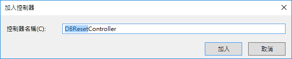
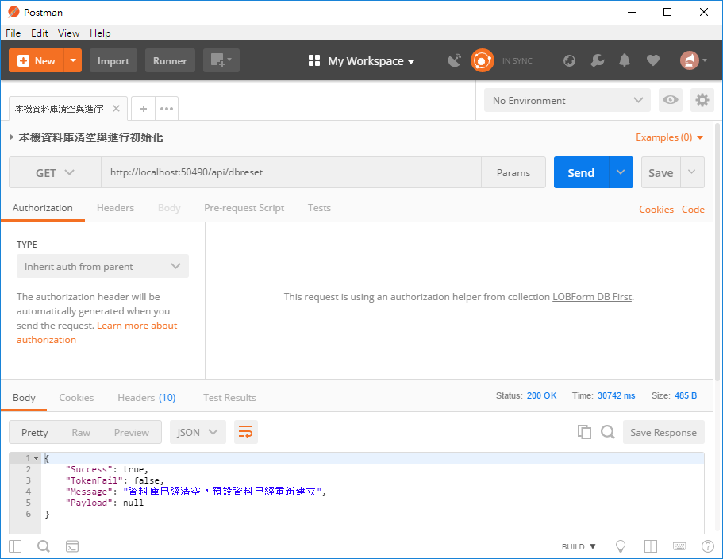

# DBFirst5 建立可以產生測試紀錄的控制器

## 產生測試紀錄的控制器

* 滑鼠右擊 `Controllers` 資料夾，選擇 `加入` > `控制器`

  

* 在 `新增 Scaffold` 對話窗中，點選 `Web API 2 控制器 - 空白` > `新增`

* 在 `加入控制器` 對話窗中，輸入 `DBReset`，如同底下畫面，最後點選 `加入` 按鈕

  

* 新增的類別檔案最上方，加入參考這些命名空間


```csharp
using LOBFormDBFirst.Models;
```

* 將新增的類別以底下程式碼替換


```csharp
public class DBResetController : ApiController
{
    private LOBFormEntities db = new LOBFormEntities();
    public int sortId { get; set; }
    public APIResult Get()
    {
        CleanDB();
        InitialDB();
        return new APIResult()
        {
            Success = true,
            TokenFail = false,
            Message = "資料庫已經清空，預設資料已經重新建立",
            Payload = null
        };
    }
 
    /// <summary>
    /// 清空資料庫內練習用的所有紀錄
    /// </summary>
    private void CleanDB()
    {
        // 清空使用者紀錄
        db.LOBMyUsers.RemoveRange(db.LOBMyUsers);
        // 清空請假單紀錄
        db.LOBLeaveAppForms.RemoveRange(db.LOBLeaveAppForms);
        // 清空請假單分類
        db.LOBLeaveCategories.RemoveRange(db.LOBLeaveCategories);
        // 清空專案名稱
        db.LOBProjects.RemoveRange(db.LOBProjects);
        // 清空工作紀錄
        db.LOBWorkingLogs.RemoveRange(db.LOBWorkingLogs);
        // 清空On-Call 電話
        db.LOBOnCallPhones.RemoveRange(db.LOBOnCallPhones);
        db.SaveChanges();
    }
 
    /// <summary>
    /// 準備要練習用的預設資料
    /// </summary>
    private void InitialDB()
    {
        InitProjects();
        InitLeaveCategories();
        InitOnCallPhones();
        InitMyUsers();
        InitLeaveAppForms();
    }
 
    public void InitProjects()
    {
        #region 專案資料初始化
        for (int i = 0; i < 30; i++)
        {
            db.LOBProjects.Add(new LOBProjects()
            {
                ProjectName = $"專案{i}"
            });
        }
        db.SaveChanges();
        #endregion
    }
 
    public void InitLeaveCategories()
    {
        #region 請假類別資料初始化
        sortId = 0;
        db.LOBLeaveCategories.Add(new LOBLeaveCategories()
        {
            SortingOrder = sortId++,
            LeaveCategoryName = "病假(一般病假)"
        });
        db.LOBLeaveCategories.Add(new LOBLeaveCategories()
        {
            SortingOrder = sortId++,
            LeaveCategoryName = "病假(住院病假)"
        });
        db.LOBLeaveCategories.Add(new LOBLeaveCategories()
        {
            SortingOrder = sortId++,
            LeaveCategoryName = "特別休假"
        });
        db.LOBLeaveCategories.Add(new LOBLeaveCategories()
        {
            SortingOrder = sortId++,
            LeaveCategoryName = "事假"
        });
        db.LOBLeaveCategories.Add(new LOBLeaveCategories()
        {
            SortingOrder = sortId++,
            LeaveCategoryName = "事假(家庭照顧假)"
        });
        db.LOBLeaveCategories.Add(new LOBLeaveCategories()
        {
            SortingOrder = sortId++,
            LeaveCategoryName = "生理假"
        });
        db.LOBLeaveCategories.Add(new LOBLeaveCategories()
        {
            SortingOrder = sortId++,
            LeaveCategoryName = "婚假"
        });
        db.LOBLeaveCategories.Add(new LOBLeaveCategories()
        {
            SortingOrder = sortId++,
            LeaveCategoryName = "喪假"
        });
        db.LOBLeaveCategories.Add(new LOBLeaveCategories()
        {
            SortingOrder = sortId++,
            LeaveCategoryName = "公假"
        });
        db.LOBLeaveCategories.Add(new LOBLeaveCategories()
        {
            SortingOrder = sortId++,
            LeaveCategoryName = "公傷病假"
        });
        db.LOBLeaveCategories.Add(new LOBLeaveCategories()
        {
            SortingOrder = sortId++,
            LeaveCategoryName = "產假含例假日"
        });
        db.LOBLeaveCategories.Add(new LOBLeaveCategories()
        {
            SortingOrder = sortId++,
            LeaveCategoryName = "安胎假"
        });
        db.LOBLeaveCategories.Add(new LOBLeaveCategories()
        {
            SortingOrder = sortId++,
            LeaveCategoryName = "撫育假"
        });
        db.SaveChanges();
        #endregion
    }
 
    public void InitOnCallPhones()
    {
        #region 緊急聯絡電話資料初始化
        sortId = 0;
        db.LOBOnCallPhones.Add(new LOBOnCallPhones()
        {
            Title = "警衛室",
            PhoneNumber = "+886091234567" + (sortId % 10).ToString(),
            SortingOrder = sortId++,
        });
        db.LOBOnCallPhones.Add(new LOBOnCallPhones()
        {
            Title = "行政部 Administrative Department",
            PhoneNumber = "+886091234567" + (sortId % 10).ToString(),
            SortingOrder = sortId++,
        });
        db.LOBOnCallPhones.Add(new LOBOnCallPhones()
        {
            Title = "稽核室 Auditorial Room",
            PhoneNumber = "+886091234567" + (sortId % 10).ToString(),
            SortingOrder = sortId++,
        });
        db.LOBOnCallPhones.Add(new LOBOnCallPhones()
        {
            Title = "董事長室 Chairman's Office",
            PhoneNumber = "+886091234567" + (sortId % 10).ToString(),
            SortingOrder = sortId++,
        });
        db.LOBOnCallPhones.Add(new LOBOnCallPhones()
        {
            Title = "電腦中心 Computer Center",
            PhoneNumber = "+886091234567" + (sortId % 10).ToString(),
            SortingOrder = sortId++,
        });
        db.LOBOnCallPhones.Add(new LOBOnCallPhones()
        {
            Title = "客戶服務部 Customer Service Department",
            PhoneNumber = "+886091234567" + (sortId % 10).ToString(),
            SortingOrder = sortId++,
        });
        db.LOBOnCallPhones.Add(new LOBOnCallPhones()
        {
            Title = "財務部 Finance Department",
            PhoneNumber = "+886091234567" + (sortId % 10).ToString(),
            SortingOrder = sortId++,
        });
        db.LOBOnCallPhones.Add(new LOBOnCallPhones()
        {
            Title = "管理部 Financial & Administrative Department",
            PhoneNumber = "+886091234567" + (sortId % 10).ToString(),
            SortingOrder = sortId++,
        });
        db.LOBOnCallPhones.Add(new LOBOnCallPhones()
        {
            Title = "總務部 General Affairs Department",
            PhoneNumber = "+886091234567" + (sortId % 10).ToString(),
            SortingOrder = sortId++,
        });
        db.LOBOnCallPhones.Add(new LOBOnCallPhones()
        {
            Title = "人力資源部 Human Resources Department",
            PhoneNumber = "+886091234567" + (sortId % 10).ToString(),
            SortingOrder = sortId++,
        });
        db.LOBOnCallPhones.Add(new LOBOnCallPhones()
        {
            Title = "資訊部 IT Department",
            PhoneNumber = "+886091234567" + (sortId % 10).ToString(),
            SortingOrder = sortId++,
        });
        db.LOBOnCallPhones.Add(new LOBOnCallPhones()
        {
            Title = "行銷部 Marketing Department",
            PhoneNumber = "+886091234567" + (sortId % 10).ToString(),
            SortingOrder = sortId++,
        });
        db.LOBOnCallPhones.Add(new LOBOnCallPhones()
        {
            Title = "企劃部 Planning Department",
            PhoneNumber = "+886091234567" + (sortId % 10).ToString(),
            SortingOrder = sortId++,
        });
        db.LOBOnCallPhones.Add(new LOBOnCallPhones()
        {
            Title = "採購部 Procurement Department",
            PhoneNumber = "+886091234567" + (sortId % 10).ToString(),
            SortingOrder = sortId++,
        });
        db.LOBOnCallPhones.Add(new LOBOnCallPhones()
        {
            Title = "品管部 Quality Control Department",
            PhoneNumber = "+886091234567" + (sortId % 10).ToString(),
            SortingOrder = sortId++,
        });
        db.LOBOnCallPhones.Add(new LOBOnCallPhones()
        {
            Title = "研究開發部 Research & Development Department",
            PhoneNumber = "+886091234567" + (sortId % 10).ToString(),
            SortingOrder = sortId++,
        });
        db.LOBOnCallPhones.Add(new LOBOnCallPhones()
        {
            Title = "業務部 Sales Department",
            PhoneNumber = "+886091234567" + (sortId % 10).ToString(),
            SortingOrder = sortId++,
        });
        db.SaveChanges();
        #endregion
    }
 
    public void InitMyUsers()
    {
        #region 使用者資料初始化
        sortId = 0;
        for (int i = 0; i < 10; i++)
        {
            var fooManager = new LOBMyUsers()
            {
                DepartmentName = $"部門{i}",
                Name = $"經理{i}",
                EmployeeID = $"manager{i}",
                Password = $"pwd{i}",
                ManagerId = -1,
                IsManager = true
            };
            db.LOBMyUsers.Add(fooManager);
            db.SaveChanges();
            var fooMan = $"manager{i}";
            fooManager = db.LOBMyUsers.FirstOrDefault(x => x.EmployeeID == fooMan);
            for (int j = 1 + (i * 10); j < 11 + (i * 10); j++)
            {
                db.LOBMyUsers.Add(new LOBMyUsers()
                {
                    DepartmentName = $"部門{i}",
                    Name = $"使用者{j}",
                    EmployeeID = $"user{j}",
                    Password = $"pwd{j}",
                    ManagerId = fooManager.MyUserId,
                    IsManager = false
                });
                db.SaveChanges();
                var fooU = $"user{j}";
                var fooUser = db.LOBMyUsers.FirstOrDefault(x => x.EmployeeID == fooU);
 
                #region 產生預設的請假單練習資料
                for (int k = 0; k < 3; k++)
                {
                    var fooBeginDate = DateTime.Now.AddDays(1).Date.AddHours(9);
                    var fooCompleteDate = DateTime.Now.AddDays(1).Date.AddHours(18);
                    var fooLeaveAppFormItem = new LOBLeaveAppForms()
                    {
                        AgentName = $"我的好友{k}",
                        ApproveResult = "尚未審核",
                        BeginDate = fooBeginDate,
                        Category = "特別休假",
                        CompleteDate = fooCompleteDate,
                        FormDate = DateTime.Now,
                        FormsStatus = "已經送出",
                        LeaveCause = "休息一下",
                        LOBMyUsers = fooUser,
                        Hours = 8
                    };
                    db.LOBLeaveAppForms.Add(fooLeaveAppFormItem);
                }
                #endregion
 
                #region 產生預設的工作日誌紀錄
                for (int k = 0; k < 3; k++)
                {
                    var fooProjectName = $"專案{k}";
                    var fooProject = db.LOBProjects.FirstOrDefault(x => x.ProjectName == fooProjectName);
                    var fooBeginDate = DateTime.Now.AddDays(1).Date.AddHours(9);
                    var fooCompleteDate = DateTime.Now.AddDays(1).Date.AddHours(18);
                    var fooWorkingLog = new LOBWorkingLogs()
                    {
                        LogDate = DateTime.Now,
                        LOBProjects = fooProject,
                        Summary = "討論上線相關準備工作",
                        Title = "與客戶開會",
                        LOBMyUsers = fooUser,
                        Hours = 3
                    };
                    db.LOBWorkingLogs.Add(fooWorkingLog);
                }
                #endregion
                db.SaveChanges();
            }
        }
        db.SaveChanges();
        #endregion
 
    }
 
    public void InitLeaveAppForms()
    {
        #region 測試用的請假單
        var fooUser1 = db.LOBMyUsers.FirstOrDefault(x => x.EmployeeID == "user1");
        var fooLeaveAppForm = new LOBLeaveAppForms()
        {
            AgentName = "Vulcan",
            ApproveResult = "Wait",
            BeginDate = DateTime.Now,
            Category = "XX",
            CompleteDate = DateTime.Now,
            FormDate = DateTime.Now,
            FormsStatus = "@@",
            LeaveCause = "??",
            LOBMyUsers = fooUser1,
            //OwnerId = fooUser1.MyUserId,
            Hours = 8,
        };
        db.LOBLeaveAppForms.Add(fooLeaveAppForm);
        db.SaveChanges();
        #endregion
    }
 
    public void Other()
    {
        int sortId = 0;
        #region 各資料表需要進行初始化的方法
 
 
        #region 使用者資料初始化
        sortId = 0;
        for (int i = 0; i < 10; i++)
        {
            var fooManager = new LOBMyUsers()
            {
                DepartmentName = $"部門{i}",
                Name = $"經理{i}",
                EmployeeID = $"manager{i}",
                Password = $"pwd{i}",
                ManagerId = -1,
                IsManager = true
            };
            db.LOBMyUsers.Add(fooManager);
            db.SaveChanges();
            var fooMan = $"manager{i}";
            fooManager = db.LOBMyUsers.FirstOrDefault(x => x.EmployeeID == fooMan);
            for (int j = 1 + (i * 10); j < 11 + (i * 10); j++)
            {
                db.LOBMyUsers.Add(new LOBMyUsers()
                {
                    DepartmentName = $"部門{i}",
                    Name = $"使用者{j}",
                    EmployeeID = $"user{j}",
                    Password = $"pwd{j}",
                    ManagerId = fooManager.MyUserId,
                    IsManager = false
                });
                db.SaveChanges();
                var fooU = $"user{j}";
                var fooUser = db.LOBMyUsers.FirstOrDefault(x => x.EmployeeID == fooU);
 
                #region 產生預設的請假單練習資料
                for (int k = 0; k < 3; k++)
                {
                    var fooBeginDate = DateTime.Now.AddDays(1).Date.AddHours(9);
                    var fooCompleteDate = DateTime.Now.AddDays(1).Date.AddHours(18);
                    var fooLeaveAppFormItem = new LOBLeaveAppForms()
                    {
                        AgentName = $"我的好友{k}",
                        ApproveResult = "尚未審核",
                        BeginDate = fooBeginDate,
                        Category = "特別休假",
                        CompleteDate = fooCompleteDate,
                        FormDate = DateTime.Now,
                        FormsStatus = "已經送出",
                        LeaveCause = "休息一下",
                        LOBMyUsers = fooUser,
                        Hours = 8
                    };
                    db.LOBLeaveAppForms.Add(fooLeaveAppFormItem);
                }
                #endregion
 
                #region 產生預設的工作日誌紀錄
                for (int k = 0; k < 3; k++)
                {
                    var fooProjectName = $"專案{k}";
                    var fooProject = db.LOBProjects.FirstOrDefault(x => x.ProjectName == fooProjectName);
                    var fooBeginDate = DateTime.Now.AddDays(1).Date.AddHours(9);
                    var fooCompleteDate = DateTime.Now.AddDays(1).Date.AddHours(18);
                    var fooWorkingLog = new LOBWorkingLogs()
                    {
                        LogDate = DateTime.Now,
                        LOBProjects = fooProject,
                        Summary = "討論上線相關準備工作",
                        Title = "與客戶開會",
                        LOBMyUsers = fooUser,
                        Hours = 3
                    };
                    db.LOBWorkingLogs.Add(fooWorkingLog);
                }
                #endregion
                db.SaveChanges();
            }
        }
        db.SaveChanges();
        #endregion
 
        #endregion
    }
}
```

# 測試此控制器

 在執行此專案之前，請先查看資料庫內的各資料表有多少紀錄

* 執行此專案

* 打開 PostMan 工具

  * 選擇 Http 方法為 `Get`

  * 輸入 URL 為 `http://localhost:50490/api/dbreset`

    > 若您自己建立的 Web API 專案，請在這裡輸入您專案的 Port 編號

  * 點選 `Send` 按鈕



* 若輸出底下內容，則您的 SQL Server 資料庫內，已經建立好相關測試用的紀錄了


```json
{
    "success": true,
    "tokenFail": false,
    "message": "資料庫已經清空，預設資料已經重新建立",
    "payload": null
}
```

 在執行此專案之後，請先查看資料庫內的各資料表有多少紀錄

# 問題研究

 為什麼建立 產生測試紀錄 的控制器呢?

 在這個專案中，若要存取資料庫內指定資料表之紀錄，可以使用 XamarinLOBFormContext 類別建立的執行個體，配合 LINQ 語法，就可以將記錄取出；當要把異動的紀錄(新增、修改、刪除)更新到資料庫內，只需要執行 XamarinLOBFormContext.SaveChanges() 方法即可。

 想要清除某資料表內的所有紀錄，可以使用類似這樣的敘述： Context.你的資料表.RemoveRange(Context.你的資料表);

 請孰悉資料表有關連時候的紀錄異動之程式設計方法。


