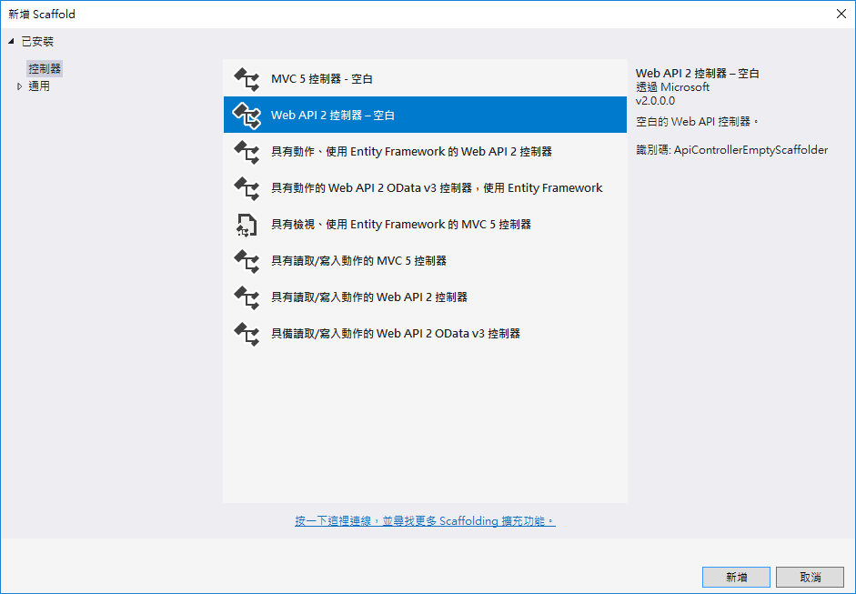
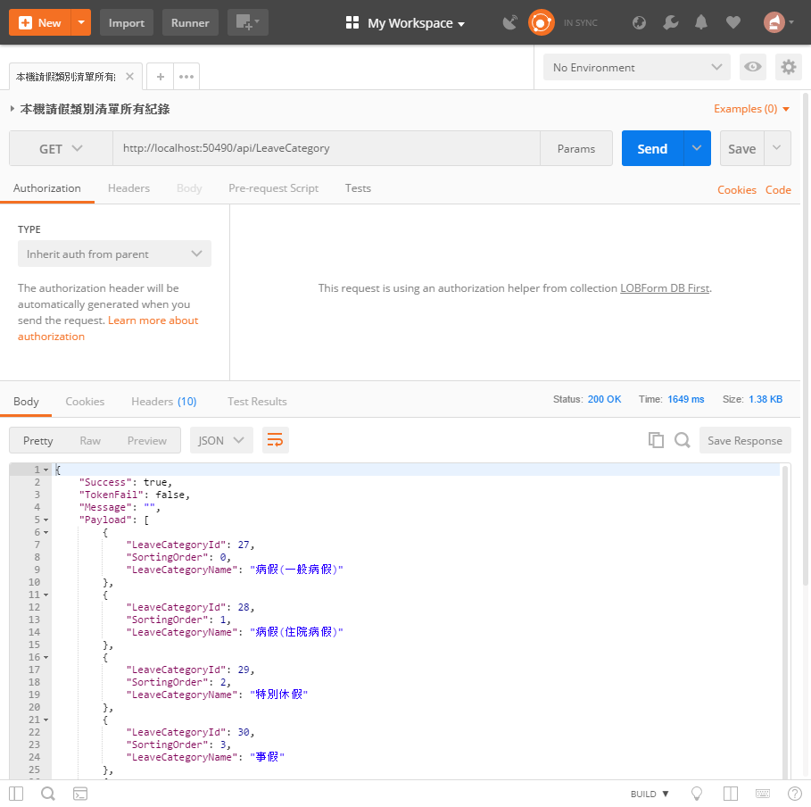

# DBFirst8 建立請假類別查詢API

在這裡，我們將會建立一個控制器，並且只會設計一個 Http GET 動作，這個動作將會回傳所有請假類別名稱清單資料。

## 建立請假類別資料控制器

* 滑鼠右擊 `Controllers` 資料夾，選擇 `加入` > `控制器`

  

* 在 `新增 Scaffold` 對話窗中，點選 `Web API 2 控制器 - 空白` > `新增`

* 在 `加入控制器` 對話窗中，輸入 `LeaveCategory`，如同底下畫面，最後點選 `加入` 按鈕

  

* 新增的類別檔案最上方，加入參考這些命名空間


```csharp
using LOBFormDBFirst.Models;
```

* 將新增的類別以底下程式碼替換


```csharp
public class LeaveCategoryController : ApiController
{
    private LOBFormEntities db = new LOBFormEntities();
 
    // GET: api/Projects
    public APIResult Get()
    {
        return new APIResult()
        {
            Success = true,
            Message = "",
            TokenFail = false,
            Payload = db.LOBLeaveCategories.Select(x => new LeaveCategory()
            {
                LeaveCategoryId = x.LeaveCategoryId,
                LeaveCategoryName = x.LeaveCategoryName,
                SortingOrder = x.SortingOrder,
            })
        };
    }
 
    protected override void Dispose(bool disposing)
    {
        if (disposing)
        {
            db.Dispose();
        }
        base.Dispose(disposing);
    }
}
```

# 測試此控制器

* 執行此專案

* 打開 PostMan 工具

  * 選擇 Http 方法為 `Get`

  * 輸入 URL 為 `http://localhost:50490/api/LeaveCategory`

    > 若您自己建立的 Web API 專案，請在這裡輸入您專案的 Port 編號

  * 點選 `Headers` 標籤頁次

  * 點選 `Send` 按鈕



* 若輸出底下內容，則表示 `請假類別` 控制器，已經成功建立完成了


```json
{
    "success": true,
    "tokenFail": false,
    "message": "",
    "payload": [
        {
            "leaveCategoryId": 170,
            "sortingOrder": 0,
            "leaveCategoryName": "病假(一般病假)"
        },
        ...
        {
            "leaveCategoryId": 182,
            "sortingOrder": 12,
            "leaveCategoryName": "撫育假"
        }
    ]
}
```
