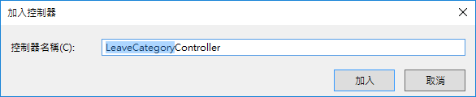
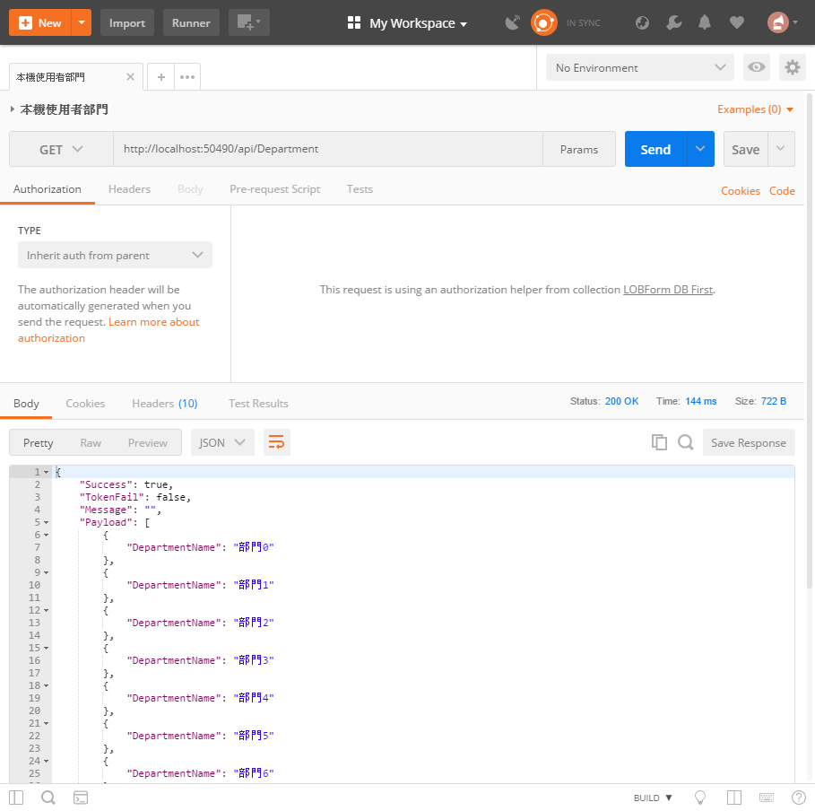

DBFirst9 建立部門清單查詢API

在這裡，我們將會建立一個控制器，並且只會設計一個 Http GET 動作，這個動作將會回傳所有部門清單名稱清單資料。

## 建立部門清單資料控制器

* 滑鼠右擊 `Controllers` 資料夾，選擇 `加入` > `控制器`

  

* 在 `新增 Scaffold` 對話窗中，點選 `Web API 2 控制器 - 空白` > `新增`

* 在 `加入控制器` 對話窗中，輸入 `Department`，如同底下畫面，最後點選 `加入` 按鈕

  

* 新增的類別檔案最上方，加入參考這些命名空間


```csharp
using LOBFormDBFirst.Models;
```

* 將新增的類別以底下程式碼替換


```csharp
    public class DepartmentController : ApiController
    {
        APIResult fooResult = new APIResult();
        public APIResult Get()
        {
            var fooList = new List<DepartmentModel>();
            for (int i = 0; i < 10; i++)
            {
                var fooDepartmentModel = new DepartmentModel()
                {
                    DepartmentName = $"部門{i}",
                };
                fooList.Add(fooDepartmentModel);
            }
            fooResult.Success = true;
            fooResult.Message = "";
            fooResult.TokenFail = false;
            fooResult.Payload = fooList;
            return fooResult;
        }
    }
```

# 測試此控制器

* 執行此專案

* 打開 PostMan 工具

  * 選擇 Http 方法為 `Get`

  * 輸入 URL 為 `http://localhost:50490/api/LeaveCategory`

    > 若您自己建立的 Web API 專案，請在這裡輸入您專案的 Port 編號

  * 點選 `Send` 按鈕



* 若輸出底下內容，則表示 `部門清單資料` 控制器，已經成功建立完成了


```json
{
    "Success": true,
    "TokenFail": false,
    "Message": "",
    "Payload": [
        {
            "DepartmentName": "部門0"
        },
        ...
        {
            "DepartmentName": "部門9"
        }
    ]
}
```
