# XF2 建立一個 Prism 專案與設定會用的圖片資源

 這份文件的完成結果專案原始碼，可以參考 `XamarinLOBForms\2XFLab\02NewProject`

## 建立一個 Prism 專案

* 開啟 Visual Studio 2017

* 從功能表選取 \[檔案] > \[新增] > \[專案]

* 在 \[新增專案] 對話窗中，點選 \[Visual C#] > \[Prism] > \[Prism Blank App (Xamarin.Form)

* 在底下 \[名稱] 欄位中，輸入 `LOBForm`

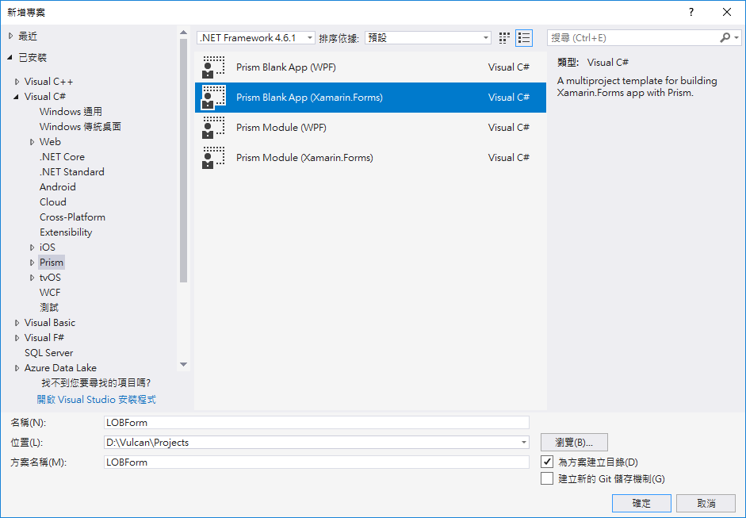

* 點選 \[確定] 按鈕

* 當出現 \[PRISM PROJECT WIZARD] 對話窗，勾選所有的行動作業系統平台，也就是 \[ANDROID] / \[iOS] / \[UWP]

* 在 \[Container] 欄位中，選擇 \[Unity]

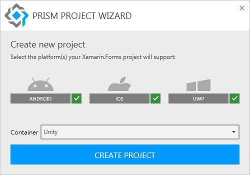

* 最後，點選 \[CREATE PROJECT] 按鈕

* 下圖為最後建立產生的 Xamarin.Forms 方案，裡面共有四個專案，分別是：Xamarin.Forms 共用類別庫(.NET Standard)、Android 原生專案、iOS 原生專案、UWP 原生專案

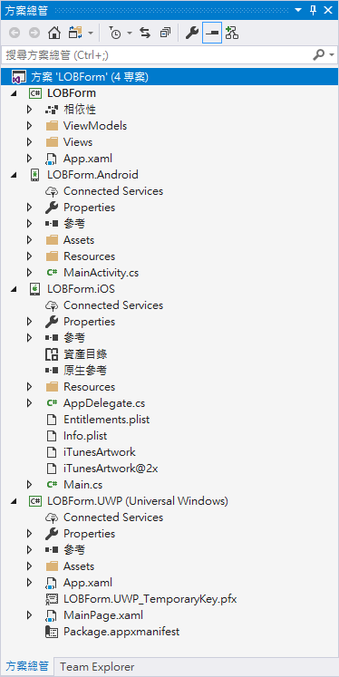

* 請分別在 Android / iOS / UWP 平台下，執行這個專案，看看能否正常執行。

* 底下是在 Android 模擬器下執行出來的結果

  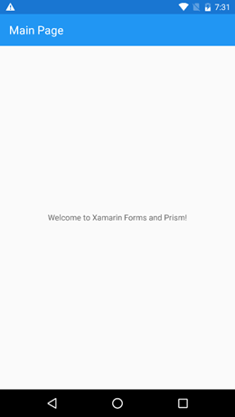

## 設定會用的圖片資源 Android 專案

* 找到課程所提供的專案原始碼壓縮檔案中，把這個路徑，`XamarinLOBForms\Images\IconAndSplash\android\drawable` ，內的圖片內容

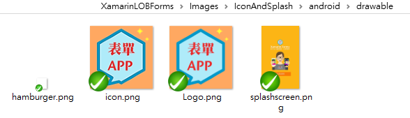

* 使用檔案總管，全選這四個圖片，並且從檔案總管中，拖拉到 Android 專案內的 \[Resourcs] > \[drawable] 目錄內

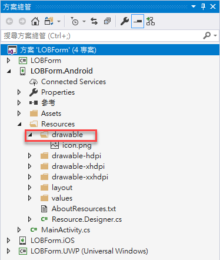

* 完成後的專案內容，如下圖所示

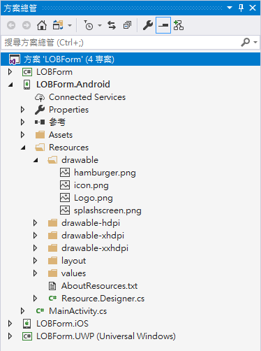

## 設定會用的圖片資源 Android 專案

* 找到課程所提供的專案原始碼壓縮檔案中，把這個路徑，`XamarinLOBForms\Images\IconAndSplash\android\drawable` ，內的圖片內容

* 使用檔案總管，全選這四個圖片，並且從檔案總管中，拖拉到 Android 專案內的 \[Resourcs] > \[drawable] 目錄內

* 完成後的專案內容，如下圖所示

## 設定會用的圖片資源 iOS 專案

* 找到課程所提供的專案原始碼壓縮檔案中，把這個路徑，`XamarinLOBForms\Images\IconAndSplash\iOS` ，內的圖片內容

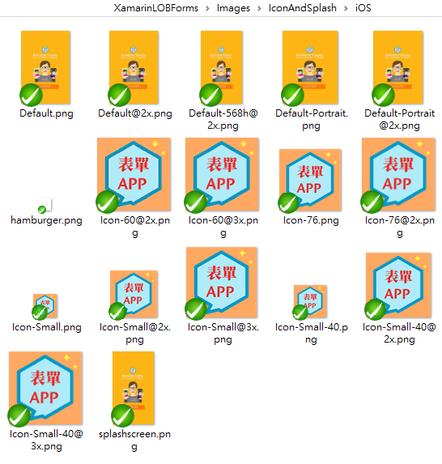

* 使用檔案總管，全選這這些圖片，並且從檔案總管中，拖拉到 iOS 專案內的 \[Resourcs] 目錄內

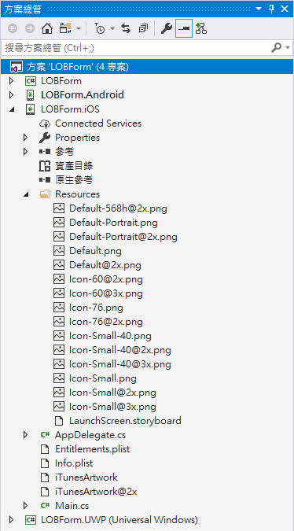

* 完成後的專案內容，如下圖所示

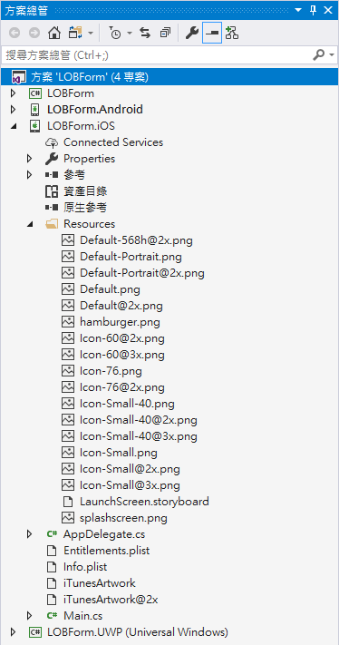

## 設定會用的圖片資源 UWP 專案

* 在 UWP 專案內，滑鼠右擊 \[Assets] 目錄，選擇 \[加入] > \[新增資料夾]

* 輸入 `Images`

* 找到課程所提供的專案原始碼壓縮檔案中，把這個路徑，`XamarinLOBForms\Images\IconAndSplash\UWP\Images` ，內的圖片內容

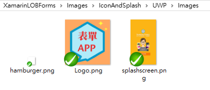

* 使用檔案總管，全選這這些圖片，並且從檔案總管中，拖拉到 UWP 專案內的 \[Assets] > \[Images] 目錄內

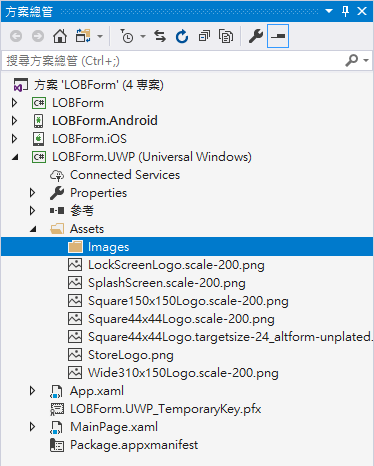

* 完成後的專案內容，如下圖所示

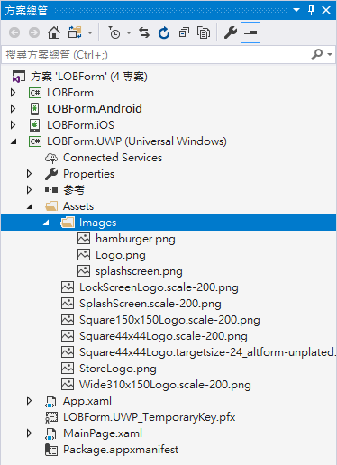

# 確認專案可以執行

* 請分別在 Android / iOS / UWP 平台下，執行這個專案，看看能否正常執行。

* 底下是在 Android 模擬器下執行出來的結果

  

# 問題研究

 請在您的行動裝置或者模擬器桌面查看這個應用程式，他的圖示呈現是甚麼圖形。

 我是否可以將這個跨平台專案會用到的所有圖片檔案，都加入到 `LOBForm` .NET Standard 共用類別庫專案內？

 要將圖片加入到每個原生專案內，有甚麼好處？

 我是否一開始就要將不同放大倍率的圖片，都加入到原生專案內。

 我要如何指定所建置、產生出了行動應用程式，其圖示名稱會顯示 `企業表單`

 為什麼我無法建置與執行 iOS 的 App 呢？

 我一定要使用 Prism Template Pack 專案範本來建立一個 Xamarin.Forms 專案嗎？

 我一定要使用 MVVM 設計模式來開發 Xamarin.Forms 專案嗎？我可以全部都使用 Code-Behind 來設計嗎？

 若視覺設計師所提供的圖片，採用了漸層顏色，在我們設計 App 上，會遇到甚麼問題嗎？

 對於視覺設計師而言，要設計一個全螢幕背景圖片，要使用多少畫素的高度與寬度來設計？

