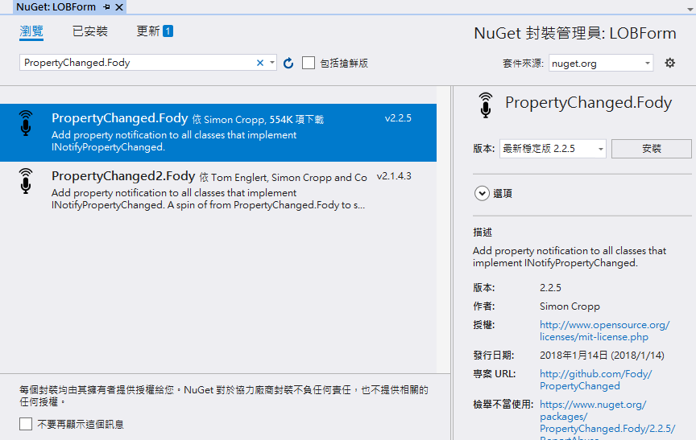
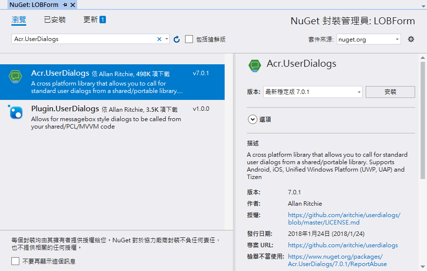
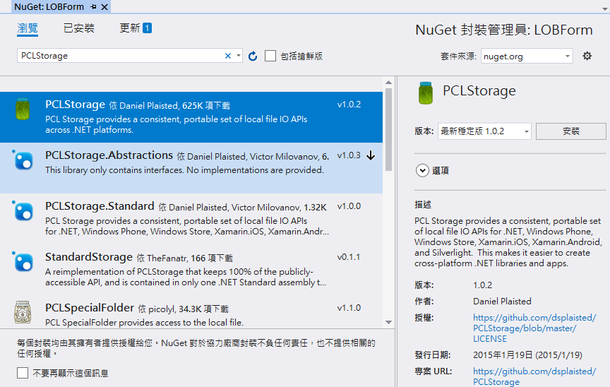
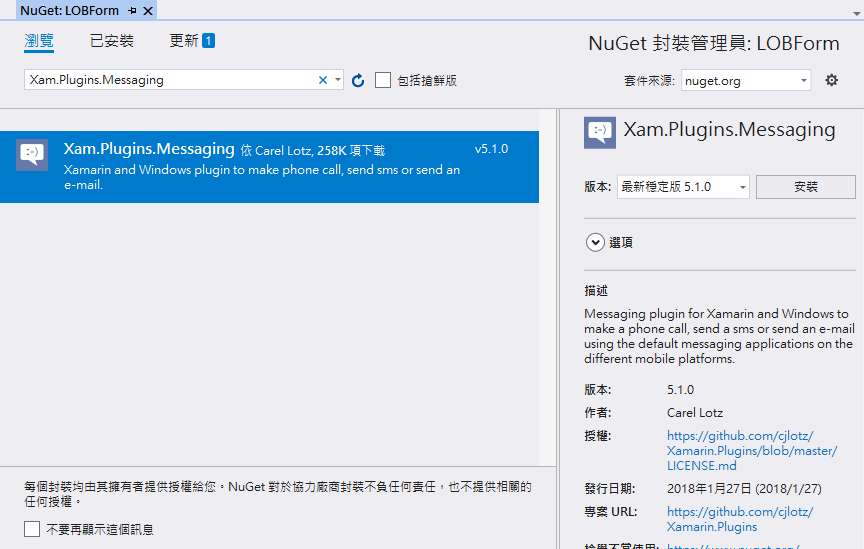
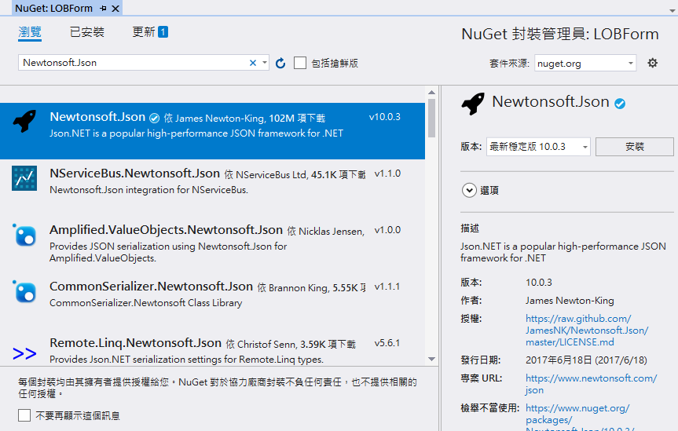
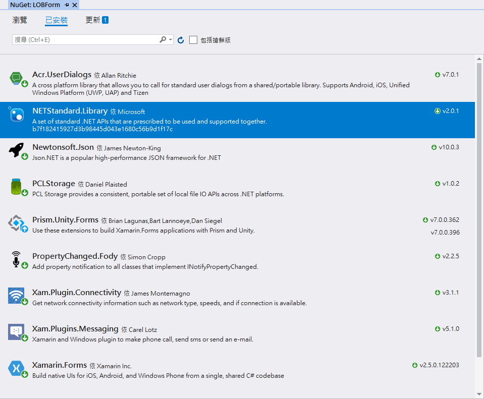

# XF3 設計專案開發會用的資料模型與NuGet套件

 這份文件的完成結果專案原始碼，可以參考 `XamarinLOBForms\2XFLab\03NuGet`

在這個步驟，我們把這個專案會用到的 NuGet 套件先安裝起來，針對必要的套件，進行套件初始化的設定。

# NuGet 套件安裝

## 安裝 PropertyChanged.Fody  套件

* 滑鼠右擊 `LOBForm` .NET Standard 共用類別庫專案，選擇 `管理 NuGet 套件`

* 點選 `瀏覽` 標籤頁次，並在搜尋文字輸入盒中，輸入 `PropertyChanged.Fody`

* 點選搜尋出來的 `PropertyChanged.Fody` 套件，並且點選 `安裝` 按紐



* 找到課程所提供的專案原始碼壓縮檔案中，把這個路徑， `XamarinLOBForms\PropertyChanged` 內的 `FodyWeavers.xml` 檔案，拖拉到 `LOBForm` .NET Standard 共用類別庫專案根目錄下。

## 安裝 Acr.UserDialogs  套件

* 滑鼠右擊 `LOBForm` .NET Standard 共用類別庫專案，選擇 `管理 NuGet 套件`

* 點選 `瀏覽` 標籤頁次，並在搜尋文字輸入盒中，輸入 `Acr.UserDialogs`

* 點選搜尋出來的 `Acr.UserDialogs` 套件，並且點選 `安裝` 按紐



* 在 Android 專案內，找到 `MainActivity.cs` 檔案，打開這個檔案

* 在 `OnCreate` 方法內，找到 `global::Xamarin.Forms.Forms.Init(this, bundle);` 程式碼

* 在剛剛找到的程式碼之後，加入底下程式碼


```csharp
#region 第三方套件／插件的初始化
 
#region 進行 UserDialogs 套件的初始化
Acr.UserDialogs.UserDialogs.Init(this);
#endregion
 
#endregion
```

## 安裝 PCLStorage  套件

* 滑鼠右擊 `LOBForm` .NET Standard 共用類別庫專案，選擇 `管理 NuGet 套件`

* 點選 `瀏覽` 標籤頁次，並在搜尋文字輸入盒中，輸入 `PCLStorage`

* 點選搜尋出來的 `PCLStorage` 套件，並且點選 `安裝` 按紐



## 安裝 Xam.Plugin.Connectivity  套件

* 滑鼠右擊 `LOBForm` .NET Standard 共用類別庫專案，選擇 `管理 NuGet 套件`

* 點選 `瀏覽` 標籤頁次，並在搜尋文字輸入盒中，輸入 `Xam.Plugin.Connectivity`

* 點選搜尋出來的 `Xam.Plugin.Connectivity` 套件，並且點選 `安裝` 按紐


## 安裝 Xam.Plugins.Messaging  套件

* 滑鼠右擊 `LOBForm` .NET Standard 共用類別庫專案，選擇 `管理 NuGet 套件`

* 點選 `瀏覽` 標籤頁次，並在搜尋文字輸入盒中，輸入 `Xam.Plugins.Messaging`

* 點選搜尋出來的 `Xam.Plugins.Messaging` 套件，並且點選 `安裝` 按紐



## 安裝 Newtonsoft.Json  套件

* 滑鼠右擊 `LOBForm` .NET Standard 共用類別庫專案，選擇 `管理 NuGet 套件`

* 點選 `瀏覽` 標籤頁次，並在搜尋文字輸入盒中，輸入 `Newtonsoft.Json`

* 點選搜尋出來的 `Newtonsoft.Json` 套件，並且點選 `安裝` 按紐



## 確認已安裝的 NuGet 套件

* 在下面截圖，為我們這個專案需要用到的相關 NuGet 套件



# 建立專案會用到的資料模型

*使用滑鼠右鍵點選`LOBForm` .NET Standard 共用類別庫專案，選擇 \[加入] > \[新增資料夾]

* 輸入 `Models`

## 建立 APIResult.cs

* 滑鼠右擊 `Models` 資料夾，選擇 \[加入] > \[類別]

* 在\[名稱] 欄位內，輸入 `APIResult`，之後點選 `新增` 按鈕

* 使用底下程式碼，替換剛剛產生的類別


```csharp
/// <summary>
/// 呼叫 API 回傳的制式格式
/// </summary>
public class APIResult
{
    /// <summary>
    /// 此次呼叫 API 是否成功
    /// </summary>
    public bool Success { get; set; } = true;
    /// <summary>
    /// 此次呼叫的存取權杖是否正確
    /// </summary>
    public bool TokenFail { get; set; } = false;
    /// <summary>
    /// 呼叫 API 失敗的錯誤訊息
    /// </summary>
    public string Message { get; set; } = "";
    /// <summary>
    /// 呼叫此API所得到的其他內容
    /// </summary>
    public object Payload { get; set; }
}
```

## 建立 OnCallPhone.cs

* 滑鼠右擊 `Models` 資料夾，選擇 \[加入] > \[類別]

* 在\[名稱] 欄位內，輸入 `OnCallPhone`，之後點選 `新增` 按鈕

* 使用底下程式碼，替換剛剛產生的類別


```csharp
/// <summary>
/// 公司緊急連絡方式
/// </summary>
public class OnCallPhone
{
    public int OnCallPhoneId { get; set; }
    public int SortingOrder { get; set; }
    public string Title { get; set; }
    public string PhoneNumber { get; set; }
}
```

## 建立 LeaveCategory.cs

* 滑鼠右擊 `Models` 資料夾，選擇 \[加入] > \[類別]

* 在\[名稱] 欄位內，輸入 `LeaveCategory`，之後點選 `新增` 按鈕

* 使用底下程式碼，替換剛剛產生的類別


```csharp
/// <summary>
/// 請假類別
/// </summary>
public class LeaveCategory
{
    public int LeaveCategoryId { get; set; }
    public int SortingOrder { get; set; }
    public string LeaveCategoryName { get; set; }
}
```

## 建立 LeaveAppFormByUserModel.cs

* 滑鼠右擊 `Models` 資料夾，選擇 \[加入] > \[類別]

* 在\[名稱] 欄位內，輸入 `LeaveAppFormByUserModel`，之後點選 `新增` 按鈕

* 使用底下程式碼，替換剛剛產生的類別


```csharp
public class LeaveAppFormByUserModel
{
    public string Account { get; set; } = "";
    public string Mode { get; set; } = "";
}
```

## 建立 Project.cs

* 滑鼠右擊 `Models` 資料夾，選擇 \[加入] > \[類別]

* 在\[名稱] 欄位內，輸入 `Project`，之後點選 `新增` 按鈕

* 使用底下程式碼，替換剛剛產生的類別


```csharp
/// <summary>
/// 專案名稱
/// </summary>
public class Project :ICloneable
{
    public int ProjectId { get; set; }
    public string ProjectName { get; set; }
 
    public Project Clone()
    {
        return this.MemberwiseClone() as Project;
    }
    object ICloneable.Clone()
    {
        return Clone();
    }
}
```

## 建立 SystemStatus.cs

* 滑鼠右擊 `Models` 資料夾，選擇 \[加入] > \[類別]

* 在\[名稱] 欄位內，輸入 `SystemStatus`，之後點選 `新增` 按鈕

* 使用底下程式碼，替換剛剛產生的類別


```csharp
/// <summary>
/// 系統運作狀態
/// </summary>
public class SystemStatus
{
    /// <summary>
    /// Web API 存取權杖
    /// </summary>
    public string AccessToken { get; set; } = "";
    /// <summary>
    /// 使用 Authorization Basic 方式來進行使用者身分驗證
    /// </summary>
    public bool LoginMethodAction { get; set; } = true;
}
```

## 建立 UserLoginModel.cs

* 滑鼠右擊 `Models` 資料夾，選擇 \[加入] > \[類別]

* 在\[名稱] 欄位內，輸入 `UserLoginModel`，之後點選 `新增` 按鈕

* 使用底下程式碼，替換剛剛產生的類別


```csharp
public class UserLoginModel
{
    public string Account { get; set; } = "";
    public string Password { get; set; } = "";
}
```

## 建立 MyUser.cs

* 滑鼠右擊 `Models` 資料夾，選擇 \[加入] > \[類別]

* 在\[名稱] 欄位內，輸入 `MyUser`，之後點選 `新增` 按鈕

* 使用底下程式碼，替換剛剛產生的類別


```csharp
/// <summary>
/// 使用者
/// </summary>
public class MyUser : ICloneable
{
    public int MyUserId { get; set; }
    public string DepartmentName { get; set; }
    public string Name { get; set; }
    public string EmployeeID { get; set; }
    public string Password { get; set; }
    public int ManagerId { get; set; }
    public bool IsManager { get; set; }
    public DateTimeOffset? CreatedAt { get; set; }
    public DateTimeOffset? UpdatedAt { get; set; }
 
    public MyUser Clone()
    {
        return this.MemberwiseClone() as MyUser;
    }
    object ICloneable.Clone()
    {
        return Clone();
    }
}
```

## 建立 UserLoginResultModel.cs

* 滑鼠右擊 `Models` 資料夾，選擇 \[加入] > \[類別]

* 在\[名稱] 欄位內，輸入 `UserLoginResultModel`，之後點選 `新增` 按鈕

* 使用底下程式碼，替換剛剛產生的類別


```csharp
public class UserLoginResultModel
{
    public string AccessToken { get; set; } = "";
    public MyUser MyUser { get; set; } = new MyUser();
}
```

## 建立 WorkingLog.cs

* 滑鼠右擊 `Models` 資料夾，選擇 \[加入] > \[類別]

* 在\[名稱] 欄位內，輸入 `WorkingLog`，之後點選 `新增` 按鈕

* 使用底下程式碼，替換剛剛產生的類別


```csharp
/// <summary>
/// 工作日誌
/// </summary>
public class WorkingLog : ICloneable
{
    public int WorkingLogId { get; set; }
    public MyUser Owner { get; set; } = new MyUser();
    public DateTime LogDate { get; set; }
    public double Hours { get; set; }
    public virtual Project Project { get; set; } = new Project();
    public string Title { get; set; }
    public string Summary { get; set; }
 
    public WorkingLog Clone()
    {
        var fooObj = this.MemberwiseClone() as WorkingLog;
        if (fooObj.Project != null)
        {
            fooObj.Project = fooObj.Project.Clone();
        }
        if (fooObj.Owner != null)
        {
            fooObj.Owner = fooObj.Owner.Clone();
        }
        return fooObj;
    }
 
    object ICloneable.Clone()
    {
        return Clone();
    }
}
```

## 建立 LeaveAppForm.cs

* 滑鼠右擊 `Models` 資料夾，選擇 \[加入] > \[類別]

* 在\[名稱] 欄位內，輸入 `LeaveAppForm`，之後點選 `新增` 按鈕

* 使用底下程式碼，替換剛剛產生的類別


```csharp
/// <summary>
/// 請假單
/// </summary> 
public class LeaveAppForm : ICloneable
{
    public int LeaveAppFormId { get; set; }
    public virtual MyUser Owner { get; set; }
    //public int OwnerId { get; set; }
    public DateTime FormDate { get; set; }
    public string Category { get; set; }
    public DateTime BeginDate { get; set; }
    public DateTime CompleteDate { get; set; }
    public double Hours { get; set; }
    public string AgentName { get; set; }
    public string LeaveCause { get; set; }
    public string FormsStatus { get; set; }
    public string ApproveResult { get; set; }
 
    public LeaveAppForm Clone()
    {
        var fooObject = this.MemberwiseClone() as LeaveAppForm;
        fooObject.Owner = Owner.Clone();
        return fooObject;
    }
    object ICloneable.Clone()
    {
        return Clone();
    }
}
```

# 確認專案可以執行

* 請分別在 Android / iOS / UWP 平台下，執行這個專案，看看能否正常執行。

# 問題研究

 在這個練習中，安裝了許多 NuGet 套件，你知道他們是做甚麼用的嗎？ 我們要在 Xamarin.Froms 應用程式開發過程中，如何使用這些 NuGet 套件 功能？

 當我們在安裝好 Acr.UserDialogs NuGet 套件之後，接著需要在 Android 專案的 `MainActivity.cs` 之 `OnCreate`方法內，做這個套件的初始化設定，這個動作一定位做嗎？那麼，為什麼在 iOS / UWP 專案內，沒有做這樣的初始化設定，我該如何知道何時、在哪個專案，才能夠做哪些的初始化設定程式碼呢？

 在 Xamarin.Forms 專案內，對於類別 `APIResult` 扮演甚麼角色呢？

 在類別 `WorkingLog` 有實作 `ICloneable`，為什麼要實作這個介面呢？

 接續上一個問題，在類別 `WorkingLog` 內，看到有兩個 `Clone` 方法定義： `public WorkingLog Clone()` / `object ICloneable.Clone()` ，為什麼要這樣設計？它的原理是甚麼？

 我們設計了一個 類別 `SystemStatus`，他並不是用於呼叫 Web API 中使用的，他是做甚麼用的呢？


