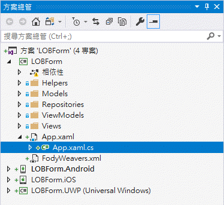

# XF5 建立專案起始畫面與讀取最新的資料清單

 這份文件的完成結果專案原始碼，可以參考 `XamarinLOBForms\2XFLab\05Splash`

現在讓我們來開始設計第一個 Xamarin.Forms 頁面，我們通稱這個頁面為起始頁面，我們會在這個頁面進行這個應用程式所需要資料的初始化設定、取得網路上最新的資料、決定接下來的頁面是要哪一個；在我們的需求中，若使用者尚未登入、或者已經登出，則會切換到登入頁面，若使用者已經登入了，則會直接切換到首頁頁面。

# 建立導航抽屜與導航工具列頁面

## 建立 NaviPage 頁面檢視 (View)與檢視模型(ViewModel)

* 滑鼠右擊 `Views` 資料夾，選擇 \[加入] > \[新增項目]

* 在 \[新增項目 LOBForm] 對話窗中，點選 \[已安裝] > \[Visual C# 項目] > \[Prism] > \[`Prism NavigationPage (Xamarin.Forms)`]

  > 請注意，這裡需要選取 `Prism NavigationPage (Xamarin.Forms)` 導航頁面 項目

* 在\[名稱] 欄位內，輸入 `NaviPage`，之後點選 `新增` 按鈕

* 在 `Views` 資料夾內，打開 `NaviPage.xaml`

* 使用底下 XAML 宣告標記語言，替換剛剛產生的頁面 XAML 內容


```xml
<?xml version="1.0" encoding="utf-8" ?>
<NavigationPage xmlns="http://xamarin.com/schemas/2014/forms"
             xmlns:x="http://schemas.microsoft.com/winfx/2009/xaml"
             xmlns:prism="clr-namespace:Prism.Mvvm;assembly=Prism.Forms"
             prism:ViewModelLocator.AutowireViewModel="True"
             x:Class="LOBForm.Views.NaviPage"
             BarBackgroundColor="#ff8421"
             >

</NavigationPage>
```

## 建立 MDPage 頁面檢視 (View)與檢視模型(ViewModel)

* 滑鼠右擊 `Views` 資料夾，選擇 \[加入] > \[新增項目]

* 在 \[新增項目 LOBForm] 對話窗中，點選 \[已安裝] > \[Visual C# 項目] > \[Prism] > \[`Prism MasterDetailPage (Xamarin.Forms)`]

  > 請注意，這裡需要選取 `Prism MasterDetailPage (Xamarin.Forms)` 導航抽屜頁面 項目

* 在\[名稱] 欄位內，輸入 `MDPage`，之後點選 `新增` 按鈕

* 在 `Views` 資料夾內，打開 `MDPage.xaml`

* 使用底下 XAML 宣告標記語言，替換剛剛產生的頁面 XAML 內容


```xml
<?xml version="1.0" encoding="utf-8" ?>
<MasterDetailPage xmlns="http://xamarin.com/schemas/2014/forms"
             xmlns:x="http://schemas.microsoft.com/winfx/2009/xaml"
             xmlns:prism="clr-namespace:Prism.Mvvm;assembly=Prism.Forms"
             prism:ViewModelLocator.AutowireViewModel="True"
             x:Class="LOBForm.Views.MDPage"
             MasterBehavior="Popover">

    <MasterDetailPage.Master>
        <ContentPage Title="Menu">

            <ContentPage.Icon>
                <!--因為每個平台的圖片路徑不同，所以，需要使用 OnPlatform 來指定不同平台的圖片名稱-->
                <!--每個屬性的 x:TypeArguments 引用型別皆不同，這裡請參考這個連結
                https://developer.xamarin.com/api/type/Xamarin.Forms.Page/-->
                <OnPlatform x:TypeArguments="FileImageSource"
                            Android="hamburger.png"
                            iOS="hamburger.png"
                            WinPhone="Assets/Images/hamburger.png" />
            </ContentPage.Icon>

            <Grid></Grid>
        </ContentPage>
    </MasterDetailPage.Master>

</MasterDetailPage>
```

# 建立專案起始畫面 頁面檢視 (View)與檢視模型(ViewModel)

* 滑鼠右擊 `Views` 資料夾，選擇 \[加入] > \[新增項目]

* 在 \[新增項目 LOBForm] 對話窗中，點選 \[已安裝] > \[Visual C# 項目] > \[Prism] > \[`Prism ContentPage (Xamarin.Forms)`]

  > 請注意，這裡需要選取 `Prism ContentPage (Xamarin.Forms)` 內容頁面 項目

* 在\[名稱] 欄位內，輸入 `SplashPage`，之後點選 `新增` 按鈕

* 在 `Views` 資料夾內，打開 `SplashPage.xaml`

* 使用底下 XAML 宣告標記語言，替換剛剛產生的頁面 XAML 內容


```xml
<?xml version="1.0" encoding="utf-8" ?>
<ContentPage xmlns="http://xamarin.com/schemas/2014/forms"
             xmlns:x="http://schemas.microsoft.com/winfx/2009/xaml"
             xmlns:prism="clr-namespace:Prism.Mvvm;assembly=Prism.Forms"
             prism:ViewModelLocator.AutowireViewModel="True"
             x:Class="LOBForm.Views.SplashPage">

    <Grid
        RowSpacing="0" ColumnSpacing="0"
        >
        <BoxView
            Color="#FCB515"/>
        <Image
            Aspect="AspectFit">
            <!--因為每個平台放置圖片的路徑不同，因此，使用 OnPlatform 來設定不同平台下的不同屬性值-->
            <Image.Source>
                <OnPlatform x:TypeArguments="ImageSource"
                            iOS="splashscreen.png"
                            Android="splashscreen.png" 
                            WinPhone="Assets/Images/splashscreen.png"
                            />
            </Image.Source>
        </Image>

        <Grid
            HorizontalOptions="Fill" VerticalOptions="End"
            Margin="0,0,0,0"
            >
            <BoxView
                Color="Black"
                Opacity="0.7"
                HeightRequest="50"/>
            <Label
                Margin="20,0"
                HorizontalOptions="Center" VerticalOptions="Center"
                Text="{Binding LoadingMessage}"
                FontSize="24"
                TextColor="White"/>
        </Grid>
    </Grid>
    
</ContentPage>
```

* 在 `ViewModels` 資料夾內，打開 `SplashPageViewModel.cs`

* 使用底下 C# 程式碼，替換這個類別內容


```csharp
using LOBForm.Models;
using LOBForm.Repositories;
using Prism.Commands;
using Prism.Mvvm;
using Prism.Navigation;
using Prism.Services;
using System;
using System.Collections.Generic;
using System.ComponentModel;
using System.Linq;
using System.Threading;
using System.Threading.Tasks;

namespace LOBForm.ViewModels
{

    public class SplashPageViewModel : INotifyPropertyChanged, INavigationAware
    {
        public event PropertyChangedEventHandler PropertyChanged;
        public string LoadingMessage { get; set; } = "";
        private readonly INavigationService _navigationService;
        private APIResult APIResult;

        public SplashPageViewModel(INavigationService navigationService)
        {
            _navigationService = navigationService;
        }

        public void OnNavigatedFrom(NavigationParameters parameters)
        {

        }

        public void OnNavigatingTo(NavigationParameters parameters)
        {

        }

        public async void OnNavigatedTo(NavigationParameters parameters)
        {
            var fooAllSuccess = true;

            if (Plugin.Connectivity.CrossConnectivity.Current.IsConnected == false)
            {
                fooAllSuccess = false;
            }
            else
            {
                LoadingMessage = "正在更新 請假單分類清單 中";
                var fooLeaveCategoryRepository = new LeaveCategoryRepository();
                APIResult = await fooLeaveCategoryRepository.GetAsync();
                if (APIResult.Success == false)
                {
                    using (Acr.UserDialogs.UserDialogs.Instance.Toast(
                        $"無法進行 更新 請假單分類清單 中 ({APIResult.Message})", TimeSpan.FromMilliseconds(1500)))
                    {
                        await Task.Delay(2000);
                    }
                    fooAllSuccess = false;
                }
                else
                {
                    LoadingMessage = "正在更新 專案清單 中";
                    var fooProjectRepository = new ProjectRepository();
                    APIResult = await fooProjectRepository.GetAsync();
                    if (APIResult.Success == false)
                    {
                        using (Acr.UserDialogs.UserDialogs.Instance.Toast(
                            $"無法進行 更新 專案清單 中({APIResult.Message})", TimeSpan.FromMilliseconds(1500)))
                        {
                            await Task.Delay(2000);
                        }
                        fooAllSuccess = false;
                    }
                    else
                    {
                        LoadingMessage = "正在更新 緊急連絡電話清單 中";
                        var fooOnCallPhoneRepository = new OnCallPhoneRepository();
                        APIResult = await fooOnCallPhoneRepository.GetAsync();
                        if (APIResult.Success == false)
                        {
                            using (Acr.UserDialogs.UserDialogs.Instance.Toast(
                                $"無法進行 更新 緊急連絡電話清單 中({APIResult.Message})", TimeSpan.FromMilliseconds(1500)))
                            {
                                await Task.Delay(2000);
                            }
                            fooAllSuccess = false;
                        }
                    }
                }
            }

            if (fooAllSuccess == true)
            {
                LoadingMessage = "系統資料更新完成";
                var fooSystemStatusRepository = new SystemStatusRepository();
                await fooSystemStatusRepository.ReadAsync();
                if (string.IsNullOrEmpty(fooSystemStatusRepository.Item.AccessToken))
                {
                    //await _navigationService.NavigateAsync("xf:///LoginPage");
                }
                else
                {
                    //await _navigationService.NavigateAsync("xf:///MDPage/NaviPage/AboutPage");
                }
            }
            else
            {
                var config = new Acr.UserDialogs.ConfirmConfig()
                {
                    Title = "警告",
                    Message = "可能因為網路問題，無法進行系統資料更新，您確定要繼續執行嗎? (強制繼續執行 App，但有可能造成 App 不正常運作)",
                    OkText = "確定",
                    CancelText = "停止"
                };
                await Task.Delay(1000);
                var fooConfirmResult =
                    await Acr.UserDialogs.UserDialogs.Instance.ConfirmAsync(config);

                if (fooConfirmResult == false)
                {
                    LoadingMessage = "請強制關閉 App，檢查網路是否可用，並且重新啟動 App";
                    return;
                }
                else
                {
                    LoadingMessage = "強制繼續執行 App";
                }
            }

            // 切換到首頁或者登入頁面
        }

    }

}
```

 請了解這個頁面檢視 (View) 的 XAML 宣告標記語言內容，與檢視模型 (ViewModel) 裡面 C# 程式碼所提供的商業邏輯的程式碼寫法。

# 修正 Xamarin.Forms 的第一個顯示頁面為 SplashPage.xaml

* 在 `LOBForm` .NET Standard 共用類別庫專案內，找到 `App.xaml` 檔案，點選該檔案前面的 三角形符號，此時，您會看到 `App.xaml.cs` 節點，打開這個節點。

  

* 您可以在 `OnInitialized` 方法內，找到這行程式碼 `await NavigationService.NavigateAsync("NavigationPage/MainPage");`

* 請使用這行程式碼將其替換掉`await NavigationService.NavigateAsync("SplashPage");`

* 完成後的 `OnInitialized` 方法程式碼如下所示：


```csharp
protected override async void OnInitialized()
{
    InitializeComponent();
 
    await NavigationService.NavigateAsync("SplashPage");
}
```

# 進行跨平台實際測試

將這個專案，分別在不同行動裝置平台上(您可以使用模擬器或者是實體裝置)，實際執行這個專案，看看運作成果。

## Android App 測試

* 設定 Android 原生專案為預設起始專案，並且執行這個專案

* 如果你可以看到如下圖的畫面，那就表示您已經完成這個 App 的起始畫面，並且成功地從遠端 Web API 主機上取得這個應用程式會用到的清單資料。

  

 您可以嘗試將 Android 裝置或者模擬器，設定無法連上網路，看看，是否會造成應用程式崩潰。

## iOS App 測試

* 設定 iOS 原生專案為預設起始專案，並且執行這個專案

* 如果你可以看到如下圖的畫面，那就表示您已經完成這個 App 的起始畫面，並且成功地從遠端 Web API 主機上取得這個應用程式會用到的清單資料。

  

 您可以嘗試將 Android 裝置或者模擬器，設定無法連上網路，看看，是否會造成應用程式崩潰。

## UWP App 測試

* 設定 UWP 原生專案為預設起始專案，並且執行這個專案

* 如果你可以看到如下圖的畫面，那就表示您已經完成這個 App 的起始畫面，並且成功地從遠端 Web API 主機上取得這個應用程式會用到的清單資料。

  

 您可以嘗試將 UWP 裝置或者模擬器，設定無法連上網路，看看，是否會造成應用程式崩潰。

# 問題研究

 我們在不同的 XAML 檔案中，看到三種頁面類別，分別是 NavigationPage / MasterDetailPage / ContnetPage，你可以區分這三種類別的差別嗎？

 若在新增頁面的時候，建立錯誤的頁面，想要刪除，該執行哪些步驟呢？

 在 MDPage 導航抽屜頁面中，這個 `OnPlatform` XAML 宣告項目，有甚麼特殊目的存在呢？

 請試著了解 SplashPage 畫面需求，若要做出這樣的效果，我們要怎樣規劃與使用那些 XAML 版面配置與相關屬性設定，才能夠做出這樣的效果呢？

 了解如何使用 `Xam.Plugin.Connectivity` 套件，來幫助我們檢查當 App 啟動的時候，當時網路是有正常連線上。

 在 OnNavigatedTo 導航事件中，究竟做了哪些事情呢？

 我們要在哪裡來修正，指定 Xamarin.Forms 第一個要顯示的頁面呢？

 我們使用了甚麼技巧，來判斷這個使用者是否曾經成功通過身分驗證呢？

 當應用程式啟動之後，為什麼一直停留這個啟動畫面呢？

 在 Android 模擬器下，如何設定控制與設定網路使用情境，例如：網路不通、網路品質不好、在3G/2G品質下的各種情況。

 若網路一開始就不通，或者當 App 啟動到一半的時候，突然網路就不通，我們的 App 會造成閃退現象嗎？


