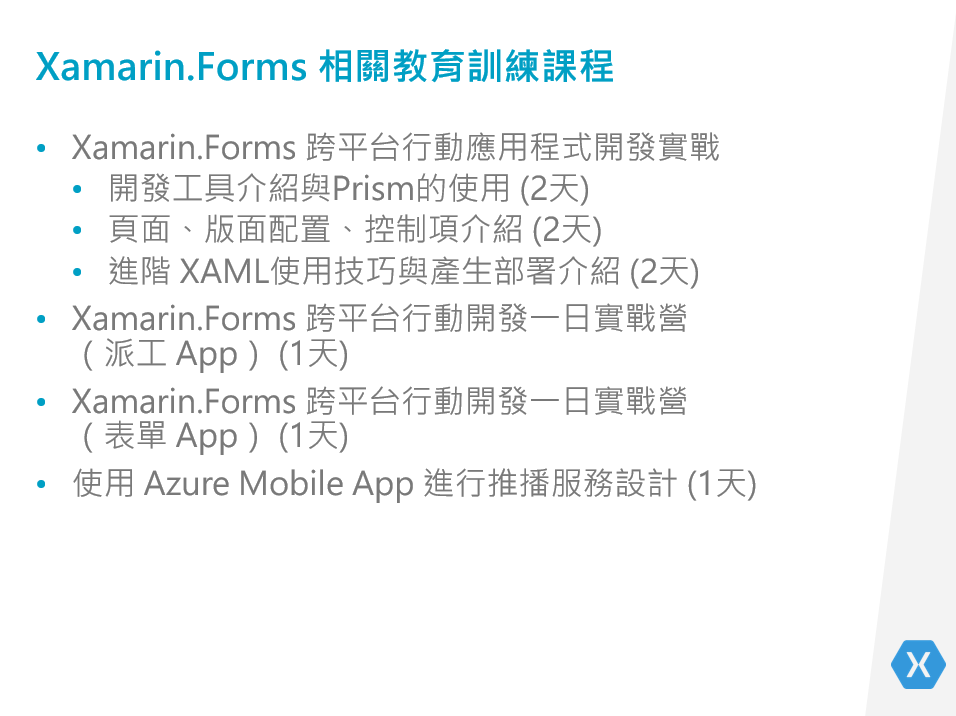

# ◎ 課程名稱
????

# ◎ 課程說明
以往想要開發原生行動應用程式，您必須要遵循每個平台的 SDK 規範與了解應用程式的生命週期，並且使用專屬程式語言與 API 使用方式，例如： iOS 需要學習 Swift 或者 Objective-C，而 Android 必須要學習 Java，這使得想要開發一套能夠在不同行動裝置下運行的應用程式，您必須學習與精通這些開發工具與程式語言；最重要的是，不論是視覺介面 UI 或者商業邏輯程式碼，都無法跨平台共用，也就是說，同樣的商業邏輯需要使用不同程式語言重覆再寫一次。  

Xamarin.Forms 使用 .NET C# 程式語言，配合豐富資源 BCL 與視覺宣告 XAML 語言，搭配地表最強的程式開發工具 Visual Studio，讓您可以一次性開發出可以在 iOS & Android & UWP 下運行的行動裝置應用程式，不論是視覺介面與商業邏輯，開發者也只需要撰寫一次即可，就可以產生出在不同行動裝置下執行的應用程式。另外，Xamarin.Forms 特別適合用於開發企業內部的行動應用。  

本次課程包含 1.5 小時開發環境準備的線上課程。在整個課程中，將會了解如何在 ASP.NET Web API 專案，並且設計相關 RESTful 服務，其中包含了使用者帳號身分驗證，並且於通過身分驗證後，會取得存取權杖 Access Token，並且用於存取其他 Web API 之用，沒有提供存取權杖 Access Token 將無法存取這些 Web API服務。另外，將會使用這個已經開發好的 Web API，進行 Xamarin.Forms 跨平台行動應用程式開發，這些應用包含了工作日報表頁面，可以進行紀錄的 新增、查詢、更新、刪除 作業，主管等級帳號使用 App 時候，可以使用 請假主管審核 頁面，進行部屬請假紀錄的審核，另外，也會說明如何取得公司緊急連絡方式清單，並且直接進行撥打電話功能。

# ◎ 課程編號

# ◎ 課程日期

# ◎ 課程主題
* 開發環境準備：1.5 小時線上課程中，內容將包含
  * 開發環境的安裝與設定
    * Visual Studio 2017 之 Xamarin.Forms 開發環境的安裝與設定
    * 如何安裝與使用 Xamarin.Forms 開發用程式碼片段
    * 安裝 Prism Template Pack 擴充功能
    * 使用 GitHub 分享有問題的專案原始碼
    * XAML 基本特色與功能介紹
    * Live XAML 的安裝設定與使用

  * 確認開發環境是否正常運作
    * VS for Android 模擬器是否正常運作
    * 實體 Android 手機 啟用開發者模式
    * Android SDK 管理員更新到最新版本
    * 建立、建置、執行 Cross-Platform 專案
    * 建立、建置、執行 Prism 專案
    * 安裝 Prism Template Pack 擴充功能
    * 如何安裝與使用 Xamarin.Forms 開發用程式碼片段

* 後端 Web API 開發練習將會分成線上與實體課程 
  > 線上課程的項目，可以刪除，不過，我的文件要留下這些項目，因為，我要做出這些內容
  * 建立與設定 Azure行動應用程式 **`(線上課程)`**
  * 確認 Azure行動應用程式服務是正常運作 **`(線上課程)`**
  * 檢視Azure Mobile App 行動應用服務提供的後端專案 **`(線上課程)`**
  * 設計建立測試用的資料表紀錄的 Web API  **`(線上課程)`**
  * 設計取得加密用的 RSA 公鑰 Web API **`(線上課程)`**
  * JWT 的安裝與設定，且通過身分驗證過後，將會取得存取權杖 Access Token **`(線上課程)`**
  * 建立 Basic 與有加密的使用者認證 Web API **`(線上課程)`**
  * 使用 RSA 公鑰進行身分驗證的帳號與密碼將會加密之 Web API **`(線上課程)`**
  * 如何部署到 Azure 上  **`(線上課程)`**
  * 建立底下 Web API，但需要使用者通過驗證，才能夠呼叫
  * 工作日報表的 CRUD Web API 設計
  * 請假單申請之 Web API  **`(線上課程)`**
  * 請假單主管審核用的 Web API **`(線上課程)`**
  * 公司緊急連絡方式清單 Web API **`(線上課程)`**
  * 設計上述資料表可以使用網頁來顯示這些內容 **`(線上課程)`**
  
* Xamarin.Forms 開發練習將會分成線上與實體課程
  * 使用 Prism Template Pack 專案範本建立 Xamarin.Forms 專案 **`(線上課程)`**
  * 相關公用工具類別庫設計 **`(線上課程)`**
  * 建立各 Web API 存取服務的類別庫 **`(線上課程)`**
  * 使用者登入驗證，並可以儲存 Access Token 
  * 使用者若已經通過身分驗證，可以直接進入首頁頁面 
  * App 導航抽屜首頁與抽屜面版設計 **`(線上課程)`**
  * 工作日報表之頁面開發，可以進行工作紀錄的新增、查詢、修改、刪除
  * 請假申請申請(若已經通過審核，該紀錄無法刪除)
  * 登入使用者若為主管，則會可以使用主管請假審核功能(使用者須具備主管身分，才會看到此功能)
  * 公司緊急連絡方式清單 (可以直接撥打電話) 

# ◎ 相關事項
* 本課程使用 **`Visual Studio 2017 for Windows`** 作為練習開發 IDE
* 學員上課前，需要觀看相關影片與文件，安裝與設定好 Xamarin 開發環境
* 這個練習的原始碼，將採用 MVVM 架構開發，並且需要搭配 Prism 開發框架來使用
* 請自行攜帶 Windows 10 電腦來做練習
* 開發過程中，可以使用 Android 模擬器或 Android 實體手機做為開發與測試之用
* 若要使用 Android 實體手機來進行開發，請學員自備
* 請已經報名成功的學員，立即加入本課程的社團，並且要觀看相關線上課程與進行練習

# ◎ 適合對象
* 具備 .NET C# 基礎開發知識
* 使用 Visual Studio 一年以上
* 想要開發企業內部使用行動跨平台應用程式
* 若能具有任一行動 App 開發經驗 (Android / iOS / UWP) 尤佳

# ◎ 預期效益
* 了解後端 Web API 的開發過程
* 學會 Xamarin.Forms 開發環境之安裝與設定
* 了解如何在 Xamarin.Forms 專案來存取遠端 Web API的應用程式開發
* 了解如何開發與設計企業應用的 Xamarin.Forms 專案

# 其他說明

本課程的主要目的在於讓學員體驗如何進行企業內部表單的行動應用專案開發，因此，會涵蓋到如何開發一個後端 Web API 服務、Xamarin.Forms 的表單應用 App之開發過程；學員上完體驗課程之後，將會取得這個完整應用的開發專案的原始碼，並且可以自行修改適合自己企業內部環境。

由於課程內容很多，只有一天=7個小時，要體驗後端與App端的開發過程，邊看邊實作，這樣的時間一定不足夠；因此，要請學員至少在一個星期前報名，並且跟著教學影片來練習，建立後端與 Xamarin.Forms 的專案，剩下的部分，將會於實體課堂上進行講解與帶領大家來實作，並且會補充說明相關設計上的考量與注意事項。

由於有一半的內容會說明如何設計一個 Web API，因此，需要有人來支援我進行這方面的課程設計與準備工作。

要請幫忙提供該應用程式的 Icon & 啟動畫面的圖片，最後是希望能夠將這個應用程式上架到 App Store / Google Play，如此，可以讓想要參加這個課程的準學員，了解到最後的產生結果。

因為不知道當時教室的投影設備如何，為了要能夠提升實體課程的教學品質，將會製作實體課程的演練步驟的詳細說明文件，到時候，學員可以搭配螢幕與這個說明文件，實際進行專案開發演練。

此課程需求從無到有開始設計、開發、錄製影片、製作文件、設計簡報，因此，會需要用耗用許多時間。

關於 Demo 用的 App，短期內將無法提供，因為，這可能要等到整個應用程式都開發出來後，才會有這個 App 產出，因此，建議可以錄製一個影片，使用簡報或者圖片來進行課程內容介紹；這個課程的重點不在於如何從頭到尾如何開發出一個 App，而是著重於如何開發出在企業內部會用到的後端 Web API 開發過程，以及如何設計一個 Xamarin.Forms 的 App，使用這個 Web API 服務。

因為著重於企業內部應用，因此，將會設計出一個範例，可以加密資料傳輸或者身分驗證、簡單的請假審核流程、表單 CRUD 的設計等過程，當然，上課學員可以將這個練習專案稍作修改與擴充，就可以直接套用到企業內部內來使用。

## 準備工作

* 設計整體課程的需求與系統架構

* 實作出後端 Web API 專案 (每個階段都會產生一個方案)

* 部署到 Azure 上的過程

* 實作出 Xamarin.Forms 專案 (每個階段都會產生一個方案)

* 製作課程簡報

* 錄製線上課程影片

* 製作實體課程的詳細操作說明 Markdown 文件 (含會用到的程式碼)

## Xamarin.Xamarin.Forms 相關教育訓練課程

這裡是我規劃的 Xamarin.Forms 的教育訓練課程清單，讓想參加我們課程的學員，了解到要學會 Xamarin.Forms 跨平台應用程式開發，我們有提供最完整的教育訓練課程解決方案。

* 開發實戰六天課程，著重 Xamarin.Forms 專案開發的核心知識與觀念介紹

* 一日實戰 - 派工 App 課程，著重於讓學員了解如何從無到有的開發出一個 App，並且上架到 Google Play

* 一日實戰 - 表單 App 課程，將會了解如何製作 ASP.NET Web API 服務與設計出一個企業內部使用的表單應用跨平台應用專案

* 一日實戰 - 推播服務 課程，將會介紹如何設計跨平台的推播服務，並且了解各式推播應用的方式

 

