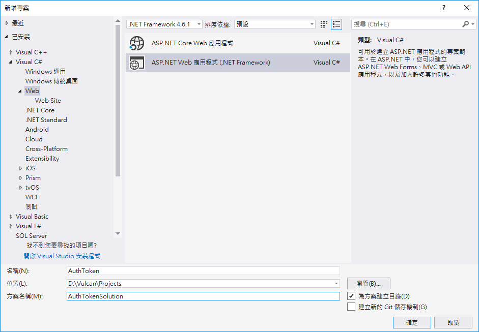
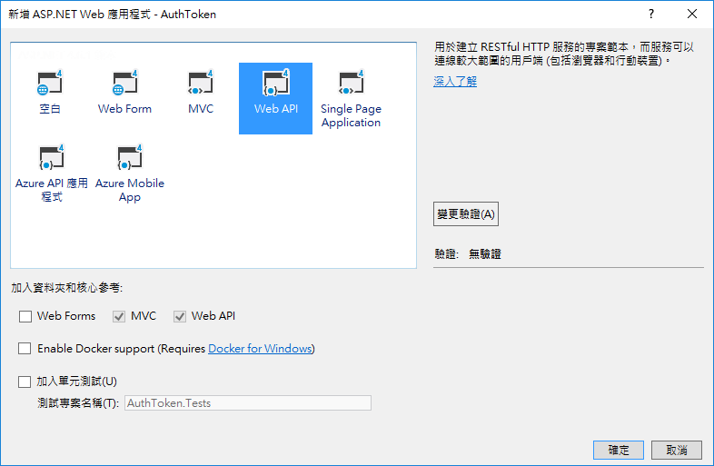
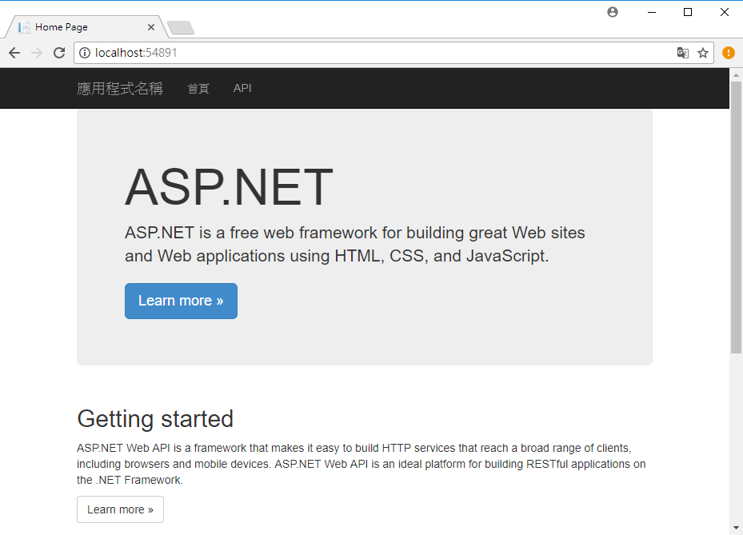

# 建立 Web API 專案

## 建立 ASP.NET Web API 專案

* 開啟 Visual Studio 2017 IDE

* 從功能表點選 \[檔案] > \[新增] > \[專案]

* 在 \[新增專案] 對話窗左半部，點選 \[已安裝] > \[Visual C#] > \[Web]

* 在這個對話的中間上方，選擇 \[.NET Framework 4.6.1]

* 接著選取 [ASP.NET Web 應用程式 (.NET Framework)]

* 在下方 \[名稱] 欄位，輸入 `AuthToken`

* 在 \[方案名稱] 欄位，輸入 `AuthTokenSolution`

* 最後，點選右下方的 \[確定] 按鈕

* 當出現 \[新增 ASP.NET Web 應用程式 - AuthToken] 對話窗

* 請選擇 \[Web API]

* 右半部的 \[驗證] 請設定為 \[無驗證]

* 其他設定可以參考這個螢幕截圖

  

* 執行這個 Web API 專案，就會看到這個畫面，那就表示您的 Web API 專案已經建立完成

  

> 這個練習的完成專案，可以參考資料夾 \[01 CreatProject]

